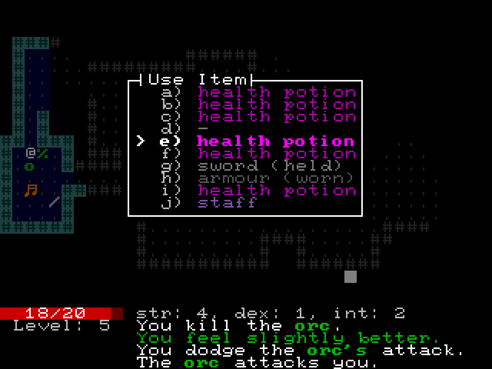
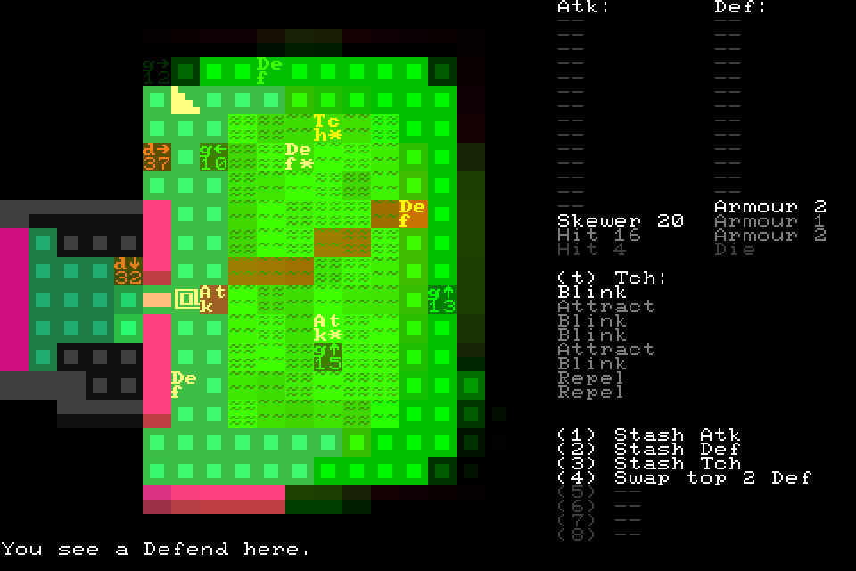
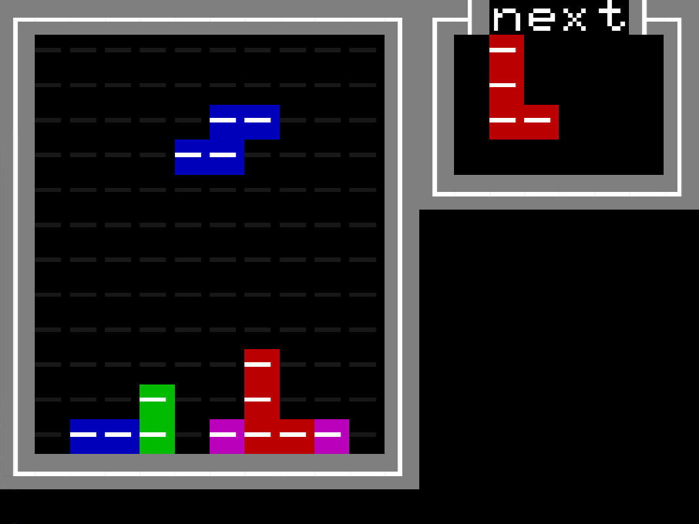
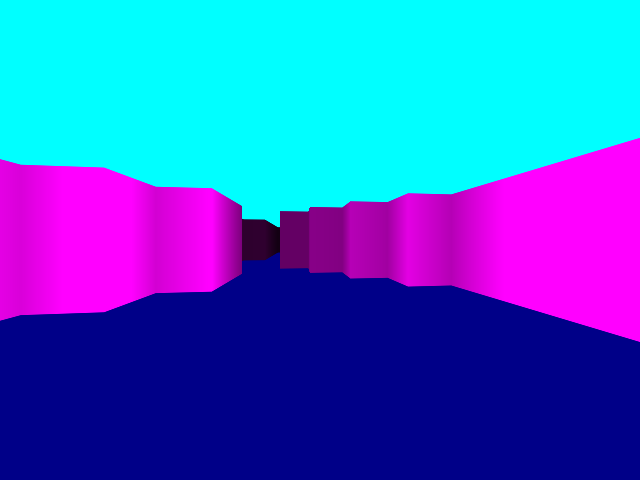
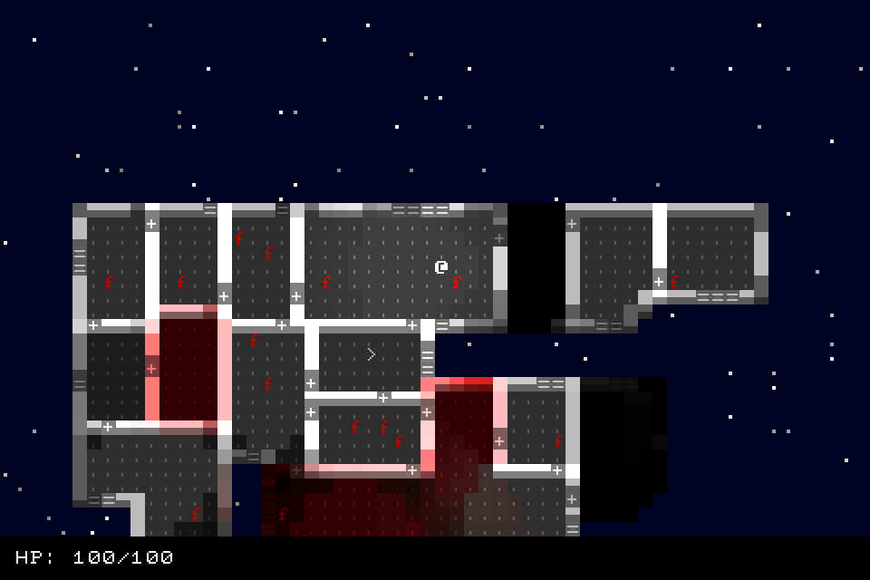
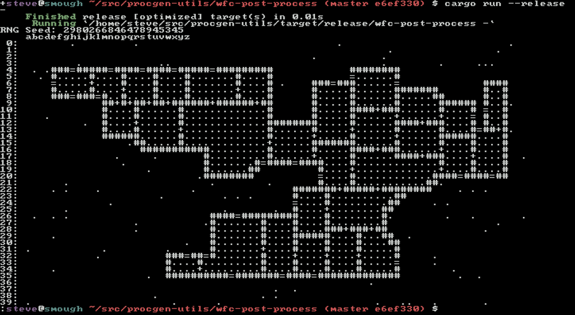
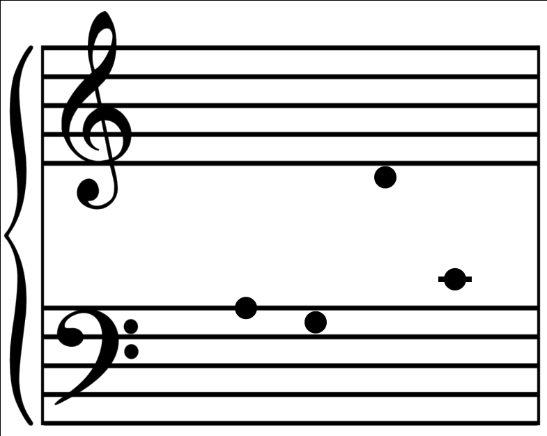

+++
title = "2020 Recap"
date = 2020-12-25
path = "2020-recap"

[taxonomies]
tags = ["meta"]
+++

This is a look at some of the things I've worked on in my spare time
during 2020. I started branching into new areas this year such as
hobby OS dev, writing, and music theory, as well as continuing to work
on roguelike games and supporting libraries.

<!-- more -->

## [Chargrid Roguelike Tutorial](@/roguelike-tutorial-2020/_index.md)

I made a tutorial series for making a roguelike with the
[chargrid](https://github.com/gridbugs/chargrid) text UI library
as part of [r/roguelikedev does the complete roguelike tutorial](https://old.reddit.com/r/roguelikedev/wiki/python_tutorial_series).

It's a series of 14 tutorials that demonstrates how to implement
a simple roguelike game with procedurally-generated levels,
melee, ranged, and magic combat, equipment, and character progression.

The series is listed in the tutorial section of the [roguelikedev subreddit](https://old.reddit.com/r/roguelikedev/).

## [slime99](https://gridbugs.itch.io/slime99)

This was my 7 Day Roguelike of 2020.
Its core mechanic is managing a stack of abilities that must be used in order.
I wrote a detailed post mortem of the project [here](@/projects/slime99/index.md).

Slime99 feels like my most complete game. It has mechanics that result in meaningful choices,
a coherent setting, music, a graphical style that I'm happy with, and an ending complete with
flavour text. Its biggest innovation is using 2x2 squares to represent game cells, allowing
more information to be conveyed for character and item tiles.

## [Disk Image Tools](https://github.com/gridbugs/gpt-fat-disk-image)

I started playing around with hobbyist OS development but quickly grew frustrated with
the difficulty of packing the kernel image, bootloader, etc into a disk image for booting
on an emulator. All the existing solutions require root and are specific to the flavour of
unix being used for development.

To address this I started working on a set of tools for reading and writing files to
GPT disk images with a single FAT partition. This is a requirement of the UEFI firmware
which is used to boot modern x86 (and some ARM) machines.

This is still a work in progress. I can reliably list and read files from disk images generated
by appropriately formatting a real disk, placing files on it, and dd-ing the disk to a file.
I'm part way through implementing a tool for making a new disk image containing a specified set
of files.

## [Conway's Game of Life on the NES](@/blog/conways-game-of-life-on-the-nes-in-rust/index.md)

For a bit of fun I set out writing my first NES program - a graphical demo that runs Conway's Game of Life.
It's written in a rust domain-specific-language that I developed when working on my own NES emulator a few years ago.

This animation shows how it partially updates the display each frame. The NES isn't fast enough to update the entire
background tile grid inside a single frame.

Here's the link to the [executable crate that generates the game of life NES rom](https://crates.io/crates/conway-nes).

And here's a
[long form blog post explaining how it works](@/blog/conways-game-of-life-on-the-nes-in-rust/index.md).

## [Chargrid Libraries](https://github.com/gridbugs/chargrid)

I renamed the prototty libraries to "chargrid".
My original intention for prototty was as a temporary text UI for games that would then
go on to be given "real" graphics.
Since its inception my attitude towards text-only graphics has changed, such that
I'd be happy to release a complete game with text-only graphics.
Hence the "proto" prefix is no longer apt, and a new name was in order.

I've made several additions to chargrid this year. It now supports input from game controllers.
The graphical frontend now renders with [wgpu](https://github.com/gfx-rs/wgpu) instead of
[gfx](https://github.com/gfx-rs/gfx). The persistent storage and audio interfaces have been moved
out of chargrid into new crates ([general_storage](https://crates.io/crates/general_storage)
and [general_audio](https://crates.io/crates/general_audio))
respectively.

## [sand - a sleep replacement with live updates](https://crates.io/crates/sand)

This is a program that waits for a specified amount of time, periodically printing the time left.

## [Wolfenstein3D-style Renderer Demo](https://gridbugs.github.io/small-wolf/)

On a whim I spent a few hours making a simple graphical demo in javascript which implements
the rendering technique employed in Wolfenstein3D.

It's written in pure javascript as a rebellion against the typical approach to writing
client side web apps in 2020. There's no transpiling, or bundling, and you can serve it
with your favourite static web server.

## [Minimal Extensible Argument Parser (rust library)](https://crates.io/crates/meap)

A few years ago I made a library called [simon](https://crates.io/crates/simon) for parsing
command-line arguments. This year I made its spiritual successor - [meap](https://crates.io/crates/meap) -
with the goal of being more pragmatic and flexible. The main additions are support for passing the same
option multiple times, a more ergonomic way to add descriptions to arguments, and interpreting all
arguments after "--" as positional. It also has zero dependencies.

## [RIP](https://github.com/gridbugs/rip)

RIP is ostensibly my long-term roguelike project.
I didn't spend as much time on it this year as I would have liked, but I have been keeping it up
to date as I change the libraries it's built with (chargrid in particular).

One big change I made to it this year is introducing procedurally generated ships.
The hull is generated with [Wave Function Collapse](https://crates.io/crates/wfc)
and then a binary-space partitioning method is used to split it into rooms.

This screenshot shows the procgen experimental environment I use for designing procgen systems
outside of the RIP game engine itself.

Finally here's a video showing off RIP's particle system. This was possibly taken in 2019 but it's
so cool and I didn't do a 2019 recap so sharing it here instead.

<iframe width="560" height="315" src="https://www.youtube.com/embed/YPzo-MnZ8eE" frameborder="0" allow="accelerometer; autoplay; clipboard-write; encrypted-media; gyroscope; picture-in-picture" allowfullscreen></iframe>

## [Daily Posts](@/daily/_index.md)

For about 3 months I wrote public daily posts on this site.
They were about whatever was on my mind, but often covered technical topics I was learning about or working on,
thoughts about software engineering, and my adventures as I started using FreeBSD.

I've since stopped writing these as it started to feel like a chore.
The posts I'm most happy with, I'm copying to full-blown blog posts.
The rest will still be reachable under the [Daily Posts](@/daily/_index.md)
page.

I've started maintaining a private journal which I think will help me more personally, but I won't be sharing
any of my entries on this site.

## [Sheet Music Flash Cards](https://gridbugs.github.io/sheet-music-flash-cards/?treble&time=2000)

I'm learning music theory in my spare time.
To help me learn sight-reading I made a tiny program that draws notes on a stave.
It accepts some params in the url to configure timing, how many notes to show, which staff
to show them in, etc.
I'll continue to add to it as I learn more.

## [tftp-ro - minimal TFTP server that can only respond to read requests](https://crates.io/crates/tftp-ro)

I set myself the task of getting the [seL4 microkernel](https://sel4.systems/) running on a ninjablocks home
automation computer. The only difficult parts were getting the build system to work on my computer,
learning how to modify device tree specs to change the amount of physical memory (seL4 already ran on a very similar device),
and set up pin multiplexing so the processor could send serial messages to the ninjablocks shield.

Along the way I needed to upload images to the board with TFTP - a trivial file transfer protocol.
Existing TFTP servers were too heavyweight and inflexible for my liking. They wanted global config files and didn't let
me serve images from an arbitrary directory. Also they insisted on being run as a daemon.
TFTP is a simple enough protocol that I could implement my own server in an afternoon.
This simplified uploading images to the ninjablocks.

It was also a good chance to learn asynchronous rust!

## gridbugs.org infra changes

This site and all the games at [games.gridbugs.org](https://games.gridbugs.org) are now hosted
on [Nearly Free Speech](https://www.nearlyfreespeech.net/).
I moved the site here from AWS, mainly to become less reliant on Amazon.

In the spirit of minimalism, inspired by the no nonsense setup of Nearly Free Speech, I deleted all the
CSS from this site (a modified jekyll template) and replaced it with CSS that I wrote myself in its image.
The resulting code is shorter and I understand it fully so it's easier for me to maintain.
