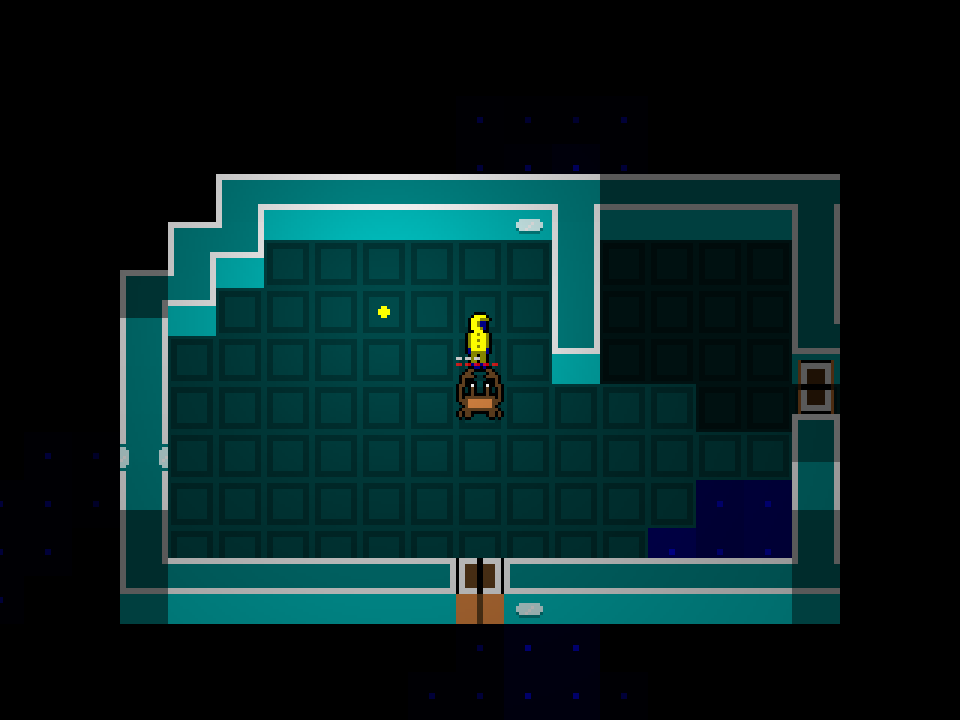
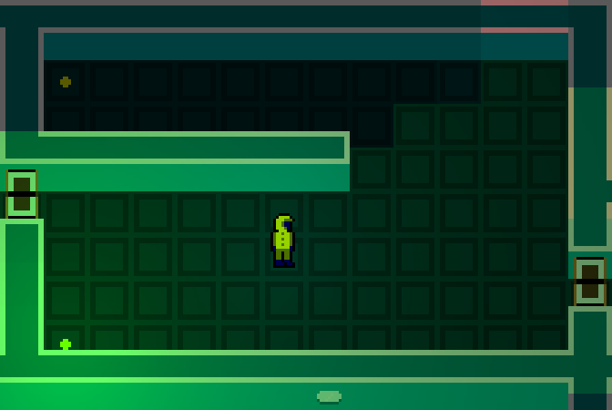
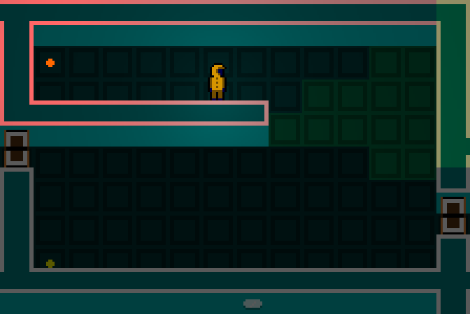

+++
title = "Another Roguelike Lighting Demo"
date = 2017-12-10T17:37:00+10:00
path = "another-roguelike-lighting-demo"

[taxonomies]
tags = ["gamedev", "roguelikes", "lighting", "project"]
+++

In keeping with my habit of making game engines rather than entire games, here's
a demo that was originally meant to be a game, but I got sidetracked by making
it pretty and lost momentum.
[This has happened before.](@/blog/post-mortem-of-abandoned-game/index.md) It's just another
step on the path to enlightenment. This post describes some of the new things I
tried.

<!-- more -->

View the [source on github](https://github.com/gridbugs/lighting-experiment).

## Graphics Hardware

I used the crate [gfx](https://github.com/gfx-rs/gfx) to access graphics hardware.
It's a bindless wrapper around several different graphics backends.
I used the opengl backend, which means I could write shaders in the opengl
shader language.

### Instanced Rendering

The renderer keeps a single rectangle in the vertex/index buffers.
Each entity in the game has an entry in an "instance buffer", which
stores information relevant for drawing that object (e.g. position, size, sprite
sheet index, depth). The graphics hardware renders the geometry in the
vertex/index buffers once for each entry in the index buffer.
In grid-based games, and many 2D games in general, instanced rendering makes it
convenient to update the rendering properties of a game entity, as all that
needs to be updated is an entry in the index buffer.

## Dynamic Lighting

I've experimented with 
[dynamic lighting in roguelikes](@/blog/roguelike-lighting-demo/index.md) before.
What's new here is the lighting is implemented in a shader, and the effect is
applied to individual pixels rather than cells. I use
[recursive shadowcast](@/blog/visible-area-detection-recursive-shadowcast/index.md),
to do visible/lit area detection. My recursive shadowcast implementation writes
its results directly into video memory, so the shaders can use this information
to know which cells need to be lit in which way.

I extended recursive shadowcast to mark the edges and corners of cells as
visible. This is
necessary as walls can be lit by different lights from different sides, but it
only makes sense to show the player the effects of lights illuminating the sides
they can see. This is demonstrated in the above/below images.

## Real Time Game Loop

The roguelike engines I've made in the past have blocked waiting for input when
it was the player's turn. This is more efficient than a polling game loop, but
it makes it cumbersome to implement real-time effects like animation. I'm
experimenting with a polling game loop, which makes it easy to do real time
animations.

{{ video_player_mp4_autoplay_loop(src="gameplay.mp4") }}

## What's Next

In an attempt to actually finish a game, I'm applying some restrictions to my
next project:

### Terminal UI

At least at first. I really enjoy writing shaders and designing renderers. So
much so that when given the option, I tend to focus too much on that, and not
enough on making something actually fun and complete. To prevent this, I'm going
to resrict myself to making a game that runs in a terminal.
If I can complete a game that
I think is fun and worth pursuing further, then I'll consider adding graphics.

I've been working on
a [rust library for making terminal UIs](https://crates.io/crates/prototty). (Yes I know
there are already many of these!). My goal is to make it as cheap as possible to
make a game idea playable. A concern I have with graphics, is if I implement a
game idea, spending time and effort to make the graphics nice from the start, if
the idea turns out not to be fun, I'll have a hard time deciding to throw it
out and try something else, since I will have already invested so much effort.
This may cause me to continue working on bad ideas that I should have abandoned
earlier.

### Only 4 Buttons

To ~~prevent~~ reduce feature creep, I'm forcing myself to design a game that
has only four inputs. It's turned out thus far to be an interesting design
challenge, and I'm looking forward to implementing and play-testing some of my
ideas.
