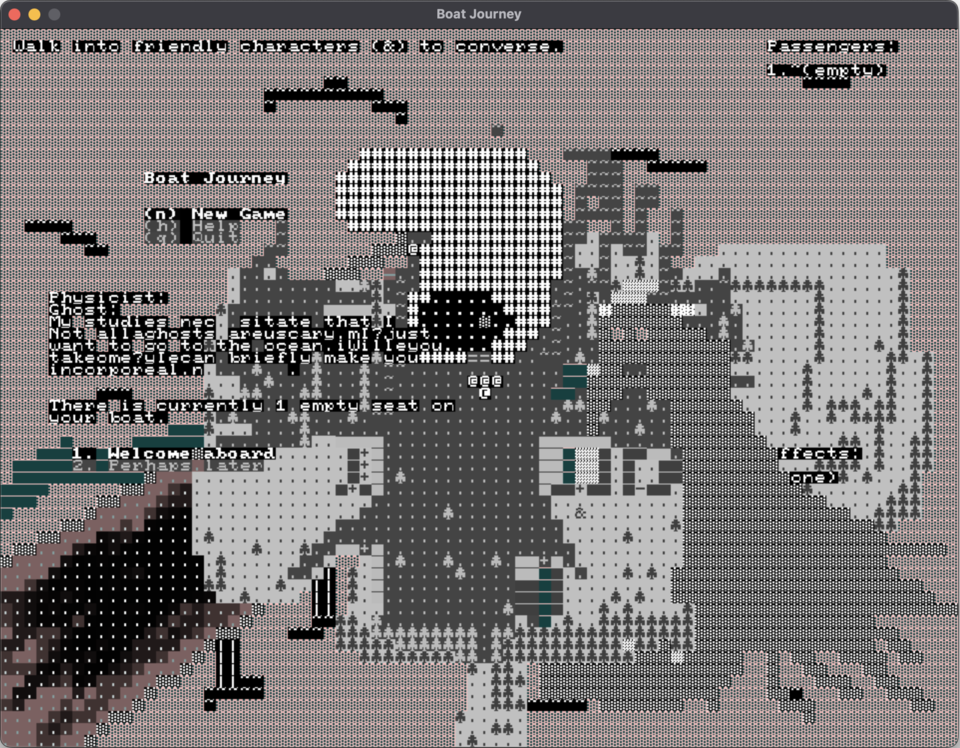

+++
title = "Chargrid SDL Frontend"
date = 2023-03-16
path = "chargrid-sdl-frontend"

[taxonomies]
tags = ["gamedev", "roguelikes"]

[extra]
og_image = "cursed.png"
+++

One problem with using the rust programming language for game development is the
notoriously slow compile times. For my recent 7DRL project
[Boat Journey](@/projects/boat-journey/index.md) an incremental debug build takes about 6
seconds on my main development machine. This is frustratingly slow when making
many minor gameplay tweaks during playtesting.

<!-- more -->

Most of that time appears to be spent linking the binary rather than building
individual libraries as the way I've structured the project means that only 3 or
4 libraries need to be recompiled after changing gameplay logic. The graphical
version of Boat Journey has 307 dependencies when built on linux (at the time of
writing). The number of dependencies varies across systems due to different
libraries being used to get access to low-level system and graphics APIs.
More than half of Boat Journey's dependencies are
transitive dependencies of a single crate
[wgpu](https://crates.io/crates/wgpu) which is the graphics library it uses for
rendering.

I had an hypothesis that the slow link times were due to the large number of
dependencies so I hacked together a SDL version of my
[chargrid](https://crates.io/crates/chargrid) library that sits between the game
and IO (including rendering). SDL is a cross-platform media library with APIs
for rendering, input handling, and audio (among other things). Unlike wgpu which
is written mostly in rust, SDL's rust library is just bindings to a shared
library that must be installed separately, so there are fewer dependencies
and less code to compile. When I build Boat Journey on top of the SDL
version of chargrid it has only 147 dependencies on linux and incremental
debug builds are down to about 2 seconds.

Because SDL depends on shared libraries, SDL builds of Boat Journey are harder
to distribute than wgpu builds. Users would either have to install SDL
themselves, or I would have to bundle SDL's libraries into the game's
distribution. Also there are some problems anti-aliasing text in SDL that means
the text doesn't look as good as in wgpu for certain font sizes. For these
reasons I won't be releasing any games made with the SDL version of chargrid,
but I'll probably be using it for most of the testing I do prior to the release
of a game thanks to its relatively fast compile times.

This screenshot shows Boat Journey running on SDL when I accidentally swapped
some colour channels around during testing, and before I got it to clear the
canvas between each frame.

