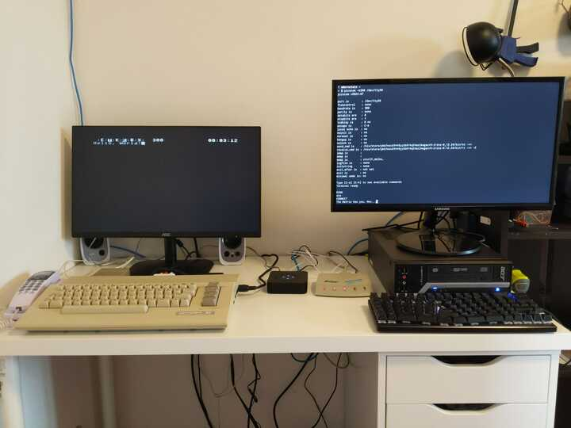
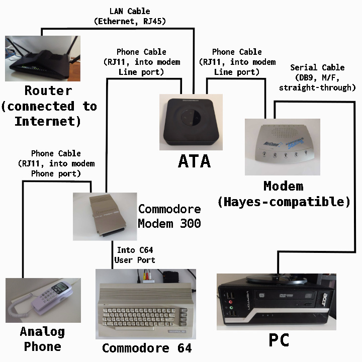
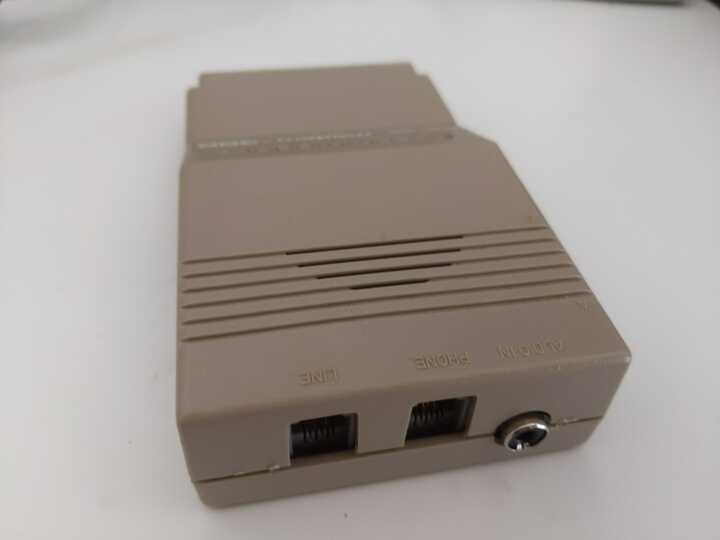
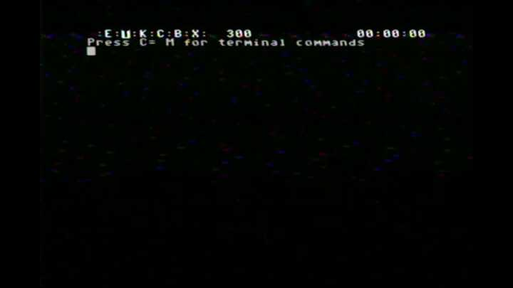

+++
title = "Dial-Up over VoIP with a Commodore Modem from 1985"
date = 2026-02-20
path = "dial-up-over-voip-with-a-commodore-modem-from-1985"
description = "Guide for setting up a point-to-point dial-up network between a pair of computers using old-fashioned modems connected over VoIP lines"

[taxonomies]
tags = ["retrocomputing"]

[extra]
og_image = "setup.jpg"
+++

I connected a pair of computers with a 300 bits/s point-to-point dial-up
network through a pair of Voice-over-IP (VoIP) phone lines. This type of
networking predates commercial dial-up internet, and required users to directly
call the specific online service they wished to connect to, such as CompuServe
or a bulletin board system. Nowadays there's little practical benefit to
dial-up networking. It's also become more difficult over time because telcos
have started digitizing landlines employing codecs and audio filtering
optimized for voice that can interfere with the tones that dial-up modems use
to communicate. VoIP phone lines have been known to suffer from similar issues,
but at least give users some amount of control over how the signal is digitized.

Despite this I thought it would be really cool to connect my Commodore 64 to
some dial-up BBSes. But then I realized that there aren't any left in Australia
as far as I can tell. So then I thought it would be even cooler to run my own.
I'm not at that point yet, but getting two computers to communicate with each
other at all was very involved so I'm documenting what I've found out so far
before going further. Two months ago I'd never heard of an ATA or
Hayes-compatible modem so telephony-wise I was really starting from scratch. This
post is aimed at me two months ago and anyone else curious about going online
like it's 1985 but aren't sure how to start.

Here's my setup:

On the left is a Commodore 64 with a Commodore 300 Modem attached.
On the right is a regular PC running Linux. In between, the beige box
is a dial-up modem connected to the PC's serial port, and the black
box is an analog telephone adapter (ATA) which converts analog telephone
signals to VoIP. Both modems are attached to the ATA with phone cables.

And here's a diagram showing all the devices involved and how they're connected to each other.

I can call the PC's modem from the Commodore, and once connected, when I type
on the Commodore the text appears on the PC's terminal, and typing in the PC's
causes the text to appear on the Commodore.

## Analog Telephone Adapter (ATA)

An ATA is a device which converts analog phone signals to VoIP.
I'm using a Grandstream HT802 v2 as my ATA which has two telephone ports
allowing me to plug in both modems. I made an account with a VoIP provider
(Crazytel), set up two SIPs, each with their own associated phone number, and
then registered one SIP for each port of the ATA via its web interface.

Dial-up networking over VoIP requires as raw a signal as possible being sent between the modems.
Make sure the first choice of codec is PCMU, also known as G.711, which is the highest quality
codec available on most ATAs. Also make sure any echo or silence suppression provided by the ATA
is disabled. Enable jitter buffering (it's probably enabled by default). I found it's most reliable
to use the maximum amount of jitter buffering available on the ATA.

Test the ATA setup by making calls between each VoIP phone number and your mobile phone by plugging
an analog phone into each port on the ATA.

## PC and dial-up modem

My modem is a NetComm Roadster II 56 Ultra SVD. There's not much information about it online and I
wasn't able to dig up a manual, but there are some photos [here](https://wiki.preterhuman.net/NetComm_Roadster_II_56_Ultra_SVD) and it's also mentioned [here](https://goughlui.com/2012/11/27/tech-flashback-other-external-modems-in-my-collection/).

Here it is. The lights on the front are labeled: Power, Terminal Ready, Off Hook, Carrier Detect, Data.

Here's the back. The "Data" port is how it connects to the PC.

You'll need a DB9 male to female serial cable like this one to connect it to a PC:

I was lucky enough to find a computer under a bridge which is old enough to still have a
DB9 port but new enough to run a modern OS. Most computers from the past decade or so don't have this port
but it should be easy to find a USB to DB9 adapter.

To interact with the modem from the PC you'll need terminal software that can send and receive data
over a serial port. On Linux I usually use `picocom`. Once everything is connected and powered on, run
`picocom /dev/ttyS0` from a terminal. Typing in a picocom session sends characters over the serial connection.
Eventually we'll use this to send characters all the way to the Commodore 64 via the dial-up network, but
for now the characters will be interpreted by the modem, which implements the
[Hayes AT command set](https://en.wikipedia.org/wiki/Hayes_AT_command_set).
These are commands for configuring a modem or performing actions such as
dialing a number or answering a call.

To test that the modem is working, try typing `AT` (then hit enter), to which the modem should reply with `OK`.
Test that the modem can receive calls by connecting it to one of the ATA's phone ports with a phone cable
and then calling number associated with that port (with your mobile phone).
When I do this the modem sends the word `RING` over the serial connection. The
command to answer a call is `ATA` (it's a coincidence that this is the name for
the device for connecting analog devices to VoIP). The modem will probably send
some beeps over the phone connection then give up when it doesn't receive a
carrier signal. The command to end a call is `ATH`. It's not directly relevant to this setup,
but you can also dial a number from the modem with the command `ATDT` followed by the number.

## Commodore 64 and Commodore Modem 300

Here's my Commodore 64:

I'm using a [SD2IEC](https://www.c64-wiki.com/wiki/SD2IEC) device (the black
box at the top right) to run programs from an SD card.

The Commodore Modem plugs into the Commodore 64's user port. Here's the modem:

This modem doesn't have built-in support for generating the touch tones to dial a number.
Instead, there's an "Audio In" jack on the back which you can play touch tones into.
The intended usage was to connect the audio signal coming out of the Commodore 64 itself
to this jack and then use the Commodore 64's sound chip to generate touch tones.
The terminal software I'm using on the Commodore doesn't have support for generating these tones
however. One approach which works is to generate the tones from another device like a laptop or phone.
There's lots of software out there for generating DTMF touch tones! Another approach is to use
an analog phone to initialize the call and then hand the call over to the modem once the phone starts ringing.

The modem has a built-in speaker which lets you hear the dial tone and other phone noises to understand
what state the line is in. Unfortunately it's really loud and of poor quality, and there's no way to turn
it down or off. After a day of this I decided to make some modifications and added this headphone jack
to the side, and now I can plug in a speaker with a volume knob. The audio
quality was also dramatically improved. This headphone jack also makes it possible to record the raw
audio signal received by the modem, which wasn't possible before.

The terminal program I'm using on the Commodore is [Novaterm](https://www.c64-wiki.com/wiki/Novaterm)
which I'm loading off an SD card with the SD2IEC device.
Here's the main menu:

The configuration to make Novaterm work with the Commodore modem is below.
On the first configuration page, the `Modem type` must be set to `1660`.

On the second configuration page, the `Serial driver` must be `User port`.
Also enable `Print in ASCII` since the Linux side of the connection will assume text is ASCII-encoded.

Once Novaterm is configured you can save the configuration to the SD card, then
enter the terminal by selecting `Terminal mode` from the main menu.

