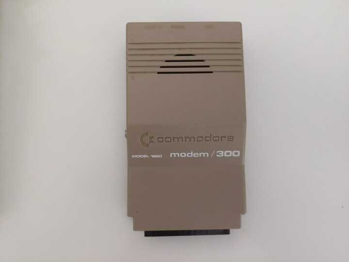
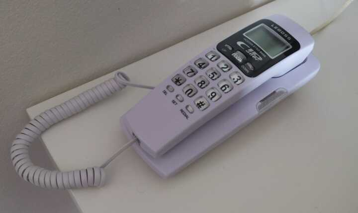

+++
title = "Dial-Up over VoIP with a Commodore Modem from 1985"
date = 2026-02-20
path = "dial-up-over-voip-with-a-commodore-modem-from-1985"
description = "Guide for setting up a point-to-point dial-up network between a pair of computers using old-fashioned modems connected over VoIP lines"
[taxonomies]
tags = ["retrocomputing"]
+++

I connected a pair of computers with a 300 bits/s point-to-point dial-up
network through a pair of Voice-over-IP (VoIP) phone lines. This type of
networking predates commercial dial-up internet, and required users to directly
call the specific online service they wished to connect to, such as CompuServe
or a bulletin board system. Nowadays there's little practical benefit to
dial-up networking. It's also become more difficult over time because telcos
have started digitizing landlines employing codecs and audio filtering
optimized for voice that can interfere with the tones that dial-up modems use
to communicate. VoIP phone lines have been known to suffer from similar issues,
but at least give users some amount of control over the digitization process.

Despite this I thought it would be really cool to connect my Commodore 64 to
some dial-up BBSes. But then I realized that there aren't any left in Australia
as far as I can tell. So then I thought it would be even cooler to run my own.
I'm not at that point yet, but getting two computers to communicate with each
other at all was very involved so I'm documenting what I've found out so far
before going further. Two months ago I'd never heard of an ATA or
Hayes-compatible modem so telephony-wise I was really starting from scratch. This
post is aimed at me two months ago and anyone else curious about going online
like it's 1985 but aren't sure how to start.

