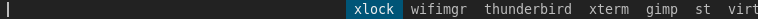
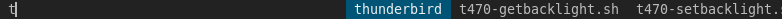

+++
title = "dmenu_histogram"
date = 2020-11-29
path = "dmenu_histogram"

[taxonomies]
tags = ["unix"]
+++

Of all the programs I've written, perhaps the one that has most directly benefited me is
[this little bash script in my dotfiles repo](https://github.com/gridbugs/dotfiles/blob/master/bin/dmenu_histogram)
which runs the application launcher [dmenu](https://tools.suckless.org/dmenu/) showing the most-frequently-used
programs first.

The typical way to run dmenu is to pipe the output of `dmenu_path` into `dmenu`.
Both commands come in the `dmenu` package. The former simply prints a list of all programs
in the user's path:
```
$ dmenu_path
[
2to3-2.7
2to3-3.7
aafire
aainfo
aalib-config
aasavefont
aatest
ac
accton
...
```
<!-- more -->

The `dmenu` program reads a list of strings from its standard input and presents a graphical list.
The user selects a single item from the list, and dmenu prints the selection to its standard output.

For example:
```
$ echo -e 'hello\nworld'
hello
world
$ echo -e 'hello\nworld' | dmenu
```
The second command displays this GUI at the top of the screen:


Use the arrow keys to change the selection or start typing a name to narrow down the list:


Hit enter and dmenu exits after printing `world` to its standard output.

To use it as a program launcher, the dmenu package comes with a third program - a shell script
`dmenu_run` which combines the above two programs. Here's its source:
```sh
#!/bin/sh
dmenu_path | dmenu "$@" | ${SHELL:-"/bin/sh"} &
```

As an aside, dmenu is a perfect example of a tool which does one thing well, and adds value
to an existing set of tools by being easily composable.

Here's the list I see when I run it:


And after pressing "t":


Menu items are shown in the order they appeared on `dmenu`'s stdin, and `dmenu_path` prints
all program's in the user's `$PATH` in alphabetical order. The problem with this is there
are only a tiny handful of graphical programs that I ever want to launch with dmenu, and
it's unlikely that they will appear early in the alphabetically-listed program names.
`dmenu_histogram` addresses this by maintaining a histogram of launched programs and placing
these programs in order of frequency on `dmenu`'s stdin before the output of `dmenu_path`.

Running the `dmenu_histogram` script:



...shows a list of programs I commonly use. If I press "t"...



...the list narrows to just the programs starting with "t", and still shows the most
frequent programs first.

To be perfectly clear, I did not develop dmenu. I wrote myself a bash script that invokes
`dmenu` on the output of `dmenu_path` augmented with a list of common programs ordered by
frequency of use, and _updates_ a histogram (in a text file) counting the number of times each program is
launched to build a more accurate list for the next invocation.

The histogram it maintains looks like this on my system at the time of writing:
```
8 xterm
1 xfontsel
2 uxterm
6 st
1 vimdot
7 gimp
15 wifimgr
11 thunderbird
4 pavucontrol
1 mtpaint
2 surf
195 xlock
2 xeyes
5 virtualbox
1 dmenu
```
