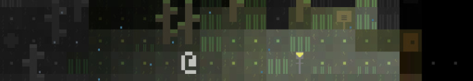
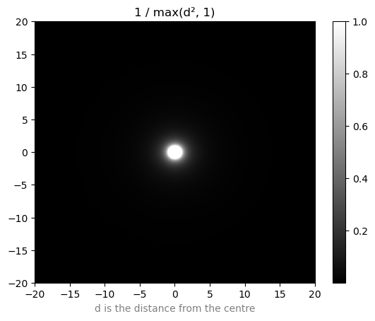
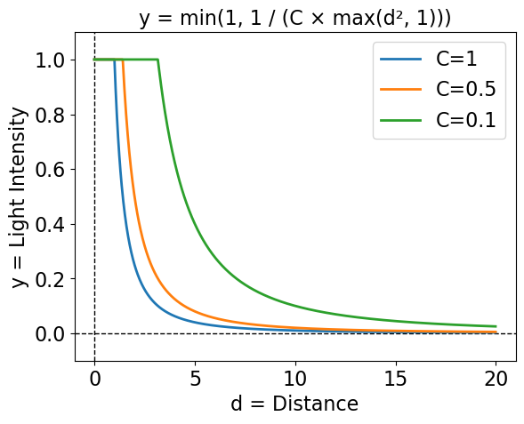
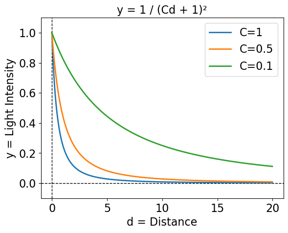
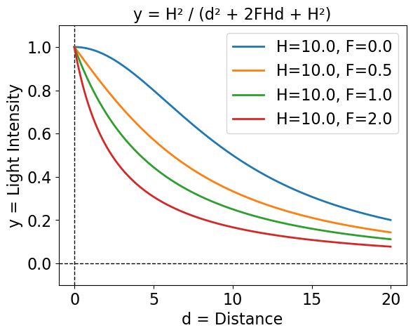
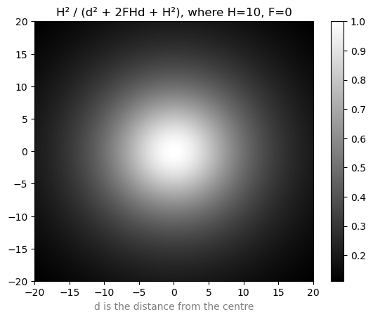
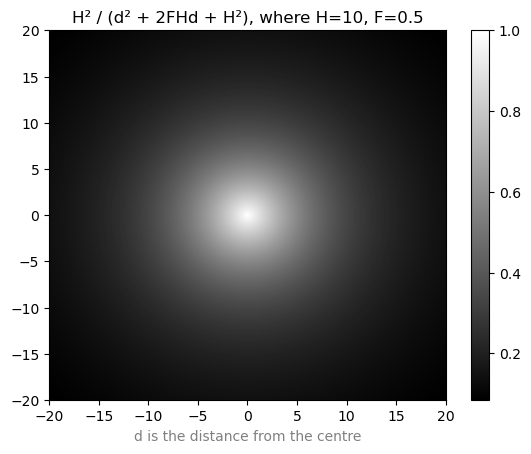
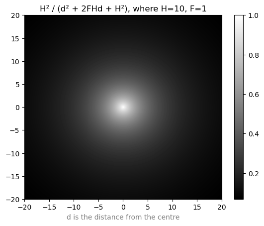

+++
title = "Every Game I Made Since 2019 had a Lighting Bug"
date = 2024-11-07
path = "every-game-i-made-since-2019-had-a-lighting-bug"
description = "I've used the same game engine for all the roguelikes I've made since 2019 and I found out this year that they are all affected by a bug in the way lighting is calculated. This post describes the bug, the fix, and shows the effect fixing the bug had on all the affected games."

[taxonomies]
tags = ["gamedev", "lighting", "roguelikes"]

[extra]
og_image = "og_image.png"

+++

I've used the same game engine for all the roguelikes I've made since 2019 and I
found out this year that they are all affected by a bug in the way lighting is
calculated. This post describes the bug, the fix, and shows the effect fixing the
bug had on all the affected games.

- [The bug](#the-bug)
- [Fixing all my games (with side-by-side comparisons)](#fixing-all-my-games)
  - [Rip](#rip)
  - [slime99](#slime99)
  - [Orbital Decay](#orbital-decay)
  - [Rain Forest](#rain-forest)
  - [Electric Organ](#electric-organ)
  - [Small Wolf](#small-wolf)

In late 2019 I returned to Australia after living abroad for two years and had
a few months to myself before starting my next job. I spent some of this
time consolidating my roguelike development side projects into a collection of Rust
libraries and a template that comprises the ad-hoc game engine that I've
been using ever since. These include libraries for path-finding, rendering grids
of text with WebGPU, a real-time particle system, a database for organizing
entities, and a lighting system which is the subject of this post.

There are two tasks the lighting system needs to do. The first is to determine
which parts of the map are illuminated by each light. This is the same problem
as detecting which parts of the map the player can see and is solved by a
library I made called [shadowcast](https://github.com/gridbugs/shadowcast).
This library knows how to compute which parts of the map are visible, and which
parts of the map are lit by each light, and combine this information to
determine what the player should see.

For example this screenshot shows a player (the @-sign) standing in a room lit with white
light, and to their south there is a doorway leading into a room lit with red
light. Note the wall to the player's right is illuminated with white light, as the
player can see the side of the wall facing the white light but not the side of
the wall facing the red light.

Now look what happens when the player walks through the door into the room lit
with red light:

That same piece of wall now appears as red, because the side of the wall visible
to the player is now illuminated by red light. It's the same wall, and as far as
game logic is concerned it's just a row of wall tiles, but the lighting system
takes edges and corners of walls into account so tiles are rendered in colours
according to the colours of only the lights that illuminate the parts of walls
that the player can see.

This library is rock solid and I haven't had to think about it in years; it's so
reliable that I've started taking it for granted. It's
not the source of today's bug. I just wanted to show off a bit.

The second task performed by the lighting system is determining the intensity of
the light at each point of the map. Notice in the images above that there are
parts of the map that are well-lit, and others that appear in shadow. The lights
themselves aren't visible in those images, but the further a point is from a
light source, the dimmer the effect of the light will be at that point. The
relationship between brightness and distance is some fairly simple arithmetic -
much much simpler than computing the lit area of the map - but I got the maths
wrong and didn't notice for almost five years!

Well I did suspect something was wrong with it a couple of times. The brightness
of the lights seemed to drop off with distance in an unnatural-looking way. Too
slowly up to a point and then too quickly. I checked and double checked the
maths and managed to convince myself that it was correct, and then I'd just
compensate for it by messing with the brightness of the lights in whatever game
I was working on. Pretty much all the roguelike development I've done over the
past five years has been in a game jam setting and I was always too busy with
the jam to properly investigate. That is until this year's 7DRL when I finally
relented and sat down with a pen and paper to conclude once and for all that
the maths was wrong and had been wrong this whole time, and when I fixed it my
game went from looking like this:

To this:

Obviously it's not a fair comparison because most of the aesthetic decisions
about the game were made after fixing this bug. But getting the lighting right
was crucial to the visuals I was trying to create, with
lots of dark places and flickering fire light and it's important that the
dynamic changes to the lighting were accurately reflected in the environment.

So now that the bug is fixed I thought it might be interesting to dig through
the history of how this code was written and to try to understand why I
implemented such a simple piece of arithmetic incorrectly, and how to fix it.
I'll also backport the fix to all the games I've made since 2019 that suffer
from this bug and share some before and after pics.

## The bug

The intensity of a light at a point is proportional to the inverse of the
square of the distance from the light source to that point. This is known as
the [Inverse-square law](https://en.wikipedia.org/wiki/Inverse-square_law). The easiest way to
implement diminishing lighting is to multiply the red, green and blue components
of the light's colour by `1 / distance²`.

The first issue with this is that the function is not defined at a distance of
0. Since this lighting system is for games rendered as a grid of tiles, the
shortest possible distance between a light's tile and any other tile is 1. Thus
my original solution was to limit the distance to the light to 1 in lighting
calculations.

Now that this function is defined at all distances we can visualize it by
plotting the function on a heatmap:

On the heatmap there's a solid circle with radius 1 corresponding to the flat
part of the function below a distance of 1, and then the brightness quickly
drops off approaching 0 as the distance increases.

I wanted a way of slowing down the rate with which the light diminishes so that
it spreads out over a larger area so I added a parameter `C` which can be used
to tune the light diminishing rate, effectively stretching out the
curve horizontally.

And this was the bug. I didn't account for the fact that stretching out the
curve horizontally would also stretch it _vertically_. Assuming the colour of
the light is white, this will effectively clip the curve at y=1, causing
saturation:

Visualizing with a heatmap, this has the effect of creating a large bright spot
in the saturated region which then quickly drops off outside that region which
matches the original symptom of the bug.

My first thought for how to fix this would be stop flattening the curve below a
distance of 1, but instead ensure that the function is defined at a distance of
0 by _shifting_ the entire curve to the left such that it has a value of 1 at a
distance of 0.

I switched to the formula `1 / (Cd² + 1)`. Like before, `C` can be used to
control how quickly the light diminishes. I didn't realize at the time that I
made this change (remember I was mid game jam!) but this function changes the
shape of the curve to be less steep around a distance of 0 as is clear in the
following plot.

Here's the new heatmap:

I didn't find out until revisiting the lighting maths while writing this post,
but the shape of these curves is actually physically accurate, and I had stumbled
upon the formula for the intensity of the light on the ground a horizontal
distance from a light, at a fixed height. The `C` parameter controls the height
of the light, with `C = 1/height²`.

To demonstrate imagine we have a light `H` distance above the ground, and we're
interested in finding the light intensity at a point `p` with a horizontal
distance of `d` from the light.

The line from `p` to the light is the hypotenuse of a right triangle, so the
distance from `p` to the light is `sqrt(d² + H²)`. Now according to the 
Inverse-square law, the intensity of the light at `p` is proportional to `1/sqrt(d² + H²)² = 1/(d² + H²)`.
When `d=0`, this will have the value of `1/H²` (the distance is just the height
of the light above the ground). To match the rest of the post I'd rather the
intensity be 1 at `d=0` so multiply the formula by `H²` to get `H²/(d² + H²)`.
Now divide the top and bottom of this fraction by `H²` to get `1/(d²/H² + 1)`
which is the same as `1/(Cd² + 1)` where `C = 1/H²`.

The formula above was good enough for the game jam, but while working on this
post I wanted to take things a step further. My solution so far is physically accurate
for lights a given distance above the ground that shine uniformly in all
directions, but sometimes the effect of these lights on the ground looks too
unfocused. Occasionally I want a sharp point of light that radiates out in all
directions, diminishing at a configurable rate. `1/d²` has the shape I want
but it's not defined at 0, however `1/(d + 1)²` has the same shape but is
shifted to the left such that it has the value 1 at `d=0`. To control the rate of
diminishing, multiply `d` by a constant parameter `C` as before:

The heatmap shows a much more focused point of light compared to the previous
formula:

The final step is to combine the two different lighting formulae into a single
formula and add a second parameter for interpolating between them.

Recall that the unfocused lighting formula is `1/(d²/H² + 1)` and the focused
formula is `1/(Cd + 1)²`. Start with the denominator of the focused formula: `(Cd + 1)²,`.
This is equivalent to `C²d² + 2Cd + 1`, so the focused formula becomes `1/(C²d² + 2Cd + 1)`.
Now if we replace the constant `C` with the constant expression `1/H`, the
second formula becomes `1/(d²/H² + 2d/H + 1)` which is very similar to the
unfocused lighting formula. The only difference is the `2d/H` term in the
denominator. We can introduce a new parameter `F` (for "focus") and multiply it
by that term, and then we'll be able to smoothly interpolate between the
unfocused and focused lighting formulae by changing `F` between 0 and 1.
The formula becomes `1/(d²/H² + 2Fd/H + 1)`, which can be made more readable by
multiplying the top and bottom by `H²` to get `H²/(d² + 2FHd + H²)`.

So now we can use a single formula to represent both focused and unfocused
lights, as well as everything in between.

Here's a heatmap of a totally unfocused light:

Here's a heatmap of a partially focused light:

And here's a heatmap of a focused light:

## Fixing all my games

### Rip

Rip was the project I was working on when I implemented the lighting system and
most of the rest of my roguelike game engine. It wasn't really a game, just a
collection of demos of different engine components such as the particle system
used to implement the explosions in the videos below. The video on the right has
the lighting bug corrected. The lighting is softer and there's more of a
gradient.

{{ video_player_mp4_autoplay_loop(src="rip-old-lighting.mp4") }}
{{ video_player_mp4_autoplay_loop(src="rip-new-lighting.mp4") }}

### slime99

[slime99](@/projects/slime99/index.md) was my 7DRL entry in 2020.
The game has lots of glowing green acid pools whose brightness
dynamically changes in realtime but the effect was kind of lost until this
lighting bug was fixed.

{{ video_player_mp4_autoplay_loop(src="slime99-old-lighting.mp4") }}
{{ video_player_mp4_autoplay_loop(src="slime99-new-lighting.mp4") }}

### Orbital Decay

[Orbital Decay](@/projects/orbital-decay/index.md) was my 7DRL entry in 2021.
This game didn't
do as much with lighting as the previous game but fixing the bug caused the
lighting gradients to become more apparent.

{{ video_player_mp4_autoplay_loop(src="orbital-decay-old-lighting.mp4") }}
{{ video_player_mp4_autoplay_loop(src="orbital-decay-new-lighting.mp4") }}

### Rain Forest

[Rain Forest](@/projects/rain-forest/index.md) was my 7DRL entry in 2022.
This game didn't have a lot of gameplay and was more of an exercise in using
visuals to set the mood than an actual game. Still it's very pretty and fixing
the lighting makes it even prettier, softening up the edges on the pools of
light.

{{ video_player_mp4_autoplay_loop(src="rainforest1-old-lighting.mp4") }}
{{ video_player_mp4_autoplay_loop(src="rainforest1-new-lighting.mp4") }}

Here's another comparison from Rain Forest. After fixing the lighting the door
of the cabin now casts a shadow, where its shadow was washed out by the
over-saturated lights in the original version.

{{ video_player_mp4_autoplay_loop(src="rainforest2-old-lighting.mp4") }}
{{ video_player_mp4_autoplay_loop(src="rainforest2-new-lighting.mp4") }}

(We skipped 2023 as that year's game doesn't use the lighting system.)

### Electric Organ

[Electric Organ](@/projects/electric-organ/index.md) was my 7DRL in 2024.
I fixed the lighting bug while working on it, so it didn't actually have this
bug. I re-introduced the bug for the purposes of comparison, but the effect is
very subtle. The corrected version is slightly darker and the lighting gradients
are more apparent. For the games made before the bug was fixed, the lights were
configured to be darker than the lights in this game to compensate for the lighting bug
which caused the lights to be oversaturated near the light source. Electric
Organ didn't need to compensate in this way. Its lights are naturally
brighter, so the effect of re-introducing the bug is less pronounced.

{{ video_player_mp4_autoplay_loop(src="electric-organ-old-lighting.mp4") }}
{{ video_player_mp4_autoplay_loop(src="electric-organ-new-lighting.mp4") }}

### Small Wolf

This bug also appears in another [small
project](https://github.com/gridbugs/small-wolf/) I did a few years ago where I
recreated a simple version of the Wolfenstein 3D render in javascript.
Originally the brightness of the walls would get saturated at the max and min
brightness causing the gradients to be lost, ruining the 3D effect. I fixed that
while I was at it and it now looks much better.

{{ video_player_mp4_autoplay_loop(src="small-wolf-old-lighting.mp4") }}
{{ video_player_mp4_autoplay_loop(src="small-wolf-new-lighting.mp4") }}

## Conclusion

I'm not going to re-release any of the fixed games. This is partly because they
were playtested on the buggy lighting system and fixing it may cause some parts
of the games to be too dark or not look the way I originally intended. Also in
making this post I found that the graphical and web versions of the older games
(especially Rip and slime99) had bitrotted quite badly. The Rust libraries for
rendering with WebGPU and for working with WebAssembly were in a very
experimental state back in 2019, and even with lockfiles it's
non-trivial to get some Rust libraries from over 5 years ago to play nice with the current
versions of drivers and system libraries, at least on Linux. I got them running
on MacOS though, and all the relevant git repos now have a `lighting-fix` branch
so curious and determined folks can try them out.
