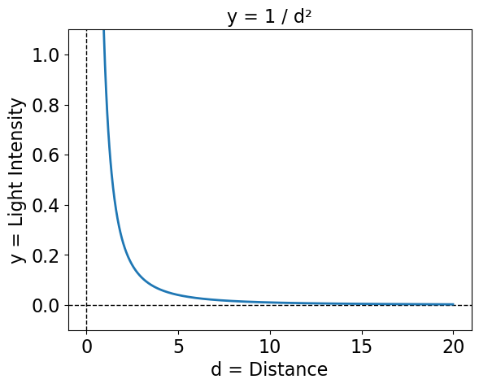
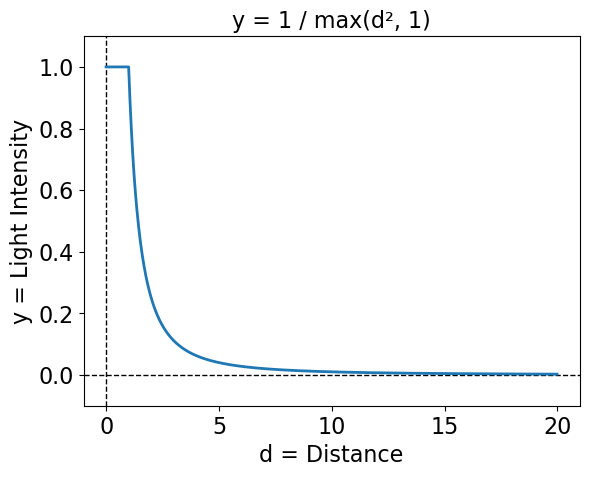
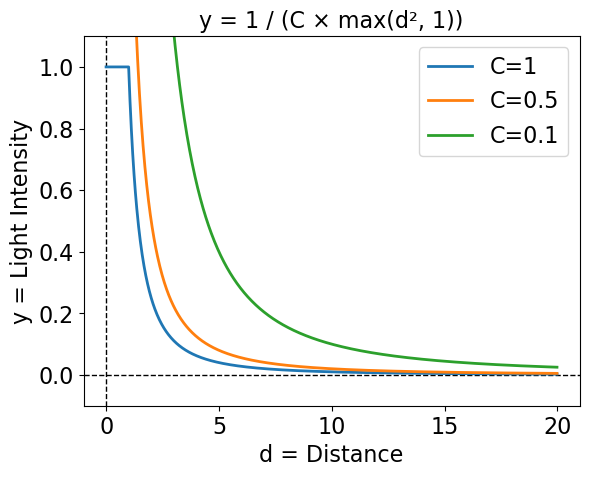
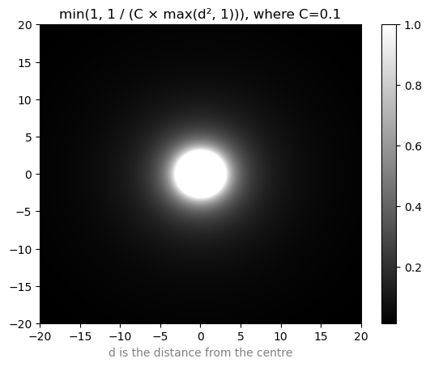

+++
title = "Fixing a Five Year Old Lighting Bug in my Game Engine"
date = 2024-11-04
path = "fixing-a-five-year-old-lighting-bug-in-my-game-engine"
draft = true

[taxonomies]
tags = ["gamedev", "lighting", "roguelikes"]
+++

In late 2019 I returned to Australia after living abroad for two years and had
a few months to myself before starting my next job. I spent some of this
time consolidating my roguelike development side projects into a collection of Rust
libraries and a template that comprises the ad-hoc game engine that I've
been using ever since. These include libraries for path-finding, rendering grids
of text with WebGPU, a real-time particle system, a database for organizing
entities, and a lighting system which is the subject of this post.

There are two tasks the lighting system needs to do. The first is to determine
which parts of the map are illuminated by each light. This is the same problem
as detecting which parts of the map the player can see and is solved by a
library I made called [shadowcast](https://github.com/gridbugs/shadowcast).
This library knows how to compute which parts of the map are visible, and which
parts of the map are lit by each light, and combine this information to
determine what the player should see.

For example this screenshot shows a player (the @-sign) standing in a room lit with white
light, and to their south there is a doorway leading into a room lit with red
light. Note the wall to their right is illuminated with white light, as the
player can see the side of the wall facing the white light.

Now look what happens when the player walks through the door into the room lit
with red light:

That same piece of wall now appears as red, because the side of the wall visible
to the player is now illuminated by red light. It's the same wall, and as far as
game logic is concerned it's just a row of wall tiles, but the lighting system
takes edges and corners of walls into account so tiles are rendered in colours
according to the colours of only the lights that illuminate the parts of walls
that the player can see.

This library is rock solid and I haven't had to think about it in years; it's so
reliable that I've started taking it for granted. It's
not the source of today's bug. I just wanted to show off a bit.

The second task performed by the lighting system is determining the intensity of
the light at each point of the map. Notice in the images above that there are
parts of the map that are well-lit, and others that appear in shadow. The lights
themselves aren't visible in those images, but the further a point is from a
light source, the dimmer the effect of the light will be at that point. The
relationship between brightness and distance is some fairly simple arithmetic -
much much simpler than computing the lit area of the map - but I got the maths
wrong and didn't notice for almost five years!

Well I did suspect something was wrong with it a couple of times. The brightness
of the lights seemed to drop off with distance in an unnatural-looking way. Too
slowly up to a point and then too quickly. I checked and double checked the
maths and managed to convince myself that it was correct, and then I'd just
compensate for it by messing with the brightness of the lights in whatever game
I was working on. Pretty much all the roguelike development I've done over the
past five years has been in a game jam setting and I was always too busy with
the jam to properly investigate. That is until this year's 7DRL when I finally
relented and sat down with a pen and paper to conclude once and for all that
the maths was wrong and had been wrong this whole time, and when I fixed it my
game went from looking like this:

To this:

Obviously it's not a fair comparison because most of the aesthetic decisions
about the game were made after fixing this bug. But getting the lighting right
was crucial to the visuals I was trying to create, with
lots of dark places and flickering fire light and it's important that the
dynamic changes to the lighting were accurately reflected in the environment.

So now that the bug is fixed I thought it might be interesting to dig through
the history of how this code was written and to try to understand why I
implemented such a simple piece of arithmetic incorrectly, and how to fix it.
I'll also backport the fix to all the games I've made since 2019 that suffer
from this bug and share some before and after pics.

## The Inverse Square Rule

The intensity of a light at a point is proportional to the inverse of the
square of the distance from the light source to that point. The easiest way to
implement diminishing lighting is to multiply the red, green and blue components
of the light colour by `1 / distance²`.

The first issue with this is that the function is not defined at a distance of
0. Since this lighting system is for games rendered as a grid of tiles, the
shortest possible distance between a light's tile and any other tile is 1. Thus
my original solution was to limit the distance to the light to 1 in lighting
calculations.

Now that this function is defined at all distances we can visualize it by
plotting the function on a heatmap:

On the heatmap there's a solid circle with radius 1 corresponding to the flat
part of the function below a distance of 1, and then the brightness quickly
drops off approaching 0 as the distance increases.

I wanted a way of slowing down the rate with which the light diminishes so that
it spreads out over a larger area so I added a parameter `C` which can be used
to tune the rate with which the light diminishes, effectively stretching out the
curve horizontally.

And this was the bug. I didn't account for the fact that stretching out the
curve horizontally would also stretch it _vertically_. Assuming the colour of
the light is white, this will effectively clip the curve at y=1, causing
saturation:

Visualizing with a heatmap, this has the effect of creating a large bright spot
in the saturated region which then quickly drops off outside that region which
matches the original symptom of this bug.

