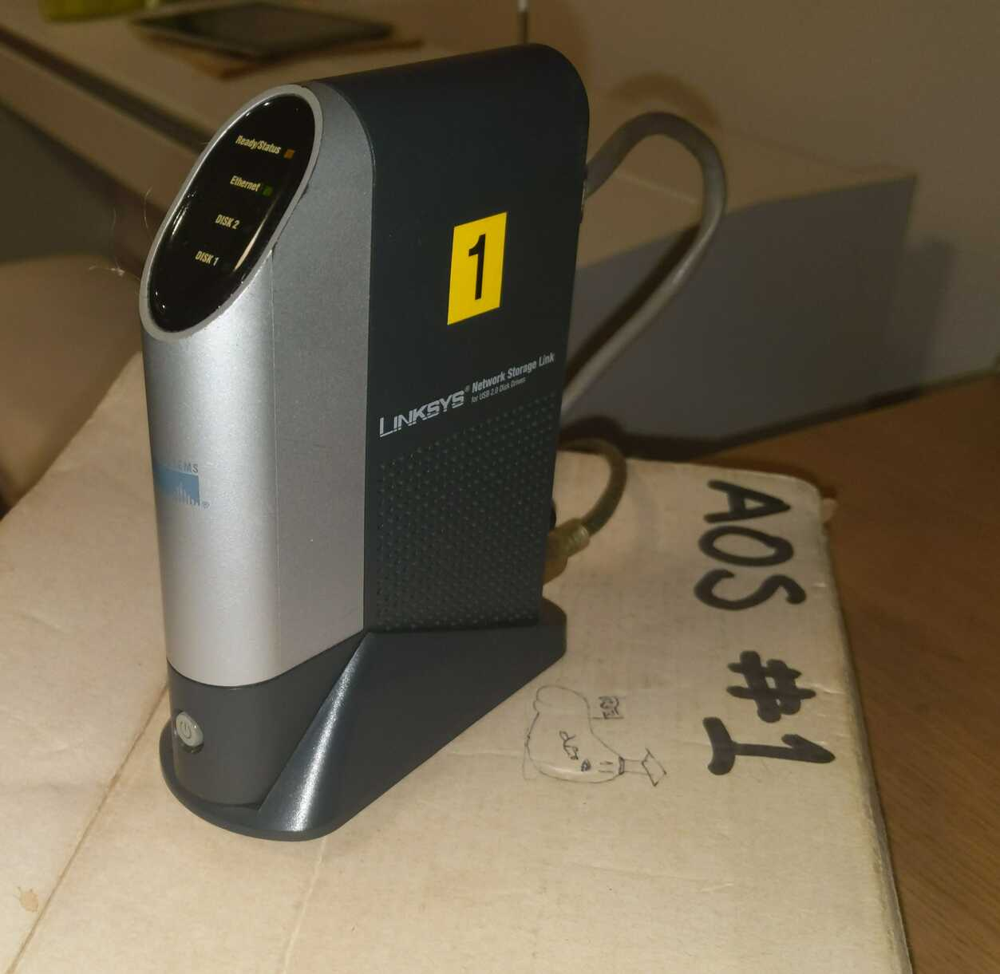
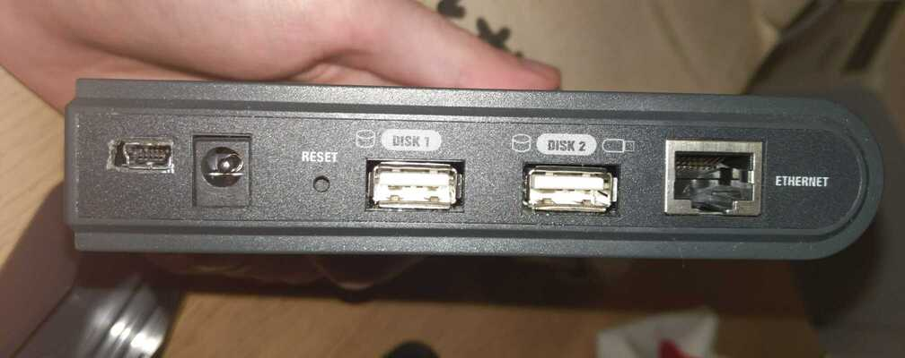

+++
title = "Fixing my Old OS Assignment with Machine Code Hacks"
date = 2025-08-24
path = "fixing-my-old-os-assignment-with-machine-code-hacks"

[taxonomies]
tags = ["osdev"]

[extra]
og_image = "nslu2.jpg"
+++

Back in 2012 I took an Operating Systems course, the main assessment of which
was a 12 week pair assignment implementing a user-level OS personality for the
[seL4 microkernel](https://sel4.systems/). I recently got the urge to boot up
our little OS. I saved the contents of my university computer system home directory
before I graduated so I still had a copy of the code, and
fortunately I didn't `make clean` the last time I worked on it so the bootable
(at least in theory!) disk image is still in the project directory.

Also fortunately my project partner somehow forgot to return the hardware loaned
to them by the university and over the following years it ended up in one of my
(ahem) several boxes of junk that I'll definitely do something with someday.

And for this [Storage Link for USB 2.0 Disk Drives](https://en.wikipedia.org/wiki/NSLU2), a.k.a NSLU2,
affectionately referred to as the Slug, today was that day.



## Powering it On

Plugging it into power and switching it on illuminated the power indicator LED.
There's no screen or input devices, so all interaction will be via an
aftermarket USB serial port. In the image below the USB serial port is the
left-most port which was clearly made by some kind of power tool.



Plugging a USB cable into my computer, and the serial device shows up in the
output of `dmesg`:
```
[138157.363235] usb 1-5: new full-speed USB device number 18 using xhci_hcd
[138157.511474] usb 1-5: New USB device found, idVendor=0403, idProduct=6001, bcdDevice= 6.00
[138157.511481] usb 1-5: New USB device strings: Mfr=1, Product=2, SerialNumber=3
[138157.511483] usb 1-5: Product: USB <-> UNSW-AOS
[138157.511485] usb 1-5: Manufacturer: FTDI
[138157.511487] usb 1-5: SerialNumber: 12345678
[138157.516506] ftdi_sio 1-5:1.0: FTDI USB Serial Device converter detected
[138157.516539] usb 1-5: Detected FT232R
[138157.521742] usb 1-5: FTDI USB Serial Device converter now attached to ttyUSB0
```

Running `picocom` to open a terminal on `/dev/ttyUSB0`:
```
$ picocom /dev/ttyUSB0
picocom v2024-07

port is        : /dev/ttyUSB0
flowcontrol    : none
baudrate is    : 9600
parity is      : none
databits are   : 8
stopbits are   : 1
txdelay is     : 0 ns
escape is      : C-a
local echo is  : no
noinit is      : no
noreset is     : no
hangup is      : no
nolock is      : no
send_cmd is    : /nix/store/cmpvp7nx52dmbjaqkiscgkdzqzaikmaz-lrzsz-0.12.20/bin/sz -vv
receive_cmd is : /nix/store/cmpvp7nx52dmbjaqkiscgkdzqzaikmaz-lrzsz-0.12.20/bin/rz -vv -E
imap is        :
omap is        :
emap is        : crcrlf,delbs,
logfile is     : none
initstring     : none
exit_after is  : not set
exit is        : no
minimal cmds is: no

Type [C-a] [C-h] to see available commands
Terminal ready
```
...but there was no output.

I couldn't remember the process we used to load our OS project onto the slug. I
was hoping that it would already be loaded on there, and powering it on would
print something to the terminal, but no luck there.

On a whim I searched my entire old uni home directory for "ttyUSB0" since
I assumed the project would be transferred over the serial port and thus I would
have some script that referenced the name of the serial device. This assumption
would later turn out to be false but I did find something helpful in my search:
```
$ grep -rni 'ttyUSB0'
nslu2-util/nslu2.c:67:  char defport[] = "/dev/ttyUSB0";
```

The `nslu2-util` program is a tiny command-line utility for start, stopping, and
resetting the slug. There was a `Makefile` and running `make` gave me a `nslu2`
executable:
```
$ ./nslu2 -h
Usage: nslu2 <-p port> up|down|reset
```

So I ran `./nslu2 reset` and this caused something to appear on my `picocom`
serial terminal:
```
Terminal ready
>R+;#23/#766'2"*""3+":
```

Getting garbage text over a serial port usually means the baudrate is wrong.
The default baudrate was 9600. Trying 115200 instead and resetting the slug
gives a more coherent message:
```
$ picocom -b 115200 /dev/ttyUSB0
...
Terminal ready
++
Ethernet eth0: MAC address 00:14:bf:68:99:03
IP: 192.168.168.2/255.255.255.0, Gateway: 192.168.168.1
Default server: 0.0.0.0, DNS server IP: 0.0.0.0

RedBoot(tm) bootstrap and debug environment [ROMRAM]
Red Hat certified release, version 1.92 - built 22:30:50, Jul 22 2008

Platform: IXDP425 Development Platform (XScale)
Copyright (C) 2000, 2001, 2002, Red Hat, Inc.

RAM: 0x00000000-0x02000000, 0x000724b0-0x01ff3000 available
FLASH: 0x50000000 - 0x50800000, 64 blocks of 0x00020000 bytes each.
== Executing boot script in 2.000 seconds - enter ^C to abort
RedBoot> load -r -v -b 0x00100000 -h 192.168.168.1 bootimg.bin;go
Unable to reach host 192.168.168.1 (192.168.168.1)

```

## RedBoot

The printout indicates that the slug is running a default boot script:
```
load -r -v -b 0x00100000 -h 192.168.168.1 bootimg.bin;go
```

I don't remember interacting with RedBoot as a student, so presumably that boot
script would cause our project to boot. That script would have been set up by
the people running the OS course; it would be different on a brand new slug.

The line above is also interesting:
```
== Executing boot script in 2.000 seconds - enter ^C to abort
```

Resetting the slug and hitting ctrl+c within 2 seconds of seeing that runs an
interactive shell. Luckily this shell accepts a `help` command. I'll paste the
entire output here in case it's helpful to someone in the future:
```
RedBoot> help
go to assign mode
   assign
Set/Query the system console baud rate
   baudrate [-b <rate>]
sercomm boot flow
   boot
Manage machine caches
   cache [ON | OFF]
Display/switch console channel
   channel [-1|<channel number>]
Compute a 32bit checksum [POSIX algorithm] for a range of memory
   cksum -b <location> -l <length>
Display (hex dump) a range of memory
   dump -b <location> [-l <length>] [-s] [-1|2|4]
Execute an image - with MMU off
   exec [-w timeout] [-b <load addr> [-l <length>]]
        [-r <ramdisk addr> [-s <ramdisk length>]]
        [-c "kernel command line"] [<entry_point>]
Manage FLASH images
   fis {cmds}
Execute code at a location
   go [-w <timeout>] [entry]
Help about help?
   help [<topic>]
Set/change IP addresses
   ip_address [-l <local_ip_address>] [-h <server_address>]
Load a file
   load [-r] [-v] [-d] [-h <host>] [-m <varies>] [-c <channel_number>]
        [-b <base_address>] <file_name>
Compare two blocks of memory
   mcmp -s <location> -d <location> -l <length> [-1|-2|-4]
Fill a block of memory with a pattern
   mfill -b <location> -l <length> -p <pattern> [-1|-2|-4]
move kernel&ramdisk to ram
   move
Network connectivity test
   ping [-v] [-n <count>] [-l <length>] [-t <timeout>] [-r <rate>]
        [-i <IP_addr>] -h <IP_addr>
Reset the system
   reset
Set/Read MAC address for NPE ethernet ports
   set_npe_mac [-p <portnum>] [xx:xx:xx:xx:xx:xx]
go to upgrade mode
   upgrade
Display RedBoot version information
   version
Display (hex dump) a range of memory
   x -b <location> [-l <length>] [-s] [-1|2|4]
```

This tells us that the default boot script is running `load` to download the OS
image over the network and then `go` to boot it. This unlocked a memory of
running some software (I forget exactly what) on my laptop to serve the OS image
over the network and plugging the slug directly into my laptop with an Ethernet
cable. Based on the `load -r -v -b 0x00100000 -h 192.168.168.1 bootimg.bin`
command, in this setup my laptop presumably had the IP address `192.168.168.1`,
and the bootable OS image was in a file named `bootimg.bin`.

Searching my old home directory for `bootimg.bin`:
```
$  find . -name bootimg.bin
./aos/aoshg/images/bootimg.bin
```

But the `192.168.168.1` address isn't going to work. My home network uses
addresses in the `192.168.1.*` range, so unless I set up a computer with a spare
Ethernet port as a router and plug the slug directly into it, I'm going to have
to change the network configuration of the slug. Fortunately there's a command
for that:
```
Set/change IP addresses
   ip_address [-l <local_ip_address>] [-h <server_address>]
```

Running `ip_address` with no arguments prints the current configuration:
```
RedBoot> ip_addr
IP: 192.168.168.2/255.255.255.0, Gateway: 192.168.168.1
Default server: 0.0.0.0, DNS server IP: 0.0.0.0
```

And I can change the address with:
```
RedBoot> ip_addr -l 192.168.1.22
IP: 192.168.1.22/255.255.255.0, Gateway: 192.168.168.1
Default server: 0.0.0.0, DNS server IP: 0.0.0.0
```

I chose `192.168.1.22` arbitrarily among the unused IP addresses on my home
network. After this change I could `ping` that address from my computer, and
also use RedBoot's own `ping` command to ping my computer (whose address is
`192.168.1.7`:
```
RedBoot> ping -h 192.168.1.7
Network PING - from 192.168.1.22 to 192.168.1.7
PING - received 10 of 10 expected
```

So the slug is on my home network now and it can see my development machine
where `bootimg.bin` is located. Now I just need a way to send `bootimg.bin` over
the network to the slug. The documentation printed by `help` about the `load`
command doesn't go into much detail about what network protocol RedBoot will use
to transfer a file:
```
Load a file
   load [-r] [-v] [-d] [-h <host>] [-m <varies>] [-c <channel_number>]
        [-b <base_address>] <file_name>
```

I found some better documentation
[online](https://doc.ecoscentric.com/ref/download-command.html) which explained
that the `-m` option accepts `TFTP` or `HTTP`. There doesn't seem to be a way to
specify the port number. For some reason this caused me to prefer
[TFTP](https://en.wikipedia.org/wiki/Trivial_File_Transfer_Protocol), possibly
because I'm so used to HTTP servers running on ports besides the default (80)
when running websites locally. I actually implemented a [simple send-only TFTP
server](https://crates.io/crates/tftp-ro) a few years ago when I got frustrated
that all the TFTP servers I could find wouldn't let me just serve files out of
the current directory, so that's what I'll be using here.

To install it:
```
$ cargo install tftp-ro
```

And then I ran it from the directory containing `bootimg.bin` like:
```
$ sudo tftp-ro -v -d .
[2025-08-24T07:46:46Z INFO  tftp_ro] Listening on 0.0.0.0:69
[2025-08-24T07:46:46Z INFO  tftp_ro] Serving files out of .
```

Then I tried downloading the file to the slug:
```
RedBoot> load -r -v -b 0x00100000 -h 192.168.1.7 -m TFTP bootimg.bin
Can't load 'bootimg.bin': operation timed out
```

I'm not sure if this is a bug or performance issue with my TFTP server. My
quick fix was to compress the image. RedBoot's `load` command takes a flag `-d`
which decompresses the image assuming its compressed with gzip.

So I compressed the image:
```
$ gzip -k bootimg.bin
```
...and tried `load`-ing it again:
```
RedBoot> load -r -v -d -b 0x00100000 -h 192.168.1.7 -m TFTP bootimg.bin.gz
\
Raw file loaded 0x00100000-0x0017bfff, assumed entry at 0x00100000
```

Success! RedBoot remembers that we loaded that image starting at address
`0x00100000`, so we can now run `go` to start executing at that address:
```
RedBoot> go
ELF-loader image started:   paddr=[0x00100000..0x0017c000]
ELF-loading kernel image:   paddr=[0x01000000..0x01039154] vaddr=[0xf0000000..0xf0039154] v_entry=0xf0000000
ELF-loading userland image: paddr=[0x00407000..0x005d0000] vaddr=[0x00007000..0x001d0000] v_entry=0x000080b4
Enabling MMU and paging
Jumping to kernel-image entry point
Bootstrapping kernel

SOS Starting...
Info Page:  0x001d1000
IPC Buffer: 0x001d0000
Node ID: 0 (of 1)
IOPT levels: 0
Init cnode size bits: 12

Cap details:
Type              Start      End
Empty             0x00000266 0x00001000
Shared frames     0x00000000 0x00000000
User image frames 0x0000000c 0x000001d5
User image PTs    0x000001d5 0x000001d7
Untypeds          0x000001d7 0x000001f7

Untyped details:
Untyped Slot       Paddr      Bits
  0     0x000001d7 0x01000000 12
  1     0x000001d8 0x01001000 12
  2     0x000001d9 0x01002000 12
  3     0x000001da 0x01003000 12
  4     0x000001db 0x01004000 12
  5     0x000001dc 0x01005000 12
  6     0x000001dd 0x01006000 12
  7     0x000001de 0x01007000 12
  8     0x000001df 0x01008000 12
  9     0x000001e0 0x01009000 12
 10     0x000001e1 0x0100a000 12
 11     0x000001e2 0x0100b000 12
 12     0x000001e3 0x0100c000 12
 13     0x000001e4 0x0100d000 12
 14     0x000001e5 0x0100e000 12
 15     0x000001e6 0x0100f000 12
 16     0x000001e7 0x01ff0000 13
 17     0x000001e8 0x01064000 14
 18     0x000001e9 0x01068000 15
 19     0x000001ea 0x01070000 16
 20     0x000001eb 0x01fe0000 16
 21     0x000001ec 0x01fc0000 17
 22     0x000001ed 0x01f80000 18
 23     0x000001ee 0x01080000 19
 24     0x000001ef 0x01f00000 19
 25     0x000001f0 0x01100000 20
 26     0x000001f1 0x01e00000 20
 27     0x000001f2 0x01200000 21
 28     0x000001f3 0x01c00000 21
 29     0x000001f4 0x01400000 22
 30     0x000001f5 0x01800000 22
 31     0x000001f6 0x0103a000 13

Num device regions: 13
Device Addr     Size Start      End
 0 0xc8001000 12 0x000001f7 0x000001f8
 1 0xc8002000 12 0x000001f8 0x000001f9
 2 0xc8004000 12 0x000001f9 0x000001fa
 3 0xc8005000 12 0x000001fa 0x000001fb
 4 0xc8006000 12 0x000001fb 0x000001fc
 5 0xc8007000 12 0x000001fc 0x000001fd
 6 0xc8008000 12 0x000001fd 0x000001fe
 7 0xc8009000 12 0x000001fe 0x000001ff
 8 0xc800a000 12 0x000001ff 0x00000200
 9 0xc800b000 12 0x00000200 0x00000201
10 0x50000000 12 0x00000201 0x00000261
11 0x60000000 12 0x00000261 0x00000265
12 0xc4000000 12 0x00000265 0x00000266
-----------------------------------------

Parsing Dite data:
Found section              sos at index 0 (0x00007018)
        flags 0
        entry 80b4
        base 0x00008000
        size 1838928
        magic (nil)
        pbase 0x00008000
Found section         tty_test at index 1 (0x00007040)
        flags 0
        entry 0
        base 0x001c9000
        size 27863
        magic (nil)
        pbase 0x001c9000
DMA memory is at 0x10000000 to 0x10400000
Initialising the frame table!
Made a frame, physical address 181d000, cap 1646
Made a frame, physical address 181e000, cap 1647
Made a frame, physical address 181f000, cap 1648
...
Made a frame, physical address 18e2000, cap 1843
Made a frame, physical address 18e3000, cap 1844
Made a frame, physical address 18e4000, cap 1845
Initialising the pager!
Leaking a frame.
Mapping our leaked frame to the MASTER_PAGEDIR address (leaking a hardware page table, unavoidable)
Leaking a frame.
Mapping our leaked frame to the MASTER_PAGETABLE address (probably not but possibly also leaking a hardware page table)
Creating the original 4 capdirs
We are mapping in a kernel page at vaddr e3ffa000 to pd 3
We are mapping in a kernel page at vaddr e4000000 to pd 3
Trying to map in a hardware page table at vaddr e4000000 for pd 3
We are mapping in a kernel page at vaddr e3ffb000 to pd 3
We are mapping in a kernel page at vaddr e3ffc000 to pd 3
We are mapping in a kernel page at vaddr e3ffd000 to pd 3
Adding to capdir (cap dir 0 is 0xe3ffa000)
Pager initialised!  Moving morecore across to pager-based allocation!

Starting network_init

        Network Mask: 225.225.225.0
  Gateway IP Address: 192.168.168.1
    Local IP Address: 192.168.168.2

Device memory at 0xb8005000 to 0xb8006000
Device memory at 0x40000000 to 0x40060000
Device memory at 0x50000000 to 0x50004000
Device memory at 0xb8006000 to 0xb8007000
Device memory at 0xb8007000 to 0xb8008000
Device memory at 0xb8008000 to 0xb8009000
Undelivered IRQ: 2
Device memory at 0xb4000000 to 0xb4001000
Device memory at 0xb8009000 to 0xb800a000
Device memory at 0xb800a000 to 0xb800b000
waiting for PHY 0 to become ready...

Network failed to respond to ARP query

seL4 root server abortedDebug halt syscall from user thread 0xf0063e00
halting...
```

This is debug output from the OS project which is very exciting.
It looks like its failing an assertion after unsuccessfully attempting to
connect to the network. It looks like it has the same IP addresses hard-coded
into it as the initial boot script, so can't connect to my home network.

We'll get to fixing this, but first let's talk about the goal of this endeavour.

## Call Me Maybe

I built an Easter egg into the OS. The slug has a buzzer, and there's a
particular bit in a register that can be toggled at a given frequency to buzz at
that frequency. I wrote this code in mid 2012 and so the obvious song to play
according to 20 year old me was Call Me Maybe by Carly Rae Jepsen. I remember
implementing a device driver with a unix-style "everything's a file" interface,
where reading from `/dev/maybe` would lock up the OS while it buzzed the hottest
song of 2012.

Unfortunately it appears the snapshot of the project I stored on the university
server was not its final form. I did most of the work for this project on a
netbook (remember netbooks?) which has sadly been lost to the ages. The
implementation of `/dev/maybe` is not in this version, but it still has the
logic to play the song and print the lyrics to the terminal:
```c
void call_me_maybe(int beat_len) {

    printf("Hey I just met you\n");
    udelay(beat_len);
    tone(NOTE_G4, beat_len);
    tone(NOTE_B3, beat_len/4);
    tone(NOTE_D4, beat_len/2);
    tone(NOTE_G4, beat_len/4);
    tone(NOTE_G4, beat_len/4);
    tone(NOTE_D4, 3*beat_len/4);

    printf("And this is crazy\n");
    udelay(beat_len);
    udelay(beat_len/2);
    tone(NOTE_B3, beat_len/2);
    tone(NOTE_B3, beat_len/4);
    tone(NOTE_D4, beat_len/2);
    tone(NOTE_B4, beat_len/4);
    tone(NOTE_B4, beat_len/2);
    tone(NOTE_G4, beat_len/2);

    printf("But here's my number\n");
    udelay(beat_len);
    udelay(beat_len/2);
    tone(NOTE_G4, beat_len/2);
    tone(NOTE_B4, beat_len/2);
    tone(NOTE_C5, beat_len/2);
    tone(NOTE_B4, beat_len/2);
    tone(NOTE_G4, beat_len/2);

    printf("So call me maybe\n");
    udelay(beat_len);
    udelay(beat_len/2);
    tone(NOTE_G4, beat_len/2);
    tone(NOTE_B4, beat_len/2);
    tone(NOTE_A4, beat_len/2);
    tone(NOTE_A4, beat_len/2);
    tone(NOTE_G4, beat_len/2);
}
```

Rather than playing the song by reading a file, this version of the project
would play it immediately after booting if a certain flag was set:
```
    if (I_JUST_MET_YOU) {
        call_me_maybe(500000);
    }
```

Unfortunately:
```c
#define I_JUST_MET_YOU 0
```

The C compiler was probably smart enough to elide the entire call to
`call_me_maybe` since that condition is never true. Fortunately the presence of
the song's lyrics in the image tells us that the `call_me_maybe` function did
make it into the image despite never being called:
```
$ strings bootimg.bin | grep Hey
Hey I just met you
```

So once the network issue is fixed, my goal is going to be getting Call Me Maybe
to play on the buzzer of my slug.

_Why don't you just change it to `#define I_JUST_MET_YOU 1`?_

Well...


## Fixing the Network

I can't build the project. I have the source code, and luckily I have a mostly
working bootable image. I also have the object files for each source file which
were built with debug symbols. But there's no way to change the source code and
rebuild the image to incorporate those changes.

And I refuse to do the kind of archaeology that would be required to get a
32-bit ARM toolchain and seL4 build tools circa 2012 running on a modern OS.
Getting all the tools working was hard enough back in 2012.

In order to get past the failing assertion we need the OS to choose an IP
address in a valid range for my home network. Currently it tries to use
192.168.168.2:
```
        Network Mask: 225.225.225.0
  Gateway IP Address: 192.168.168.1
    Local IP Address: 192.168.168.2
```

The network information is a compile-time constant string which means these
strings are literally present in the binary:
```
$ strings bootimg.bin | grep '192\.168'
192.168.168.1
192.168.168.2
```

To change them to suitable addresses, one must simplify _modify the binary
directly_. I don't own a [magnetized needle](https://xkcd.com/378/) so instead
I'll use the tool `hexedit`.

When you run `hexedit bootimg.bin` it shows you the hexadecimal and ASCII
representations of the binary data in the image file:
```
000000B0   E5 9F 03 24  E5 9F 13 24  E5 9F 23 24  EB 00 04 97  ...$...$..#$....
000000C0   E5 9F 03 20  EB 00 00 F6  E3 50 00 00  0A 00 00 02  ... .....P......
000000D0   E5 9F 03 14  EB 00 04 9F  EB 00 00 D1  E5 9F 43 04  ..............C.
000000E0   E1 A0 00 04  E3 A0 10 01  E2 8D 20 40  E2 8D 30 38  .......... @..08
000000F0   EB 00 01 F3  E1 A0 00 04  E3 A0 10 00  E2 8D 20 20  ..............
00000100   E2 8D 30 18  EB 00 01 EE  E1 A0 00 04  EB 00 01 DB  ..0.............
00000110   E1 A0 90 01  E5 9D 30 1C  E5 8D 30 00  E5 8D 10 04  ......0...0.....
00000120   E5 9F 02 C8  E5 9D 10 44  E5 9D 20 3C  E5 9D 30 24  .......D.. <..0$
00000130   EB 00 04 7A  E5 9F 62 A4  E5 9F A2 A4  E5 9D 00 44  ...z..b........D
00000140   E5 9D 10 3C  E2 41 10 01  E1 A0 20 06  E1 A0 30 0A  ...<.A.... ...0.
00000150   EB FF FF CC  E3 50 00 00  0A 00 00 02  E5 9F 02 90  .....P..........
00000160   EB 00 04 7C  EB 00 00 AE  E5 9F 02 78  E3 A0 10 01  ...|.......x....
00000170   EB 00 02 35  E3 50 00 00  1A 00 00 02  E5 9F 02 74  ...5.P.........t
00000180   EB 00 04 74  EB 00 00 A6  E5 9F 02 6C  EB 00 00 C4  ...t.......l....
00000190   E3 50 00 00  0A 00 00 02  E5 9F 02 60  EB 00 04 6D  .P.........`...m
000001A0   EB 00 00 9F  E5 9F 42 50  E1 A0 00 04  E3 A0 10 01  ......BP........
-**  bootimg.bin       --0x0/0x7C000--0%---------------------------------------
```

To find the addresses, search for sequence of hexadecimal digits representing
the ASCII encoding of `192` (0x313932):
<pre><code><span>0005F5E0   30 00 00 00  4E 65 74 77  6F 72 6B 20  4D 61 73 6B  0...Network Mask
</span><span>0005F5F0   00 00 00 00  <span style="background-color:red">31 39 32 2E  31 36 38 2E  31 36 38 2E</span>  ....<span style="background-color:red">192.168.168.</span>
</span><span>0005F600   <span style="background-color:red">31</span> 00 00 00  47 61 74 65  77 61 79 20  49 50 20 41  <span style="background-color:red">1</span>...Gateway IP A
</span><span>0005F610   64 64 72 65  73 73 00 00  00 00 00 00  <span style="background-color:green">31 39 32 2E</span>  ddress......<span style="background-color:green">192.</span>
</span><span>0005F620   <span style="background-color:green">31 36 38 2E  31 36 38 2E  32</span> 00 00 00  4C 6F 63 61  <span style="background-color:green">168.168.2</span>...Loca
</span><span>0005F630   6C 20 49 50  20 41 64 64  72 65 73 73  00 00 00 00  l IP Address....
</span><span>0005F640   00 00 00 00  6E 65 74 69  66 20 21 3D  20 4E 55 4C  ....netif != NUL
</span><span>---  bootimg.bin       --0x5F5E4/0x7C000--77%----------------------------------
</span></code></pre>


The ASCII representation of the data confirms that we're in the right place. I
changed the local and gateway addresses to `192.168.1.25` and `192.168.1.1`
respectively, again choosing an arbitrary unused valid address for the local
address and my router's address as the gateway address. These strings are
(luckily!) shorter than the original addresses so they'll fit in the allocated
space. I overwrote the remaining characters of the original strings with 0s as
these as null-terminated C strings (so technically I just needed to put a single
0 byte immediately after each new value).

<pre><code><span>0005F5E0   30 00 00 00  4E 65 74 77  6F 72 6B 20  4D 61 73 6B  0...Network Mask
</span><span>0005F5F0   00 00 00 00  <span style="background-color:red">31 39 32 2E  31 36 38 2E  31 2E 31</span> 00  ....<span style="background-color:red">192.168.1.1</span>.
</span><span>0005F600   00 00 00 00  47 61 74 65  77 61 79 20  49 50 20 41  ....Gateway IP A
</span><span>0005F610   64 64 72 65  73 73 00 00  00 00 00 00  <span style="background-color:green">31 39 32 2E</span>  ddress......<span style="background-color:green">192.</span>
</span><span>0005F620   <span style="background-color:green">31 36 38 2E  31 2E 32 35</span>  00 00 00 00  4C 6F 63 61  <span style="background-color:green">168.1.25</span>....Loca
</span><span>0005F630   6C 20 49 50  20 41 64 64  72 65 73 73  00 00 00 00  l IP Address....
</span><span>0005F640   00 00 00 00  6E 65 74 69  66 20 21 3D  20 4E 55 4C  ....netif != NUL
</span><span>-**  bootimg.bin       --0x5F629/0x7C000--77%----------------------------------
</span></code></pre>

After re-`gzip`-ing the image and resetting the slug, and rerunning all the
RedBoot commands as before, the OS makes it past the network initialization
successfully:
```
Starting network_init

        Network Mask: 225.225.225.0
  Gateway IP Address: 192.168.1.1
    Local IP Address: 192.168.1.25

Device memory at 0xb8005000 to 0xb8006000
Device memory at 0x40000000 to 0x40060000
Device memory at 0x50000000 to 0x50004000
Device memory at 0xb8006000 to 0xb8007000
Device memory at 0xb8007000 to 0xb8008000
Device memory at 0xb8008000 to 0xb8009000
Undelivered IRQ: 2
Device memory at 0xb4000000 to 0xb4001000
Device memory at 0xb8009000 to 0xb800a000
Device memory at 0xb800a000 to 0xb800b000
waiting for PHY 0 to become ready....

Mounting NFS
Error receiving time using UDP time protocol
Failed to initialise NFS

Setting up capabilities for timer...

Starting timer...
Undelivered IRQ: 5
[timer] starting timer!
[timer] base address: c8005000
[timer] frame count: 1
[timer] frame size: 4096
[timer] paging success
Getting timestamp...
[gpio] starting
[gpio] found region 0x001d13a8
[gpio] paging success

Starting "tty_test"...
Loading first process.  Trying to set up a page table!
init'd some startup stuff! - only_process_page_dir is at 0x000b9cb0, only_procss_vroot (sel4_pd) is 1985
 * Loading segment 00008000-->0000a3c0
We are mapping in a kernel page at vaddr 8000 to pd 1985
Trying to map in a hardware page table at vaddr 0 for pd 1985
We are mapping in a kernel page at vaddr d0008000 to pd 3
Trying to map in a hardware page table at vaddr d0000000 for pd 3
We are mapping in a kernel page at vaddr e4001000 to pd 3
We are mapping in a kernel page at vaddr 9000 to pd 1985
We are mapping in a kernel page at vaddr d0009000 to pd 3
We are mapping in a kernel page at vaddr a000 to pd 1985
We are mapping in a kernel page at vaddr d000a000 to pd 3
 * Loading segment 000123c0-->00013490
We are mapping in a kernel page at vaddr 12000 to pd 1985
We are mapping in a kernel page at vaddr d0012000 to pd 3
We are mapping in a kernel page at vaddr 13000 to pd 1985
We are mapping in a kernel page at vaddr d0013000 to pd 3
Mapping in a hardware page (vaddr 8ffff000, pd 1985)
We are mapping in a kernel page at vaddr 8ffff000 to pd 1985
Trying to map in a hardware page table at vaddr 8ff00000 for pd 1985
Paged in the stack frame.

SOS entering syscall loop
vm fault at 0x8ffdffd0, pc = 0x000083a0, Data fault
Mapping in a hardware page (vaddr 8ffdffd0, pd 1985)
We are mapping in a kernel page at vaddr 8ffdf000 to pd 1985
vm fault at 0x8ffe0fe8, pc = 0x000083ac, Data fault
Mapping in a hardware page (vaddr 8ffe0fe8, pd 1985)
We are mapping in a kernel page at vaddr 8ffe0000 to pd 1985
vm fault at 0x8ffe1fe8, pc = 0x000083ac, Data fault
Mapping in a hardware page (vaddr 8ffe1fe8, pd 1985)
...
We are mapping in a kernel page at vaddr 8fffc000 to pd 1985
vm fault at 0x8fffdfe8, pc = 0x000083ac, Data fault
Mapping in a hardware page (vaddr 8fffdfe8, pd 1985)
We are mapping in a kernel page at vaddr 8fffd000 to pd 1985
vm fault at 0x8fffefe8, pc = 0x000083ac, Data fault
Mapping in a hardware page (vaddr 8fffefe8, pd 1985)
We are mapping in a kernel page at vaddr 8fffe000 to pd 1985
brk syscall, tty_brk = 32498
vm fault at 0x0003249c, pc = 0x000096a4, Data fault
PANIC /home/steve/src/aos/aoshg/apps/sos/src/main.c-handle_page_fault:161 segmentation fault

Debug halt syscall from user thread 0xf0063e00
halting...
```

It still crashes but that's ok. Remember this is a snapshot of the project when
it was half finished. What matters is that it prints the line:
```
SOS entering syscall loop
```

Looking at the `main` function:
```c
    ...
    gpio_init(_boot_info);
    buzzer_init();
    if(I_JUST_MET_YOU) {
        call_me_maybe(500000);
    }

    /* Start the user application */
    start_first_process(TTY_NAME, _sos_ipc_ep_cap);

    /* Initialise the serial connection for tty_test */
    console_init();

    /* Wait on synchronous endpoint for IPC */
    dprintf(0, "\nSOS entering syscall loop\n");
    ...
```

The printout happens after the buzzer has been initialized. This means that
all the necessary hardware initialization has taken place to play the song.
So now we just need to call the `call_me_maybe` function.

## Just calling the `call_me_maybe` function

To call a function we need to know its address. Specifically its _virtual_
address. This is determined at runtime by how memory is mapped by the page
table. The logic for setting this up exists somewhere in the project, but trying
to determine which virtual address maps to a particular offset into the bootable
image without the ability to instrument the code or any debugging tooling sounds
unreliable.

No matter what approach I eventually take it would be good to know where in the
binary image `call_me_maybe` is located. To do this we'll benefit from some
slightly more sophisticated tools. It will be helpful to be able to use the
debug symbols in object files to learn which sequences of instructions in the
binary correspond to which functions in the source code. Short of setting up an
ARM toolchain, I found the `objdump` implementation that comes with LLVM
(specifically the `llvm` derivation from nixpgs) can disassemble the object
files in the project well enough, despite them having been compiled for a
foreign architecture (I'm using the x86_64 llvm package and these files were
compiled for 32-bit ARM).


Since `call_me_maybe` is defined in `buzzer.c`, I ran `llvm-objdump -d
build/arm/nslu2/sos/src/buzzer.o`. The relevant part of the output is:
```
00000054 <buzzer_init>:
      54: e3 a0 23 3a   blo     #9339788 <$d+0x8e815c>
      58: e5 9f 30 04   ldrteq  r9, [r0], #-4069
      5c: e5 83 20 00   eoreq   r8, r0, r5, ror #7
      60: e1 2f ff 1e   cdpne   p15, #15, c2, c15, c1, #7

00000064 <$d>:
      64:       00 00 00 00     .word   0x00000000

00000068 <tone>:
      68: e9 2d 40 f8   <unknown>
      6c: e1 a0 40 01   smlaltteq       r10, r0, r1, r0
      70: e1 a0 10 80   andshi  r10, r0, r1, ror #1
      74: e3 a0 09 3d   stclo   p0, c10, [r9, #-908]
      78: e2 80 0d 09   stmdbeq sp, {r1, r5, r6, r7, pc}
      7c: eb ff ff fe   cdp2    p15, #15, c15, c15, c11, #7
      80: e1 a0 60 00   rsbeq   r10, r0, r1, ror #1
      84: e1 a0 00 04   streq   r10, [r0], #-225
      88: e1 a0 10 86   ldrhi   r10, [r0], -r1, ror #1
      8c: eb ff ff fe   cdp2    p15, #15, c15, c15, c11, #7
      90: e2 50 70 00   rsbseq  r5, r0, r2, ror #1
      94: da 00 00 10   ldrdne  r0, r1, [r0], -r10
      98: e3 a0 40 00   subeq   r10, r0, r3, ror #1
      9c: e5 9f 50 3c   mrrclo  p15, #14, r9, r0, c5
      a0: e5 95 30 00   eorseq  r9, r0, r5, ror #11
      a4: e5 93 20 00   eoreq   r9, r0, r5, ror #7
      a8: e3 82 20 10   eorne   r8, r0, r3, ror #5
      ac: e5 83 20 00   eoreq   r8, r0, r5, ror #7
      b0: e1 a0 00 06   streq   r10, [r0], -r1, ror #1
      b4: eb ff ff d1   mvnsle  pc, r11, ror #31
      b8: e5 95 30 00   eorseq  r9, r0, r5, ror #11
      bc: e5 93 20 00   eoreq   r9, r0, r5, ror #7
      c0: e3 c2 20 10   eorne   r12, r0, r3, ror #5
      c4: e5 83 20 00   eoreq   r8, r0, r5, ror #7
      c8: e1 a0 00 06   streq   r10, [r0], -r1, ror #1
      cc: eb ff ff cb   blgt    #-84 <tone+0x18>
      d0: e2 84 40 01   smlaltteq       r8, r0, r2, r4
      d4: e1 57 00 04   streq   r5, [r0], #-2017
      d8: ca ff ff f0   <unknown>
      dc: e8 bd 80 f8   <unknown>

000000e0 <$d>:
      e0:       00 00 00 00     .word   0x00000000

000000e4 <call_me_maybe>:
      e4: e9 2d 40 f8   <unknown>
      e8: e1 a0 60 00   rsbeq   r10, r0, r1, ror #1
      ec: e5 9f 01 98   stmdals r1, {r0, r2, r5, r6, r7, r8, r9, r10, r11, r12, pc}
      f0: eb ff ff fe   cdp2    p15, #15, c15, c15, c11, #7
      f4: e1 a0 00 06   streq   r10, [r0], -r1, ror #1
      f8: eb ff ff c0   rscsgt  pc, pc, r11, ror #31
      fc: e3 a0 0f 62   andvs   r10, pc, #227
     100: e1 a0 10 06   ldreq   r10, [r0], -r1, ror #1
     104: eb ff ff fe   cdp2    p15, #15, c15, c15, c11, #7
     108: e2 86 70 03   cmneq   r0, #236978176
```

This shows function names (`buzzer_init`, `tone`, `call_me_maybe`), the offset
and encoding of each instruction, and the more human readable assembly
code corresponding to that instruction. The human readable instructions produced
by this tool look highly suspect, so I quickly learnt to ignore them and just
focus on the machine code (e.g. the first instruction of `buzzer_init` is `e3 a0 23 3a `).

I ended up relying heavily on an [online ARM
(dis)assembler](https://shell-storm.org/online/Online-Assembler-and-Disassembler)
for decoding and eventually encoding instructions.

As a sanity check, I disassembled the `buzzer_init` function since it's short.
The concatenation of the machine code of its 4 instructions (copied from the
output of `llvm-objdump` above is:
```
e3 a0 23 3a e5 9f 30 04 e5 83 20 00 e1 2f ff 1e
```

Disassembling this gives:
```
0x0000000000000000:  E3 A0 23 3A    mov r2, #0xe8000000
0x0000000000000004:  E5 9F 30 04    ldr r3, [pc, #4]
0x0000000000000008:  E5 83 20 00    str r2, [r3]
0x000000000000000c:  E1 2F FF 1E    bx  lr
```

The implementation of this function in C is:
```c
void buzzer_init() {
    VM_BASE_INIT(GPIO_VSTART);
}
```

Expanding the macro and constant:
```c
void buzzer_init() {
    _global_base = 0xE8000000;
}
```

The presence of the constant `0xE8000000` in the C and assembly gave me some
degree of confidence that `objdump` was correctly locating functions in the
object file and the online assembler could disassemble machine code into
instructions for the slug's processor architecture.

Observing the instruction offsets in the object file as analyzed by
`llvm-objdump`, all the functions are consecutive. This invites the question as
to whether they are consecutive, and with the same relative offset in the binary
image.

Choosing a prefix of a function's machine code (taken from the output of
`llvm-objdump`) which is long enough to be unique
in the binary image, and searching for it with `hexedit`, one locate that
function in the binary image. I've highlighted the machine code for
`buzzer_init`, `tone`, and the beginning of `call_me_maybe` in red, green, and
blue respectively in the following output from `hexedit`:

<pre><code><span>00032920   E0 D0 30 04  BA FF FF FB  E8 BD 80 F8  <span style="background-color:red">E3 A0 23 3A</span>  ..0...........#:
</span><span>00032930   <span style="background-color:red">E5 9F 30 04  E5 83 20 00  E1 2F FF 1E</span>  00 04 C2 50  ..0... ../.....P
</span><span>00032940   <span style="background-color:green">E9 2D 40 F8  E1 A0 40 01  E1 A0 10 80  E3 A0 09 3D</span>  .-@...@........=
</span><span>00032950   <span style="background-color:green">E2 80 0D 09  EB 00 AA 17  E1 A0 60 00  E1 A0 00 04</span>  ..........`.....
</span><span>00032960   <span style="background-color:green">E1 A0 10 86  EB 00 AA 13  E2 50 70 00  DA 00 00 10</span>  .........Pp.....
</span><span>00032970   <span style="background-color:green">E3 A0 40 00  E5 9F 50 3C  E5 95 30 00  E5 93 20 00</span>  ..@...P&lt;..0... .
</span><span>00032980   <span style="background-color:green">E3 82 20 10  E5 83 20 00  E1 A0 00 06  EB FF FF D1</span>  .. ... .........
</span><span>00032990   <span style="background-color:green">E5 95 30 00  E5 93 20 00  E3 C2 20 10  E5 83 20 00</span>  ..0... ... ... .
</span><span>000329A0   <span style="background-color:green">E1 A0 00 06  EB FF FF CB  E2 84 40 01  E1 57 00 04</span>  ..........@..W..
</span><span>000329B0   <span style="background-color:green">CA FF FF F0  E8 BD 80 F8</span>  00 04 C2 50  <span style="background-color:blue">E9 2D 40 F8</span>  ...........P.-@.
</span><span>000329C0   <span style="background-color:blue">E1 A0 60 00  E5 9F 01 98  EB 00 16 16  E1 A0 00 06</span>  ..`.............
</span><span>000329D0   <span style="background-color:blue">EB FF FF C0  E3 A0 0F 62  E1 A0 10 06  EB FF FF D7</span>  .......b........
</span><span>000329E0   <span style="background-color:blue">E2 86 70 03  E3 56 00 00  A1 A0 70 06  E1 A0 71 47</span>  ..p..V....p...qG
</span><span>000329F0   <span style="background-color:blue">E3 A0 00 F6  E1 A0 10 07  EB FF FF D0  E0 86 4F A6</span>  ..............O.
</span><span>00032A00   <span style="background-color:blue">E1 A0 40 C4  E3 A0 5F 49  E2 85 50 01  E1 A0 00 05</span>  ..@..._I..P.....
</span><span>00032A10   <span style="background-color:blue">E1 A0 10 04  EB FF FF C9  E3 A0 0F 62  E1 A0 10 07</span>  ...........b....
</span><span>---  bootimg.bin       --0x32A1C/0x7C000--41%----------------------------------
</span><span>
</span></code></pre>

Staring at this for a while I had the idea of rather than working out how to
call `call_me_maybe`, I could modify the `buzzer_init` function to jump to the
beginning of `call_me_maybe` instead of returning. ARM assembly has a `b`
instruction which jumps to a nearby address specified by a relative offset. So
if we're replacing the final instruction of `buzzer_init` to jump to the
beginning of `call_me_maybe`, that's a relative offset of `0xE4 - 0x60 = 0x84`.
The instruction `b #0x84` encodes to the machine code `EA 00 00 1F`, so I used
`hexedit` to replace the final instruction of `buzzer_init` (in red above)
with `EA 00 00 1F`.

This shows the same section of the binary as above, with the updated 4 bytes in
yellow:

<pre><code><span>00032920   E0 D0 30 04  BA FF FF FB  E8 BD 80 F8  <span style="background-color:red">E3 A0 23 3A</span>  ..0...........#:
</span><span>00032930   <span style="background-color:red">E5 9F 30 04  E5 83 20 00  <span style="background-color:yellow">EA 00 00 1F</span></span>  00 04 C2 50  ..0... ../.....P
</span><span>00032940   <span style="background-color:green">E9 2D 40 F8  E1 A0 40 01  E1 A0 10 80  E3 A0 09 3D</span>  .-@...@........=
</span><span>00032950   <span style="background-color:green">E2 80 0D 09  EB 00 AA 17  E1 A0 60 00  E1 A0 00 04</span>  ..........`.....
</span><span>00032960   <span style="background-color:green">E1 A0 10 86  EB 00 AA 13  E2 50 70 00  DA 00 00 10</span>  .........Pp.....
</span><span>00032970   <span style="background-color:green">E3 A0 40 00  E5 9F 50 3C  E5 95 30 00  E5 93 20 00</span>  ..@...P&lt;..0... .
</span><span>00032980   <span style="background-color:green">E3 82 20 10  E5 83 20 00  E1 A0 00 06  EB FF FF D1</span>  .. ... .........
</span><span>00032990   <span style="background-color:green">E5 95 30 00  E5 93 20 00  E3 C2 20 10  E5 83 20 00</span>  ..0... ... ... .
</span><span>000329A0   <span style="background-color:green">E1 A0 00 06  EB FF FF CB  E2 84 40 01  E1 57 00 04</span>  ..........@..W..
</span><span>000329B0   <span style="background-color:green">CA FF FF F0  E8 BD 80 F8</span>  00 04 C2 50  <span style="background-color:blue">E9 2D 40 F8</span>  ...........P.-@.
</span><span>000329C0   <span style="background-color:blue">E1 A0 60 00  E5 9F 01 98  EB 00 16 16  E1 A0 00 06</span>  ..`.............
</span><span>000329D0   <span style="background-color:blue">EB FF FF C0  E3 A0 0F 62  E1 A0 10 06  EB FF FF D7</span>  .......b........
</span><span>000329E0   <span style="background-color:blue">E2 86 70 03  E3 56 00 00  A1 A0 70 06  E1 A0 71 47</span>  ..p..V....p...qG
</span><span>000329F0   <span style="background-color:blue">E3 A0 00 F6  E1 A0 10 07  EB FF FF D0  E0 86 4F A6</span>  ..............O.
</span><span>00032A00   <span style="background-color:blue">E1 A0 40 C4  E3 A0 5F 49  E2 85 50 01  E1 A0 00 05</span>  ..@..._I..P.....
</span><span>00032A10   <span style="background-color:blue">E1 A0 10 04  EB FF FF C9  E3 A0 0F 62  E1 A0 10 07</span>  ...........b....
</span><span>---  bootimg.bin       --0x32A1C/0x7C000--41%----------------------------------
</span><span>
</span></code></pre>

And running the result:
```
...
[gpio] starting
[gpio] found region 0x001d13a8
[gpio] paging success
Hey I just met you
And this is crazy
But here's my number
So call me maybe

Starting "tty_test"...
Loading first process.  Trying to set up a page table!
...
```

Hacker voice: _I'm in._

We're successfully jumping into the `call_me_maybe` function as evidence by the
printouts, but it's not playing any sound yet. Here's the code again for
convenience:
```c
void call_me_maybe(int beat_len) {

    printf("Hey I just met you\n");
    udelay(beat_len);
    tone(NOTE_G4, beat_len);
    tone(NOTE_B3, beat_len/4);
    tone(NOTE_D4, beat_len/2);
    tone(NOTE_G4, beat_len/4);
    tone(NOTE_G4, beat_len/4);
    tone(NOTE_D4, 3*beat_len/4);

    printf("And this is crazy\n");
    udelay(beat_len);
    udelay(beat_len/2);
    tone(NOTE_B3, beat_len/2);
    tone(NOTE_B3, beat_len/4);
    tone(NOTE_D4, beat_len/2);
    tone(NOTE_B4, beat_len/4);
    tone(NOTE_B4, beat_len/2);
    tone(NOTE_G4, beat_len/2);

    printf("But here's my number\n");
    udelay(beat_len);
    udelay(beat_len/2);
    tone(NOTE_G4, beat_len/2);
    tone(NOTE_B4, beat_len/2);
    tone(NOTE_C5, beat_len/2);
    tone(NOTE_B4, beat_len/2);
    tone(NOTE_G4, beat_len/2);

    printf("So call me maybe\n");
    udelay(beat_len);
    udelay(beat_len/2);
    tone(NOTE_G4, beat_len/2);
    tone(NOTE_B4, beat_len/2);
    tone(NOTE_A4, beat_len/2);
    tone(NOTE_A4, beat_len/2);
    tone(NOTE_G4, beat_len/2);
}
```

Normally this function gets passed an argument determining the duration of each
beat. But now that this function isn't technically being called but jumped into,
whatever register stores this value isn't being initialized to anything in
particular. Its value will be whatever it was before jumping into this function.
Let's take al look at the disassembly of the beginning of `call_me_maybe`:
```
0x0000000000000000:  E9 2D 40 F8    push  {r3, r4, r5, r6, r7, lr}
0x0000000000000004:  E1 A0 60 00    mov   r6, r0
0x0000000000000008:  E5 9F 01 98    ldr   r0, [pc, #0x198]
0x000000000000000c:  EB 00 16 16    bl    #0x586c
0x0000000000000010:  E1 A0 00 06    mov   r0, r6
0x0000000000000014:  EB FF FF C0    bl    #0xffffff1c
0x0000000000000018:  E3 A0 0F 62    mov   r0, #0x188  }- corresponds to note G4
0x000000000000001c:  E1 A0 10 06    mov   r1, r6
0x0000000000000020:  EB FF FF D7    bl    #0xffffff84
0x0000000000000024:  E2 86 70 03    add   r7, r6, #3
0x0000000000000028:  E3 56 00 00    cmp   r6, #0
0x000000000000002c:  A1 A0 70 06    movge r7, r6
0x0000000000000030:  E1 A0 71 47    asr   r7, r7, #2
0x0000000000000034:  E3 A0 00 F6    mov   r0, #0xf6   }- corresponds to note B3
0x0000000000000038:  E1 A0 10 07    mov   r1, r7
0x000000000000003c:  EB FF FF D0    bl    #0xffffff84
0x0000000000000040:  E0 86 4F A6    add   r4, r6, r6, lsr #31
0x0000000000000044:  E1 A0 40 C4    asr   r4, r4, #1
0x0000000000000048:  E3 A0 5F 49    mov   r5, #0x124  }
0x000000000000004c:  E2 85 50 01    add   r5, r5, #1  }- corresponds to note D4
0x0000000000000050:  E1 A0 00 05    mov   r0, r5      }
0x0000000000000054:  E1 A0 10 04    mov   r1, r4
0x0000000000000058:  EB FF FF C9    bl    #0xffffff84
0x000000000000005c:  E3 A0 0F 62    mov   r0, #0x188  }- corresponds to note G4
0x0000000000000060:  E1 A0 10 07    mov   r1, r7
```

Looking at this code my guess is that the register `r0` is being used to pass the first
argument to functions. Thus the second line `mov   r6, r0` is saving the beat
length (`call_me_maybe`'s first argument) to `r6` before using `r0` for some other
purpose. To increase the beat length we need to replace this second instruction
with an instruction that stores a higher value in `r6`. This has to be done with
a single instruction, since the first instruction of this function is important
in maintaining the function calling convention, and the third instruction is
necessary for the function's logic.

There are several ways to do this, but I found that taking the current value of
`r6` at that point in the program and doubling it (by shifting it one bit to the
left) gives a good note length. That is I replaced the second instruction with
`lsl r6, r6, #1` which assembles to `E1 A0 60 86`. I use a process of trial end
error to come up with a good sounding beat length.

Here's the result:
<iframe width="560" height="315" src="https://www.youtube.com/embed/s_51do9YbHw?si=Fpm21KF1jjAWMK0y" title="YouTube video player" frameborder="0" allow="accelerometer; autoplay; clipboard-write; encrypted-media; gyroscope; picture-in-picture; web-share" referrerpolicy="strict-origin-when-cross-origin" allowfullscreen></iframe>
