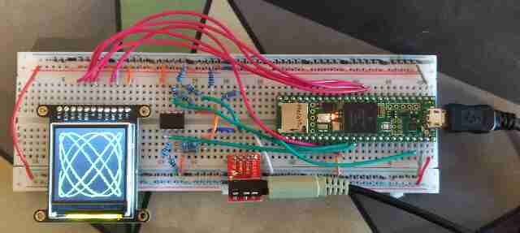
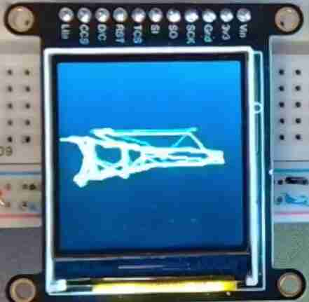
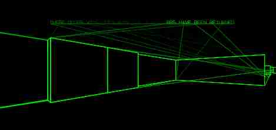

+++
title = "Making a Home-Made Oscilloscope to Play Scope Creep in Hard Mode"
date = 2025-05-11
path = "making-a-home-made-oscilloscope-to-play-scope-creep-in-hard-mode"
draft = true

[taxonomies]
tags = ["gamedev", "electronics"]
+++

I made the game [Scope Creep](https://gridbugs.itch.io/scope-creep) for a game jam a few months back. The game is rendered by generating a stereo audio signal which it plots on a virtual XY oscilloscope

<iframe width="560" height="315" src="https://www.youtube.com/embed/NMNNHuqWgUg?si=FsZQejYgWC2OEH9p" title="YouTube video player" frameborder="0" allow="accelerometer; autoplay; clipboard-write; encrypted-media; gyroscope; picture-in-picture; web-share" referrerpolicy="strict-origin-when-cross-origin" allowfullscreen></iframe>

