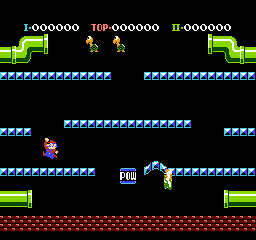
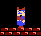
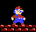

+++
title = "NES Emulator Debugging"
date = 2019-05-08T08:00:00+10:00
path = "nes-emulator-debugging"

[taxonomies]
tags = ["nes", "emulation"]
+++
<style>
.nes-emulator-debugging-screenshot img {
    width: 512px;
    height: 480px;
    image-rendering: crisp-edges;
    image-rendering: pixelated;
}
.nes-emulator-debugging-screenshot video {
    width: 512px;
    height: 480px;
}


.nes-tile img {
    width: 64px;
    height: 64px;
    image-rendering: crisp-edges;
    image-rendering: pixelated;
}

.mario-render img {
    width: 328px;
    height: auto;
    image-rendering: crisp-edges;
    image-rendering: pixelated;
}
</style>

Making an emulator for a 1980s game console is an exercise in reading and comprehension.
The work is mostly translating documentation into code.
It's oddly satisfying, building a model of an ancient machine,
instruction by instruction, device by device, especially once it can start running real programs.
You end up with an appreciation for the capabilities (or lack thereof) of hardware at the time,
and out of necessity, end up intimately familiar with the inner workings of a piece of computing history.

This post is not about making an emulator.

It is about the nightmarish, overwhelmingly complex, and at times seemingly hopeless
task of hunting down the parts of your emulator that don't behave exactly
like the real hardware.

<div class="nes-emulator-debugging-screenshot">

</div>

<!-- more -->

## Let's a-go!

I'm making an emulator for the [Nintendo Entertainment System (NES)](https://en.wikipedia.org/wiki/Nintendo_Entertainment_System).
To test my emulator, I run the game [Mario Bros.](https://en.wikipedia.org/wiki/Mario_Bros.)
When you start the game, it displays a menu for about 20 seconds, then runs a demo of gameplay.
Once I had the CPU and video output working to the point that _something_ not completely unintelligible was being rendered,
I ran the game. I wasn't emulating input yet, so I waited for the demo.

<div class="nes-emulator-debugging-screenshot">
{{ video_player_mp4_autoplay_loop(src="demo.mp4") }}
</div>

_Hey, it mostly works!_

There's no gravity, Mario and Luigi look wrong, but only when they face to the right, and platforms get wider
when you hit the bottom-left corner. These artifacts are the manifestation of emulator bugs that would take
the better part of a month to find.

## Debugging Printouts

The core of my debugging strategy is logging each instruction that is executed, and printing extra information
when something meaningful happens. In the case of the "no gravity" problem, I identified the address that stores
the vertical position of the first turtle (`0x0368`) to emerge from the pipe - the first character which gravity
should affect. The value it holds while the turtle is floating instead of
falling is `0x2C`. Therefore at some point the game is writing`0x2C` to `0x0368` when it should be writing
something _else_, so I instrumented the emulator to print a message whenever `0x2C` was read from any address in
memory, and also when address `0x0368` was written to.

Here's a snippet of the output showing the Y position of the turtle being set to `0x2C`.
I've annotated each instruction with a description of what it does.

```
CBDA  Iny(Implied)               increment index register Y
CBDB  Inx(Implied)               intrement index register X
CBDC  Cpx(Immediate) 20          compare index register X to 0x20 (32)
CBDE  Bne(Relative) F6           branch if X != 0x20 (true in this case)
CBD6  Lda(ZeroPageXIndexed) B0   load accumulator from address 0xB0 + X
reading 0x2C from 0xB8
CBD8  Sta(IndirectYIndexed) 14   store accumulator in [addess at 0x14] + Y
writing 0x2C to t1 y position
```

The non-human-readable lines are executed instructions. For example:
```
CBD6  Lda(ZeroPageXIndexed) B0
```

 - Address of instruction: `0xCBD6`
 - Instruction: `Lda` (load accumulator from memory)
 - Addressing Mode (ie. how to interpret the instruction argument): `ZeroPageXIndexed`
 - Instruction Argument: `0xB0`

The execution trace above is copying the turtle's Y position from `0x00B8` to `0x0368`.
The `Lda` instruction reads a value from memory into a CPU register called the "accumulator".
The `Sta` instruction stores the accumulator in memory. This is part of a loop that transfers
data from the "zero page" - the first 256 bytes of memory - into other parts of memory.
Most instructions have special variants (e.g. `Lda(ZeroPageXIndexed)` which can only access the zero page,
but take up less memory and execute faster.
It seems that Mario Bros. uses the zero page
for function arguments and return values, and other temporary intra-frame storage.
The `0xB0` address read from above is, at other points in the execution, used to store the
Y position of other characters. For inter-frame storage of character data, address in
`0x0300` - `0x0400` seem to be used.

This code is probably transferring the result of some computation into longer-term memory.
This indicates that the problem happened earlier in the frame.
To find details of what is done to the Y position while it's in `0x00B8`,
we could instrument the emulator to print whenever `0x2C` is read from this new address.


```
C750  Jsr(Absolute) CC90  call function at 0xCC90
CC90  Lda(ZeroPage) B8    load value at 0xB8 into accumulator
reading 0x2C from 0xB8
CC92  Clc(Implied)        clear carry flag
CC93  Adc(Immediate) 08   add 8 to the value in accumulator
CC95  Cmp(Immediate) E4   compare accumulator to 0xE4
CC97  Bcc(Relative) 08    branch if accumulator < 0xE4 (true)
CCA1  Sta(ZeroPage) 01    store accumulator at address 0x01
CCA3  Lda(ZeroPage) B9    load accumulator with value from address 0xB9
CCA5  Sta(ZeroPage) 00    store accumulator at address 0x00
CCA7  Jsr(Absolute) CA9A  call function at 0xCA9A

```

This code is reading the turtle Y position from 0xB8, adding 8 to it, and storing the
result in address 0x0001. The Y coordinate increases moving down the screen, so at
first I thought that adding to the turtle's Y position was gravity at work, but
this will turn out to be incorrect.

## What are we searching for?

The debugging process so far has closely resembled how we might debug Mario Bros. -
the program being run on the emulator -
without access to its source code. We're trying to find the part of the program
that applies gravity to characters because it looks like something is wrong with gravity.
Of course, we know that the program we're running
is fine! Run it on someone else's emulator, or real NES, and gravity works.

And this is the crux of why debugging an emulator is hard. The layer of abstraction where
the problem manifests is never the layer of abstraction where we'll find the problem.
The problem "gravity is not working" is a symptom of a problem that has nothing to do
with gravity. One or more instructions is being interpreted incorrectly, and these instructions
happen to be used by the game at some point to apply gravity.

If we were to look at the code that applies gravity in Mario Bros., we would find that
there is nothing wrong with it. Our best bet would be to look at a trace of this
code being run (what we've been doing so far) with enough detail logged such that when
a broken instruction is executed, the update to the machine state won't match our expectations.
Of course the instruction emulation is based on my interpretation of the CPU manual,
so it's likely that my expectations themselves are incorrect.

Since the virtual hardware, and my expectations of how the hardware should behave
may both be faulty, the only real "source of truth" we can rely on is the software
running on the emulator. This is an interesting reversal of the usual assumptions -
one typically assumes that their hardware works as expected and all bugs are problems with
software. We'll trace the execution of Mario Bros., and if it looks like the game
is doing something that doesn't make sense, that might indicate that the emulator is
behaving differently than the real hardware would.

## Fixing a (hopefully!) simpler problem

I spent a few days pouring over execution traces trying to find where gravity was applied
and the bug which prevent it from working. Eventually I decided to take a break
and work on what was hopefully a simpler problem.


<div class="mario-render">

</div>

The Mario and Luigi sprites are a 2x3 rectangle of 8 pixel square tiles.
When they face to the right, both columns are drawn overlapping instead of
adjacent.

It's supposed to look like this.

<div class="mario-render">

</div>

### NES Sprite Rendering

To get to the bottom of this, we need to know a little about how rendering works
on the NES. The NES Picture Processing Unit (PPU) can render up to 64 8x8
pixel foreground sprite tiles at a time. Backgrounds are rendered differently,
but aren't important for finding this bug. To render a sprite tile, the game
writes a 4-byte description of the tile to a special region of memory called the
Object Attribute Memory (OAM). This description contains the position of the
tile on the screen, a tile index specifying which tile to render, and some
attributes to fine-tune rendering.

OAM is not addressable directly by the CPU. Instead, the CPU writes a copy of
what it wants OAM to contain into RAM, starting at a 256-byte aligned address (ie. an
address whose low byte is 0), then writes the high byte of this address to a PPU
register named `OAM DMA`. Writing to `OAM DMA` causes the PPU to directly read the
256 bytes starting at specified address, and upload it to OAM.

### Finding the Mario Sprite

By logging writes to `OAM DMA`, I found that the only value Mario Bros. ever
writes to it is `2`. This means that it's storing sprite data in the region of
RAM at `0x0200` - `0x02FF`.

Next we need to find out which part of OAM contains the description of the Mario
tiles. Each sprite tile is described with a 4-byte data structure. The 4th byte
of this structure contains the X coordinate of the tile. By logging the X
coordinate of each tile every frame and watching how they change as Mario moves
on the screen, I identified the 6 OAM entries corresponding to Mario as those
occupying `0x0210` - `0x0227` (24 bytes = 6 tiles * 4 bytes per tile)
prior to uploading.

I instrumented the emulator to log writes to `0x0213` and `0x0217` which
should correspond to the X positions of the top 2 tiles of Mario.
I found a single loop where one iteration wrote to `0x0213`, and another
iteration wrote to `0x0217`.


```
CC20  Inx(Implied)
CC21  Lda(IndirectYIndexed) 12
CC23  Bit(ZeroPage) B7
CC25  Bvs(Relative) 03     branch if overflow flag is set
CC2A  Eor(Immediate) FF
CC2C  Sec(Implied)
CC2D  Sbc(Immediate) 08    subtract 8 from the accumulator
CC2F  Sec(Implied)
CC30  Adc(ZeroPage) B9
CC32  Iny(Implied)
CC33  Sta(AbsoluteXIndexed) 0200
writing 0x68 to 0x0213
...
CC20  Inx(Implied)
CC21  Lda(IndirectYIndexed) 12
CC23  Bit(ZeroPage) B7
CC25  Bvs(Relative) 03     branch if overflow flag is set
CC27  Clc(Implied)
CC28  Bcc(Relative) 06
CC30  Adc(ZeroPage) B9
CC32  Iny(Implied)
CC33  Sta(AbsoluteXIndexed) 0200
writing 0x68 to 0x0217
```

### A Hunch

These two iterations look slightly different. Notice that in the `0x0213`
iteration (the first iteration) 8 is subtracted from the accumulator
(instruction address
`0xCC2D`), and in
the `0x0217` iteration, this subtraction is skipped. 8 happens to be the
width of a sprite tile in pixels. If this subtraction occurred in the latter
iteration, it would have written `0x60` instead of `0x68` to OAM, and the left
half of the sprite would be shifted 8 pixels to the left and would no longer overlap
with the right half (note that this assumes that the former iteration is the
top-right tile, and the latter one is the top-left tile).

The first point where the two iterations differ is the `Bvs` instruction
at address `0xCC25`. This instruction branches by a specified offset if the
"overflow" flag is set. This branch is taken in the first iteration (note the
change in instruction address after `Bvs` executes), and not
taken in the second iteration.

Arithmetic operations set the overflow flag when a
signed integer overflow occurs. The fact that this code executes the `Bit`
instruction, and then branches based on the overflow flag's value, suggests that
`Bit` sets and clears the overflow flag too.
My emulator was updating the
overflow flag when emulating `Bit`, but I double checked the manual at this
point just to be safe.

The `Bit` instruction computes the bitwise AND of a value from memory and the
accumulator, discarding the result, and setting some status register flags.

Here's what the MOS6502 Programmer's Manual has to say about the status register
flags set by `Bit`:

_The bit instruction affects the N (negative) flag with N being set to
the value of bit 7 of the memory being tested, the **V (overflow) flag with V
being set equal to bit 6 of the memory being tested** and Z (zero) being set
by the result of the AND operation between the accumulator and the
memory if the result is Zero, Z is reset otherwise. It does not
affect the accumulator._

`Bit` is unusual because it
sets the overflow (V) and negative (N) flags based on its argument, instead of
its result. Every other instruction that updates the overflow and negative flags does so
based on its result.

In my first pass through the manual I did not pick up on this subtlety!

Correcting this instruction in my emulator, and now Mario renders correctly.

<div class="nes-emulator-debugging-screenshot">
{{ video_player_mp4_autoplay_loop(src="gravity-works.mp4") }}
</div>

It seems that fixing this bug also fixed gravity...

_Great!_

## Platforms get wider when you jump into them

Look closely at the previous recording. Luigi jumps and hits the ceiling, and
the platform
seems to grow a little wider as a result. This is not supposed to happen!

To help debug this, I implemented input emulation so I could actually _play_ the
game and conduct experiments.

Here's a more explicit demonstration of the problem.

<div class="nes-emulator-debugging-screenshot">
{{ video_player_mp4_autoplay_loop(src="floor-extension.mp4") }}
</div>

This only happens if you hit a platform on its bottom-left corner. This fact,
coupled with the turtle falling through the floor suggests that this bug relates
to collision detection. In Mario Bros., when you hit a platform from underneath,
an animation plays where the platform bulges above you, damaging any enemies
standing on that part of the platform. There is an emulator bug with the symptom
that collision detection with platforms has a lateral offset, which means that
if you jump just to the left of a platform, the game thinks you hit the platform
from beneath. Because it thinks you hit a platform from beneath, the game plays
the platform bulge animation above the character, which leaves a fresh platform where there was none
before. This new platform can now be collided with in the same way allowing it
to grow even further to the left.

If collision detection has an erroneous offset, you should be able to move
through the right-hand side of a platform too.

<div class="nes-emulator-debugging-screenshot">
{{ video_player_mp4_autoplay_loop(src="jump-through-floor.mp4") }}
</div>

Turtles also fall through platforms too early on the right-hand side, and too
late on the left-hand side.

### Function Analysis

Collision detection is complicated, and after a few days of blindly staring at
execution traces I elected to take a step back and try to get a better
understanding of how the game works. To that end I wrote a little library for
exploring function definitions in NES programs. The NES CPU has an instruction
named `JSR` (Jump SubRoutine) which pushes the current program counter on the
stack, and moves execution to a specified address. A second instruction, `RTS`
(Return from SubRoutine) pops an address from the stack and moves execution to
that address. Respectively, these instructions are used to call and return from
functions.

To find all the functions in the program, my library scans the ROM for all
instances of the `JSR` instruction, looking at its argument to find addresses
where functions begin. To find out where a given function ends, step through the
function instruction by instruction, stopping when a `RTS` instruction is
reached. Upon encountering a conditional branch, we need to account for the case
when the condition is true, and when the condition is false. I use a stack (the
data structure) to keep track of execution paths yet to be explored.
Instructions that unconditionally change the program counter are followed,
with the exception of `JSR` (we're only exploring the current function - not
the functions it calls) and `RTS`, which indicates we should stop exploring the
current branch. Keep track of the addresses that have been explored in this
traversal and stop if an instruction would change the program counter to
somewhere we've already been.
This is effectively a depth-first search through the control flow graph of the
function.

Here's a trace of a simple function.

```
0xCDD1  Pha(Implied)        ;; save accumulator onto stack
0xCDD2  Clc(Implied)        ;; clear the carry flag
0xCDD3  Lda(ZeroPage) 0x14  ;; load value at address 0x14 into accumulator
0xCDD5  Adc(ZeroPage) 0x12  ;; add value at address 0x12 to accumulator
0xCDD7  Sta(ZeroPage) 0x14  ;; store accumulator at address 0x14
0xCDD9  Lda(ZeroPage) 0x15  ;; load value at address 0x15 into accumulator
0xCDDB  Adc(ZeroPage) 0x13  ;; add value at address 0x13 to accumulator
0xCDDD  Sta(ZeroPage) 0x15  ;; store accumulator at address 0x15
0xCDDF  Pla(Implied)        ;; restore accumulator from stack
0xCDE0  Rts(Implied)        ;; return
```

What is this function doing?

It adds the byte at address `0x14` with the byte at address `0x12`, storing the
result at address `0x14`, then adds the byte at `0x15` with the byte at `0x13`,
storing the result in `0x15`. Notice the carry flag is cleared once at the
start, and then not cleared in between the two additions. The `ADC` instruction
adds the carry flag to its result, and sets the carry flag if the result of the
addition is greater than 255 (the maximum value that fits in a byte).

This function treats the 2 bytes at `0x14` and `0x15` as a single 2-byte
little-endian
integer, and likewise for the 2 bytes at `0x12` and `0x13`. This function adds
these two 16-bit integers, and returns the result. We can interpret
`0x12` - `0x15` as containing function's arguments. Similarly, we can interpret
`0x14` - `0x15` as containing the function's return value (after the function
returns).

Here's how you might write this function in rust:

```rust
fn add16(a: u16, b: u16) -> u16 {
    a + b
}
```

The function calling convention Mario Bros. seems to use is to choose a range
of addresses in the zero page (`0x0000` - `0x00FF`) for each function, and to
store the function's arguments and return value in this range. Each function
seems to use unique addresses for its arguments and return values, which would
allow one function to call another function without the first function needing
to worry about its own arguments being overwritten by some later function.
Note that this calling convention does not support recursion,
as the second nested call of a function would overwrite the arguments from
the first call.

Function analysis didn't directly help solve my problem, but it did help
get a better understanding of what the program was trying to do.

### A Mysterious Function

Much like before, I started by inspecting the memory of the running game to find
out which address contained Mario's X and Y coordinates between frames. Tracing
load and store instructions involving these addresses led me to the following function, which was being
passed Mario's X and Y coordinates through zero page addresses `0x00` and
`0x01`.

```
;; Load coord_x into accumulator.
CA9A  Lda(ZeroPage) 00

;; Right-shift the accumulator by 1 bit 3 times, effectively dividing it by 8.
CA9C  Lsr(Accumulator)
CA9D  Lsr(Accumulator)
CA9E  Lsr(Accumulator)

;; Store the accumulator [coord_x / 8] in address 0x12.
CA9F  Sta(ZeroPage) 12

;; Store the value 0x20 in address 0x13.
;; The 2 bytes at 0x12-0x13 now represent a 16-bit integer
;; whose value is [0x2000 + (coord_x / 8)].
;; This is because 0x20 is the high byte, and [coord_x / 8] is the low byte.
CAA1  Lda(Immediate) 20
CAA3  Sta(ZeroPage) 13

;; Store a 0 at address 0x15.
CAA5  Lda(Immediate) 00
CAA7  Sta(ZeroPage) 15

;; Load coord_y into accumulator.
CAA9  Lda(ZeroPage) 01

;; Bitwise AND the accumulator with 0xF8.
;; 0xF8 in binary is 11111000, so this clears the low 3 bits of coord_y.
;; This effectively rounds coord_y down to the next lowest multiple of 8.
CAAB  And(Immediate) F8

;; Left-shift the accumulator, setting the carry flag to the most-significant
;; bit of the accumulator prior to this instruction executing.
;; Then left-rotate the value in address 0x15 (explicitly set to 0 above).
;; Left-rotating is the same as left-shifting, except the least-significant
;; bit of the result is set to the carry flag's current value, and then the
;; carry flag is set to the original most-significant bit (ie. it rotates
;; "through" the carry flag).
;;
;; This doubles the value in the accumulator. If twice the value of the
;; accumulator is too large to fit in the 8-bit accumulator register, the
;; overflowing bits are stored in the low bits of address 0x15.
CAAD  Asl(Accumulator)
CAAE  Rol(ZeroPage) 15

;; Repeat the above, doubling the accumulator a second time.
CAB0  Asl(Accumulator)
CAB1  Rol(ZeroPage) 15

;; Store the accumulator in address 0x14.
;; At this point, the little-endian 16-bit integer at 0x14-0x15 is
;; coord_y rounded down to the next multiple of 8, then multiplied
;; by 4.
CAB3  Sta(ZeroPage) 14

;; Call the add16 function defined above.
;; Once this function returns, the sum of the 16-bit integer at 0x12
;; and the 16-bit integer at 0x14 ends up in 0x14-0x15.
CAB5  Jsr(Absolute) CDD1

;; Copy the result of add16 into the return value address of this function.
;; This function will return the 16-bit integer returned by add16
CAB8  Lda(ZeroPage) 15
CABA  Sta(ZeroPage) 00
CABC  Lda(ZeroPage) 14
CABE  Sta(ZeroPage) 01

;; Return.
CAC0  Rts(Implied)
```

Phew!

Just what is going on here?

The first hint is that `coord_x` is divided by 8. 8 happens to be the width and
height of a
sprite tile in pixels. Dividing the X pixel coordinate by 8 translates it into
a tile coordinate. If X is being translated into tile space, it seems sensible
to also translate the Y coordinate, but this Y coordinate translation is not so
straightforward.

The `And(Immediate) F8` instruction holds
the key. This rounds the Y coordinate down to the next multiple of 8, which is
equivalent to dividing Y by 8, rounding down, and then multiplying the result
by 8. The result of this operation is then multiplied by 4 (left-shifting twice),
so the final result for Y is `((coord_y / 8 ) * 8) * 4` = `(coord_y / 8) * 32` (assuming integer division).

The second hint is that the NES video output is 256 pixels wide = 8 pixels per
tile * 32 tiles. The width of the screen is 32 tiles.

The rust code with the same intent as the above assembly would be:

```rust
// don't forget about the 0x2000 which is added to X after dividing by 8
const MYSTERIOUS_OFFSET: u16 = 0x2000;

const TILE_SIZE_PIXELS: u8 = 8;
const SCREEN_WIDTH_TILES: u16 = 32;

fn mystery(pixel_coord_x: u8, pixel_coord_y: u8) -> u16 {
    let tile_coord_x = (pixel_coord_x / TILE_SIZE_PIXELS) as u16;
    let tile_coord_y = (pixel_coord_y / TILE_SIZE_PIXELS) as u16;
    let index = tile_coord_x + (tile_coord_y * SCREEN_WIDTH_TILES);
    return index + MYSTERIOUS_OFFSET;
}
```

If we treat the 32x30 (NES video output is 240 pixels = 30 tiles high)
tiles on the screen as a 1D array of tiles ordered
left-to-right, then top-to-bottom, then this function computes the index of the
tile containing Mario's coordinate. And then it adds `0x2000`. How mysterious.

When this function is called with Mario's coordinates, the result is stored
in `0x0520`-`0x0521`. Later in the frame, these addresses are read:

```
CB87  Lda(AbsoluteXIndexed) 0520
CB8A  Sta(Absolute) 2006
CB8D  Inx(Implied)
CB8E  Lda(AbsoluteXIndexed) 0520
CB91  Sta(Absolute) 2006
CB94  Lda(Absolute) 2007
CB97  Lda(Absolute) 2007
```

The above code is run in a loop several times each frame. The addresses `0x2006` and `0x2007`
contain Picture Processing Unit (PPU) registers. Thus, I assumed that this code is
somehow related to rendering. Not collision detection. So I moved on to look
elsewhere.

### Execution Trace Diffing

What is the difference between a frame with a Mario collision, and a frame
without? To get to the bottom of collision detection, I came up with an
experiment to find out how execution differs between a frame where Mario
collides with the ceiling, and a frame where he does not.

I recorded a save
state mid-jump, and instrumented my emulator to load the save and overwrite
Mario's X position with a specific value which won't result in a collision.

Notice how Mario teleports a few pixels to the left on the second frame.

<div class="nes-emulator-debugging-screenshot">
{{ video_player_mp4_autoplay_loop(src="short-jump-no-collision.mp4") }}
</div>

I ran this for a specific number of frames, and recorded an execution trace.
Then I repeated the experiment with an X offset which would result in a
collision.

<div class="nes-emulator-debugging-screenshot">
{{ video_player_mp4_autoplay_loop(src="short-jump-collision.mp4") }}
</div>

Equipped with a collision trace, and a non-collision trace, I could now compare
the two. Since there's a discrete difference in the program's behaviour between
the two traces, it stands to reason that there will be at least one branch
instruction where one instance branches, and the other does not. The first such
branch instruction will hopefully tell me something about how this game does
collision detection.

In addition to the instructions being executed, I also logged several other data
which I thought would be useful, such as the value read by the `LDA` (load
accumulator from memory) instruction.

In these diffs, the black lines are in both traces, the "**<span style="color:red">-</span>**" (red) lines are only in the
collision trace, and the "**<span style="color:green">+</span>**" (green) lines are only in the non-collision trace.

As expected, during the first few frames where no collision occurs, the only difference
was the result of the Mario X position being different between traces. The first
difference in the diff snippet below is clearly an example of this, as the
values `0xB2` and `0xB3` differ by 1.

```patch
@@ -40592,12 +40592,12 @@ LDA read value 22
 CB8A  Sta(Absolute) 2006
 CB8D  Inx(Implied) 
 CB8E  Lda(AbsoluteXIndexed) 0520
-LDA read value B3
+LDA read value B2
 CB91  Sta(Absolute) 2006
 CB94  Lda(Absolute) 2007
 LDA read value 24
 CB97  Lda(Absolute) 2007
-LDA read value 93
+LDA read value 24
 CB9A  Sta(AbsoluteXIndexed) 0520
 CB9D  Inx(Implied) 
 CB9E  Dey(Implied) 
```

The second difference is more interesting. `0x93` vs `0x24`? And look at those
instruction addresses. We've been here before! This is the code that reads from
the result of the mysterious index-computing function from the previous section.

A bit further down the diff, we see the first instance of a branch instruction
that is followed in one trace but not the other. The `CAC3 Bcc(Relative) 0E`
instruction has this honour. This instruction, and the `Cmp` instruction which
precedes it, compare the accumulator to the immediate value `0x92`, and branch if
the accumulator is less than `0x92`. In the collision case (red), the branch was
not followed. The preceding `LDA` indicates that in this case the accumulator
contained 0x93. In the no-collision case (green) the branch was followed as the
accumulator contained `0x24`.

```patch
@@ -41963,193 +41963,22 @@ LDA read value 1
 C97F  And(Immediate) 0F
 C981  Beq(Relative) 09
 C983  Lda(ZeroPage) CB
-LDA read value 93
+LDA read value 24
 C985  Jsr(Absolute) CAC1
 CAC1  Cmp(Immediate) 92
 CAC3  Bcc(Relative) 0E
-CAC5  Cmp(Immediate) A0
-CAC7  Bcc(Relative) 07
-CAD0  Lda(Immediate) 01
-LDA read value 1
-CAD2  Rts(Implied) 
+CAD3  Lda(Immediate) 00
+LDA read value 0
+CAD5  Rts(Implied) 
 C988  Ora(Immediate) 00
 C98A  Bne(Relative) 04
```

The values `0x24` and `0x93` have _something_ to do with graphics, as they are read
in the part of the program that interacts with the Picture Processing Unit
(remember addresses `0x2006` and `0x2007` refer to PPU registers), and they probably
have something to do with collision detection, as the first differing branch
between the two traces was because of these two values.

Let's hazard a guess that these are indices of background tiles.

Tile number `0x24`:

<div class="nes-tile">

</div>

That is an 8x8 square of black pixels, used for the empty space in the
background.

Can you guess what tile `0x93` is:

<div class="nes-tile">

</div>

A floor tile!

All the other solid tiles have indices greater than `0x92` as well.
The comparison with `0x92` is this game's way of checking if an area of the screen
is solid.

Recall that the problem we're trying to solve is that collision detection seems
to be off some value. Let's assume for a second that this value is 8 pixels, or
1 tile. An off-by-one error in the function that computes the tile index seems
like the obvious culprit, but I checked the arguments and return value of this
function in my trace and it definitely was working as intended.

### The PPU: More than just rendering!

The diff revealed something interesting going on in the code from earlier which
I dismissed as related to rendering.
Before diving back in, here's all you need to know about the NES Picture
Processing Unit.

This code is interacting with 2 PPU registers, mapped to `0x2006` and `0x2007`.

`0x2006` refers to the "PPU Address" register. Not unlike modern computers, the
NES had a dedicated memory attached to its graphics hardware. This video memory
could not be addressed directly by the CPU. If the CPU wishes to read or write
from video memory, it must write the low byte of the 2-byte video memory address to `0x2006`, and then
write the high byte of the address to `0x2006`.

Once the CPU has written both bytes of the address to `0x2006`, it can read or
write `0x2007`, the "PPU Data" register, to access video memory at the specified
address. The PPU keeps
track of the "current" address being accessed, and increments this address after
each access. Thus if you wished to write 16 consecutive bytes to video memory,
you would first write the intended video memory address to `0x2006`, and then
write to `0x2007` 16 times.

Here's the trace:

```
;; Assume that the X index register is initially 0,
;; so the first 2 LDAs read from 0x520 and 0x521.
;; Also assume that 0x0520 contains the low byte of
;; the tile index computed by the mysterious function,
;; and 0x0521 contains the high byte.

;; Write the low byte of the mysterious function output
;; to the PPU Address Register.
CB87  Lda(AbsoluteXIndexed) 0520
CB8A  Sta(Absolute) 2006

;; Write the high byte of the mysterious function output
;; to the PPU Address Register.
CB8D  Inx(Implied)
CB8E  Lda(AbsoluteXIndexed) 0520
CB91  Sta(Absolute) 2006

;; Load accumulator from PPU Data Register.
CB94  Lda(Absolute) 2007

;; Load accumulator from PPU Data Register again.
;; The value loaded here is the one that later gets compared
;; with 0x92 to see if the tile is solid.
CB97  Lda(Absolute) 2007
```

This code takes the output of the mysterious index + offset function detailed
above, and reads the byte from video memory at that address. It then discards
this value, overwriting it with the byte read from the next video memory
address. This second byte is then compared with `0x92` to check if a collision
occurred.

This explains what the mysterious offset, `0x2000`, is for. In the NES video
memory layout, 0x2000 is the address of the start of the first "nametable" - an
array of tile indices that specify the background tiles to render. The
mysterious function computes an offset within this array, and then adds it to
the video memory address of the start of the array.

One mystery solved!

This also explains how character/level collision detection worked in Mario Bros.
To test if an area of the screen is solid, determine the tile currently rendered
there by reading from video memory, and check if it's one of the solid tiles. That's why
rendering the floor bulge animation resulted in a solid floor remaining in the
game world. If you can see it, you can collide with it.

The last two lines of the trace above (both `Lda(Absolute) 2007`) made me highly
suspicious. The index computation seemed to be doing something sensible, and
getting the correct result. The tile index read by the first of these two
instructions should be the tile used for collision detection decisions. Why
then, is the first-read value being discarded and replaced with the index of the tile one space to
the right?

&nbsp;
&nbsp;

_Making an emulator for a 1980s game console is an exercise in reading and comprehension._

&nbsp;
&nbsp;

An excerpt from the [nesdev wiki](https://wiki.nesdev.com/w/index.php/PPU_registers#PPUDATA)
that I overlooked when first reading about the PPU:

_When reading while the VRAM address is in the range 0-$3EFF (i.e., before the
palettes), the read will return the contents of an internal read buffer. This
internal buffer is updated only when reading PPUDATA, and so is preserved across
frames. After the CPU reads and gets the contents of the internal buffer, the
PPU will immediately update the internal buffer with the byte at the current
VRAM address. **Thus, after setting the VRAM address, one should first read this
register and discard the result.**_

<div class="nes-emulator-debugging-screenshot">
{{ video_player_mp4_autoplay_loop(src="working.mp4") }}
</div>

Now that I've had my fun, I'm going to subject my emulator to a
[suite of test ROMs](https://github.com/christopherpow/nes-test-roms)
to clean up any not-yet manifested bugs. There's still a lot of work to do
before my emulator is finished. At the moment there's no sound, many PPU features are
unimplemented, and only the most basic cartridges are supported.

You can view the source code for my emulator [here](https://gitlab.com/stevebob/mos6502/).
