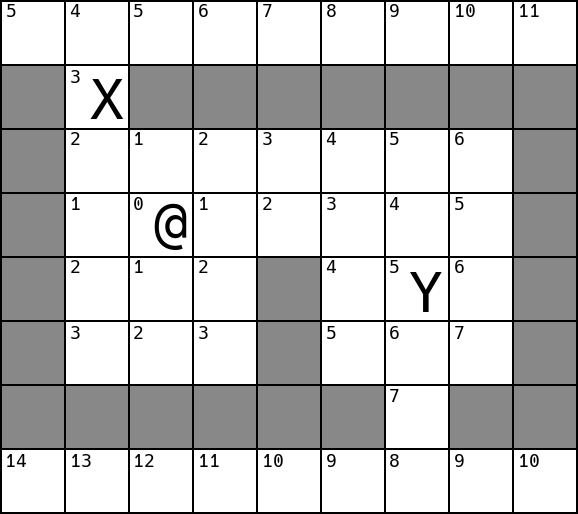
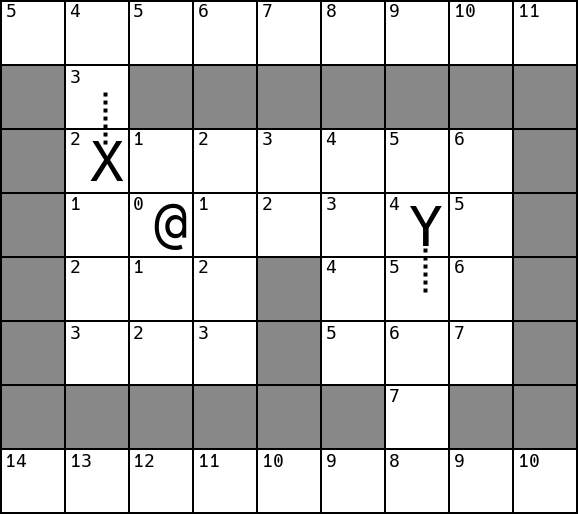
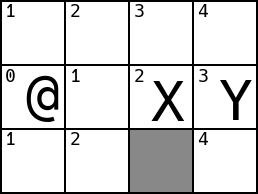
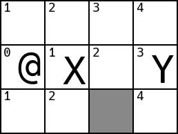
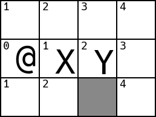
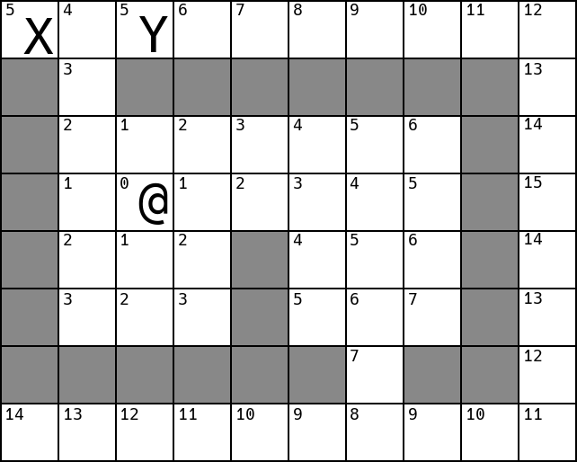
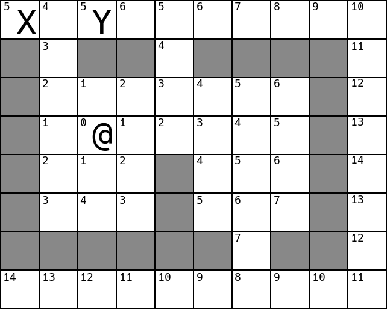
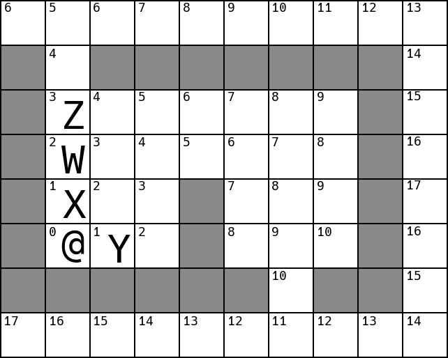
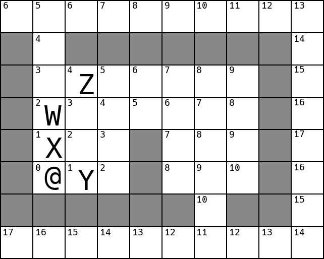
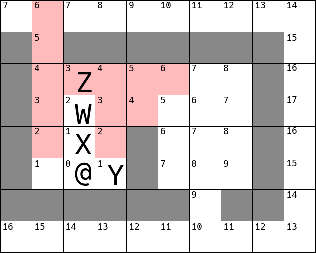

+++
title = "Pathfinding on a Grid"
date = 2018-02-15T21:43:00+10:00
path = "pathfinding-on-a-grid"

[taxonomies]
tags = ["gamedev", "roguelikes", "algorithms"]
+++

In this post I describe how to achieve sensible pathfinding of multiple
NPCs in a turn-based, grid-based setting.
When multiple NPCs are moving around on the same map, they can get in each
other's way, which causes unusual-looking behaviour unless properly handled.
This post builds up a pathfinding technique, identifying, and addressing,
unusual behaviour caused by multiple NPCs interfering with each other.

I'll make the
following assumptions:

 - there is a single player
 - the goal of each NPC is to become adjacent to the player
 - NPCs can't move through one another or the player
 - on their turn, the player, and each NPC can move 1 or 0 squares in a cardinal direction
 - the map is a 2d grid of squares, each of which is permanently either
   traversable or non-traversable
 - the cost of moving between a pair of adjacent, traversable squares is 1 (ie. the grid is
   uniform)

The approach I describe won't rely too heavily on any of these assumptions.
I'm stating them here so as to remove any ambiguity in explanations.
Generalising the pathfinding technique to rely on fewer assumptions is left as
an exercise to the reader.

A note on diagrams: The player will be denoted with a `@`. Each NPC will be
referred to by a letter. White cells are traversable. Grey cells are
non-traversable.

## Initial Approach: Follow a Dijkstra Map

The first approach will be to generate a map which stores, for each cell, the
distance from that cell to the player. These distances are shown as the numbers
in the top-left corner of each traversable cell in the diagrams below.
The data structure storing these distances (generally a 2d array of numbers) is
sometimes called a "Dijkstra Map".
[Here](http://www.roguebasin.com/index.php?title=The_Incredible_Power_of_Dijkstra_Maps)
is an article elaborating on dijkstra maps.

A benefit of using a dijkstra map, rather than searching for a path for each NPC,
is that the dijkstra map only needs to be recomputed each time the player moves.
To determine which way an NPC should move, we need only consider the neighbours
of that NPC's cell in the dijkstra map, choosing the one with the lowest score.
This scales well as the number of NPCs increases, as there is only a small
amount of work that must be done for each NPC.

The example above shows a single step for `X` and `Y`, where each moved to its
lowest-valued neighbour.
Note that `Y` chose arbitrarily between 2 cells equidistant from the player.

## Gaps forming between NPCs

Here's the first problem with the current approach. Consider the following
arrangement:

When `X` moves:

And then `Y` moves:

Everything seems fine, but what if `Y` had moved first? Since NPCs can't move
through each other, the best choice for `Y` is to stay where it is, as any
single legal move would only increase its distance from the player.

On `X`'s
turn, `X` would still move towards the player, creating a gap between `X` and
`Y`, which looks unusual:

To prevent gaps from forming, we need to make sure that
NPCs move in increasing order of their distance to the player (that is,
the closest NPC to the player moves first, then the second closest, and so on). Since we generate
a dijkstra map, it's easy to determine how far each NPC is from the player.
Simply sorting NPCs by the value of their cell in the dijkstra map is enough to
produce a turn order which avoids this problem.

## NPCs getting in each other's way

Let's look at some cases where NPCs interfere with the movement of other NPCs.

On `X`'s next turn, it will remain next to the player - there's nothing it can
do to get closer to the player, so there's no need to move. (In a typical roguelike it
would probably attack the player at this point.) What does `Y` do? None of
`Y`'s traversable neighbours are lower-valued in the dijkstra map than `Y`'s
current cell, so it will stay put, despite it being possible to eventually get
closer to the `@`, by first moving north, into a higher-valued cell.

In the next example, assume `X` moves before `Y`:

`X` will move east, occupying `Y`'s west neighbour. On `Y`'s turn, its
valid moves are to move east, into a higher-valued cell than its present cell,
or to do nothing. If `Y`'s goal is to get to the player in as few turns as
possible, its best course of action is to wait where it is for one turn,
assuming `X` will proceed south and make room for `Y` to continue moving towards
the player. `Y`'s alternative - moving east, and proceeding down the east edge
of the map - will take longer.

What if there's a gap in the wall closer to `Y`. Assume `X` moves first again:

Here, it might make sense for `Y` to move east on its turn rather than waiting a
turn before moving west. It may look more natural for `Y` to follow a longer
path, than wait for the shorter one to free up, though the decision 
seems to depend on how much longer the longer path is.

Assume it's `Z`'s turn. What should it do?

Here there's no path to the player, but rather than giving up, `Z` should
probably still try to get as close to the player as it can.
It seems like it should move east, south, south, on its next 3 turns,
assuming nothing else moves.

After making the first move it finds itself here:

Looking at its immediate neighbours, it seems like `Z` could now go either
south, or west - the neighbours in both directions are the same distance from
the player. It is of
course preferable for `Z` to move south.

This last case is important, as it shows that
the presence of multiple NPCs means that it's never
sufficient for an NPC to act purely on its neighbouring cells in the game grid
and dijkstra map.

A solution which addresses all these cases, is for each NPC, on is turn, to
examine all the cells reachable within a certain number of turns (3 turns will
suffice for all the examples here), and take the first step along the shortest
path to the cell it just examined with the lowest value in the dijkstra map.
If all the cells examined have a higher value than the NPC's current cell, it
doesn't move at all.

It's worth noting that this won't necessarily get every NPC as close
to the player as possible.

Will `Z` go east or west, looking for the best cell up to 3 moves away?

It could go either way! If it had looked 4 moves away, it would have
noticed that going west gives the potential to eventually be 1 move from the
player, while going east, the closest it can get is 2 away. Note however, that in
this example, `W` will move first (it's closer to the player than `Z`), and `W`
is close enough to notice that going west is better, so it will go west, getting
out of `Z`'s way and allowing `Z` to move forward.

To improve an NPC's decision making, you can increase the number of cells it
examines before moving.
The specific number depends on the nature of the game and
the individual NPC. In typical games, where NPCs die and the player moves
around, sub-optimal-but-still-pretty-good decision-making by NPCs won't have a
noticeable effect on gameplay.

## Summary

Before any NPCs move, if the player has moved since the dijkstra map was last
computed, recompute the dijkstra map based on the player's current position.
Now, produce a list of NPCs sorted by the
value of their cells in the dijkstra map, in increasing order.
NPCs will take their turns in this order.
On each NPC's turn, examine all the cells within a certain number of moves from
the NPC, without allowing moves through other NPCs.
Of the cells examined, identify the one whose value in the dijkstra map
is lowest. If no cell has a lower value than the NPC's current cell,
the NPC doesn't move that turn. Otherwise, the NPC takes the first
step along the shortest path between its
current cell and this cell. This causes NPCs to move towards the player in a
sensible way, without the influence of other NPCs causing unusual-looking
behaviour.
