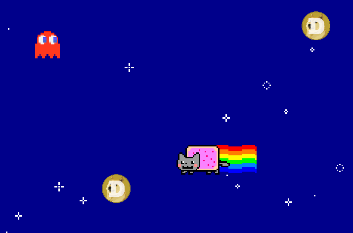

+++
title = "Pitch Controlled Game"
date = 2015-07-10T22:46:01+10:00
path = "pitch-controlled-game"

[taxonomies]
tags = ["project"]
+++

A game I made for UNSW ArtsWeek 2014. Control the cat by making noises of various pitches.
Collect the coins but avoid the ghosts.

[Play in browser](https://games.gridbugs.org/pitch-controlled-game)

