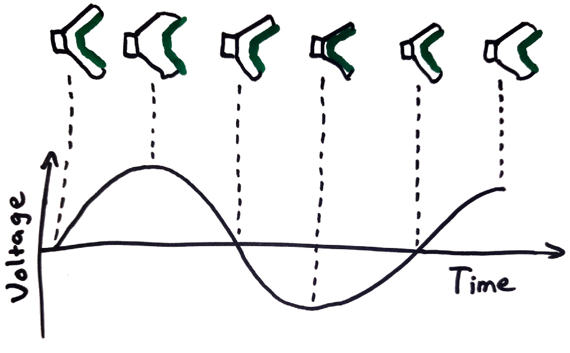
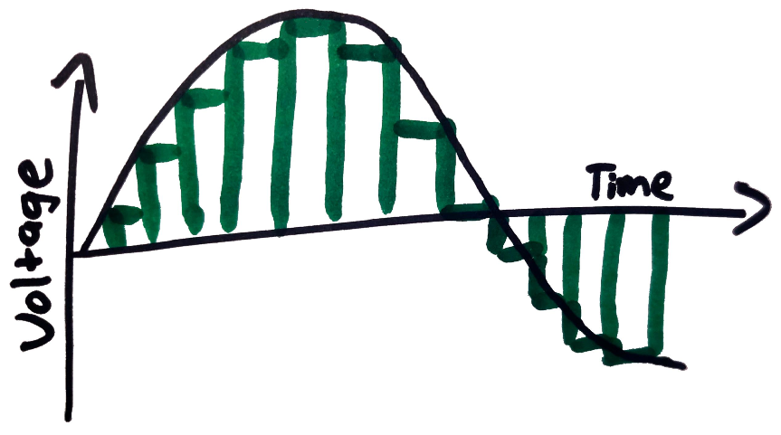
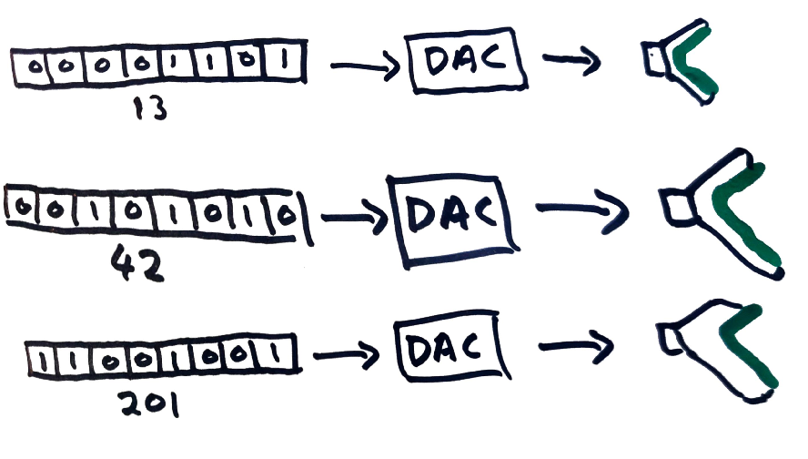
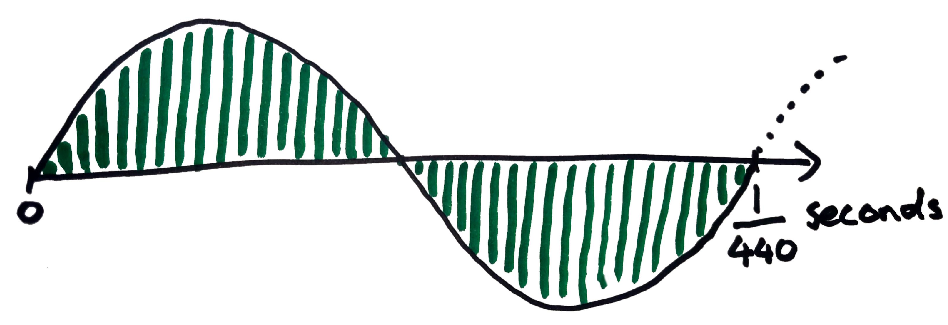
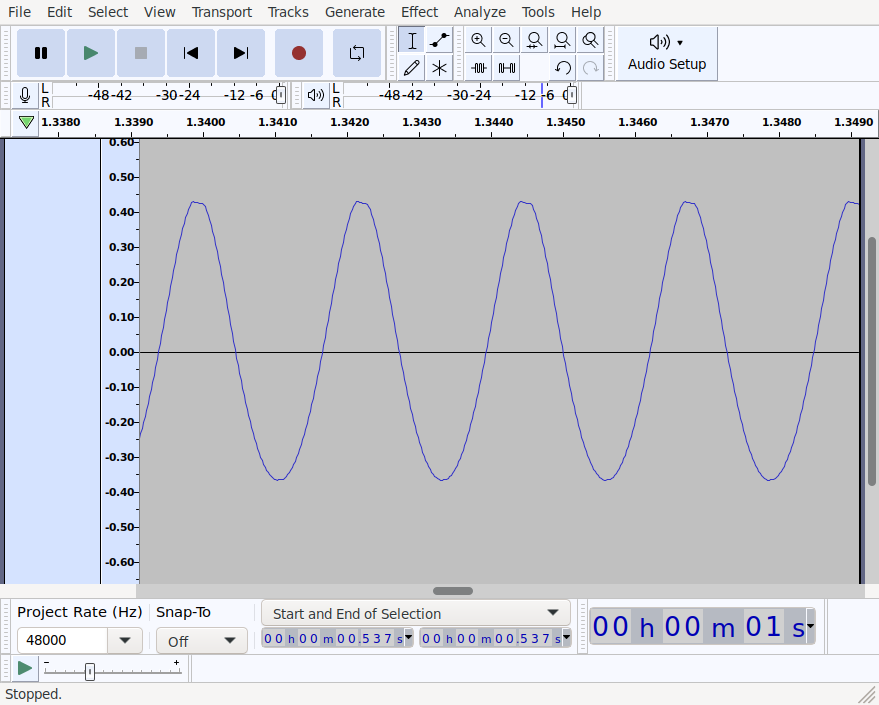
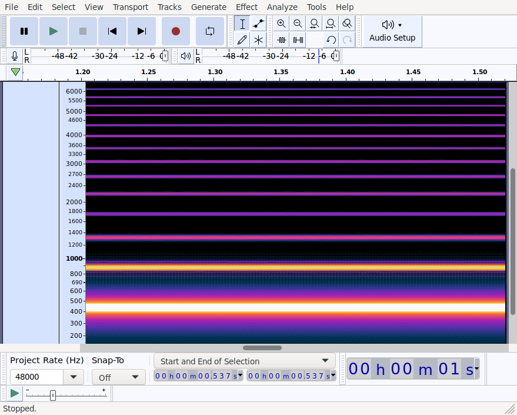
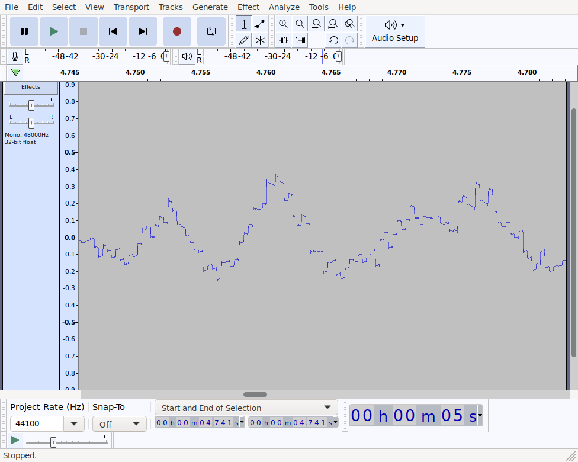
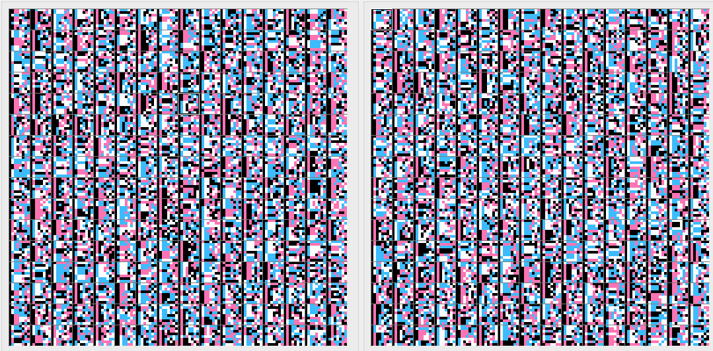

+++
title = "Playing sound on the NES by directly setting its DMC output"
date = 2023-01-21
path = "playing-sound-on-the-nes-by-directly-setting-its-dmc-output"

[taxonomies]
tags = ["nes", "audio"]

[extra]
og_image = "audacity-NES.png"
+++

Games on the Nintendo Entertainment System play audio using a handful of
tools within the device's Audio Processing Unit (APU). The Delta Modulation
Channel (DMC) is the most expressive such tool as it can play arbitrary audio
data. Any sound you've heard come out of a NES other than variations on
square and triangle waves, and noise, was played using the DMC.

As its name suggests, the DMC can play [delta
modulated](https://en.wikipedia.org/wiki/Delta_modulation)
audio data, where a signal is represented by a sequence of relative changes
rather than a sequence of samples. The DMC also exposes a register that allows
audio samples to be written directly to its output, and that's what this post
will be about.

This post is aimed at people looking to write programs to play
audio on the NES, or write an emulator for the NES's APU. I found [the DMC
documentation on the NesDev wiki](https://www.nesdev.org/wiki/APU_DMC) great for
low-level technical details but after reading it I felt I had little
intuition for what to expect when actually using the DMC, so I did some experiments which
I will share.

<!-- more -->

## Mental model for working with audio

This is my working model for the basics of digital audio.

Part of a speaker called the "diaphragm" gets pushed outwards when a positive
voltage is applied to the speaker, and pulled inwards when a negative voltage is
applied.


By varying the voltage applied to the speaker over time, the rapid pushing and
pulling causes the diaphragm to
vibrate, creating sound. Note that the variations in voltage over time
correspond to proportionate variations in the displacement of the speaker
diaphragm over time.



In digital audio, a signal is represented by a series of discrete values, each
corresponding to a diaphragm displacement at a specific point in time. These
values are called "samples", and are often represented by 16 or 32 bit integers,
or floating points. Samples are recorded at fixed time intervals, and
the rate at which they are recorded is the "sample rate", measured in
hertz. A common sample rate is 44.1kHz.



Representing a signal digitally results in loss of quality. Two reasons for
this:
 - There are effectively an infinite number of different displacements the
   speaker diaphragm can take, but the data type used to represent samples will
   have a finite number of possible values.
 - The value of the signal is only sampled periodically, but the signal itself
   may be constantly varying. The effect of this is that [frequencies in the
   signal which are  above half the sample rate can't be represented in the
   digital signal](https://en.wikipedia.org/wiki/Nyquist_frequency).
   Fortunately humans can't hear frequencies above around
   20kHz so as long as the sample rate is above 40kHz humans won't be able to
   tell that any information has been lost.

Converting from a digital sample to a voltage to apply to a speaker is done
using a device called a Digital-to-Analog Converter (DAC). In the diagram below,
8-bit samples are converted to analog voltages to apply to a speaker. Here,
assume that a sample of 255 is converted to the largest voltage the speaker can
accept, 127 is converted to a voltage of zero, and 0 is converted to the
smallest negative voltage the speaker can accept, with voltages linearly
interpolated in between.

(In practice this would be more complicated. For example in the NES, the DMC's digital
output is combined with the output of other audio channels by a mixer which
contains a DAC. The analog signal from the mixer is sent to the TV attached to the NES which
probably contains an amplifier which adjusts the analog signal to a voltage
range appropriate for the TV's speakers.)



Earlier we saw that varying the voltage applied to the speaker causes its
diaphragm to vibrate and produce sound. In a digital system we can similarly vary the
value of the sample sent to the DAC to produce sound in much the same way.
The remainder of this post will describe some experiments I did to better
understand how to play sound on the NES by directly writing the digital value
sent from the DMC to the mixer (which includes a DAC).

## Play a Sine Wave

Let's get the NES to play a sine wave at 440Hz which is the frequency of the
note A above middle C. This program will work by repeatedly setting the DMC's "direct
load" register which is mapped to the memory address 0x4011.
There's no easy way to get the NES itself to generate a sine wave, so instead
I'll programatically generate the instructions to set the direct load register
to a sequence of values approximating a sine wave. The generated NES program
will repeatedly execute the following pair of instructions:
```
LDA(Immediate) XXX    // load the accumulator register with the literal value XXX
STA(Absolute) 0x4011  // store the value in the accumulator to the DMC direct load register
```
These two instructions will be repeated with the placeholder XXX replaced with
successive values sampled from a sine wave. The DMC load register is 8 bits
wide but the most significant bit is ignored so we'll be discretizing the sine
wave to integer samples between 0 and 127.

Before we can generate the sequence of samples we need to work out the sample
rate. This is the rate at which we will be setting the DMC direct load register.
The processor in the NTSC version of the NES runs at 1.79MHz (ie. 1,790,000
cycles per second). The
`LDA(Immediate)` instruction takes 2 cycles and the `STA(Absolute)` instruction
takes 4 cycles so the repeated pair of instructions will take 6 cycles.
This gives us a sampling rate of 1,790,000 / 6 ≈ 298,333.33 samples per second.
This is a far higher sampling rate than is necessary to accurately produce a
440Hz sine wave. As the sampling rate goes up, so too does the number of samples
over a fixed period. We have to store all the samples in ROM, which could cause
us problems as memory is limited in the NES.

To play a continuous sine wave we can get away with playing a single oscillation
of the signal in a loop.
Therefore we need to store enough samples to cover one oscillation of the 440Hz sine
wave.



The sine wave repeats 440 times per second and we're sampling it
298,333.33 times per second so a single oscillation of the sine wave will be
broken down into 298,333.33 / 440 ≈ 678 samples. This means the pair of
instructions will be repeated 678 times. It takes 5 bytes to store both
instructions (2 for the first one, 3 for the second). 5 x 678 = 3390 bytes will
comfortably fit inside the 32kb ROM, so we're safe to keep our comically high
sample rate.

I've written [before](@/blog/conways-game-of-life-on-the-nes-in-rust/index.md#rust)
about using Rust as a macro language for NES assembly programming.
Here is some Rust code that generates the sequence of instructions that plays a
440Hz sine wave by setting the DMC's load register:
```rust
const NUM_SAMPLES: usize = 678;
b.label("sine-440Hz-start");
for i in 0..NUM_SAMPLES {
    // get the position within a single oscillation of the signal
    let offset = (i as f64 * ::std::f64::consts::PI * 2_f64) / 678_f64;
    // sample the sine wave at the offset
    let sample = offset.sin();
    // quantize the sample to a 127 bit integer
    let sample_quantized = (((sample + 1_f64) / 2_f64) * 127_f64) as u8;
    // emit the instructions to set the DMC load register
    b.inst(Lda(Immediate), sample_quantized);
    b.inst(Sta(Absolute), Addr(0x4011));
}
// begin the next oscilation
b.inst(Jmp(Absolute), "sine-440Hz-start");
```

If you're attempting to reproduce this result, be sure to enable the DMC channel
via the APU's status register (0x4015):
```rust
b.inst(Lda(Immediate), 1 << 4);
b.inst(Sta(Absolute), Addr(0x4015));
```

Looking at the generated instructions:
```
LDA(Immediate) 63
STA(Absolute) 0x4011
LDA(Immediate) 64
STA(Absolute) 0x4011
LDA(Immediate) 64
STA(Absolute) 0x4011
LDA(Immediate) 65
STA(Absolute) 0x4011
LDA(Immediate) 65
STA(Absolute) 0x4011
...
```
We can see that it starts with a value of 63 which is right in the middle of 0
and 127 (the max 7-bit value), which corresponds to a signed value of 0
quantized into a 7-bit unsigned integer.

I ran the generated program in an emulator, recorded my desktop audio with OBS
and opened the result in Audacity:



Clearly it is playing a sine wave. Switching to Audacity's spectrogram view we
can check the frequency of the wave:



There's clearly a strong signal at around 440Hz. The weaker lines at every
multiple of 440Hz is due to the signal not being a perfect sine wave.
Taking another look at the first screenshot the waveform is clearly slightly
misshaped (e.g. the top is asymmetrical).

## Playing the song from Rainbow Road on the N64

Now instead of generating samples programmatically let's take an existing song
and play a short segment of it on a NES by repeatedly setting the DMC load
register. We'll use the song from the Rainbow Road stage of Mario Kart 64.


Playing this file in `mplayer`, one of its log messages is:
```
AO: [alsa] 48000Hz 2ch floatle (4 bytes per sample)
```
This tells us that the song is sampled at 48kHz, and each sample is a 4 byte
float (this will be a single-precision floating point). Additionally the song
has two channels (a left and right channel). Audio on the NES only has a single
channel, so we'll need to combine the left and right channel by taking the mean
of each corresponding pair of samples. Recall that samples on the NES are 7-bit integers,
and for convenience we'll use a single byte to store each sample. After
combining the left and right channels, a single second of audio at a sample rate
of 48kHz will take up 48,000 bytes.

The program which plays a sine wave combined the code for loading samples with
the sample values themselves. This simplified the program but required us to
store 5 bytes for each sample. This time around we will save memory by storing
the entire sample as contiguous bytes in ROM, and writing a small program which
reads each byte in order and writes it to the DMC load register.

Simple NES cartridges (NROM) have 32kb of
ROM for storage of code and static data, and an additional 8kb of ROM for
storage of tile data. We don't care about graphics so we can use the tile ROM
for storing additional audio samples. This memory is accessed
through the PPU (Picture
Processing Unit) but it's still convenient and fast to read so the fact
that it's not directly addressable won't be an issue.
The program that plays audio samples will be negligibly small, so we're left
with about 40kb of ROM for storing audio data. With a sample rate of 48kHz we
can only fit about (48 * 1024) / 40,000 ≈ 0.85 seconds of the song in memory.

We'll need to resample the song at a lower sampling rate in order to fit more it
in ROM at the expense of reducing the quality. In particular reducing the sample
rate will lower the maximum frequency which can be represented. So in effect,
the longer the section of song we store, the lower the maximum frequency which
can be stored.

After some trial and error I found a ~13.33 second phrase
which sounds ok when downsampled to 3kHz. Here it is at its original sample
rate of 48kHz:

{{ audio_player(src="rainbow-road-1-48kHz.ogg", type="audio/ogg") }}

And here is how it sounds resampled at 3kHz:

{{ audio_player(src="rainbow-road-1-3kHz.ogg", type="audio/ogg") }}

Obviously it doesn't sound as good, but the melody can still be heard.
Compare this the same downsampling applied to a different section of the song
with a higher melody. Here's a section at the original sample rate:

{{ audio_player(src="rainbow-road-2-48kHz.ogg", type="audio/ogg") }}

And the same section at 3kHz:

{{ audio_player(src="rainbow-road-2-3kHz.ogg", type="audio/ogg") }}

Some of the high notes are no longer audible at all. This is because
downsampling audio has the effect of lowering the maximum frequency which can be
represented, and in this case, it's lowered below the frequency of these notes
so they are simply removed.

So now to assemble a ROM which plays the selected ~13 seconds from the song. I
ended up encoding the downsampled section of song as a wav file and using the
Rust library [hound](https://crates.io/crates/hound) to decode the samples. Then
I quantized each sample into the range 0..=127 to make them suitable for use
with the NES's DMC. This code isn't particularly interesting so I won't show it
here.

The first 8192 samples are then copied into "CHR ROM", or tile memory, which
will get packed into the ROM directly (really just an .ines file - I can't make real NES
cartridges and I don't even own a NES). The "PRG ROM" - the memory used to store
code and static data - requires some more work to get right. Here is some Rust
code which sets up PRG ROM with a program that plays audio data, followed by the
audio data itself.

```rust
// Write the PRG ROM section of a ROM with code to play audio samples, and the audio samples
// themselves, skipping over the first ines::CHR_ROM_BLOCK_BYTES bytes with the expectation that
// they are stored in CHR ROM instead.
//
// b is a mos6502 assembler which we can use to emit code and add data to the ROM
// audio_data is an array of samples quantized into 7-bit integers
fn program(b: &mut Block, audio_data: &[u8]) {
    use mos6502_model::addressing_mode::*;
    use mos6502_model::assembler_instruction::*;

    // Add the interrupt vector at the end of the ROM
    b.set_offset(INTERRUPT_VECTOR_START_PC_OFFSET);
    b.label_offset_le("reset");
    b.set_offset(INTERRUPT_VECTOR_NMI_OFFSET);
    b.label_offset_le("nmi");

    // Start adding instructions to PRG ROM at the beginning of memory
    b.set_offset(0);

    // Simple interrupt handler for non-maskable interrupts
    b.label("nmi");
    b.inst(Rti, ());

    // Execution will start at the "reset" label. This is our program's entry point.
    b.label("reset");

    // Enable the DMC
    b.inst(Lda(Immediate), 1 << 4);
    b.inst(Sta(Absolute), Addr(0x4015));

    // We'll start by playing the audio samples stored in tile memory. Tile memory is read through
    // the registers of the PPU. PPU addresses are 16 bytes wide, and the current address is set by
    // writing the high byte, then the low byte, to the PPUADDR register mapped into memory at
    // address 0x2006. We'll start reading samples from PPU address 0, so write a 0 to both the
    // high and low bytes of the PPU address.
    b.inst(Lda(Immediate), 0);
    b.inst(Sta(Absolute), Addr(0x2006));
    b.inst(Sta(Absolute), Addr(0x2006));

    // We'll need a 16 bit counter to keep track of our current position within tile memory so that
    // we know when to stop reading. We'll use a little-endian 16-bit integer at address 2. Start
    // by setting the counter to 0. Note that the accumulator still has a 0 in it from setting the
    // PPU address to 0 above.
    let counter_addr = 2;
    b.inst(Sta(ZeroPage), counter_addr);
    b.inst(Sta(ZeroPage), counter_addr + 1);

    // We're going to be reading audio samples out of PPU memory. After setting the PPU address,
    // the first read will return garbage, and subsequent reads will start from the address written
    // to the PPU address. Read the single garbage value from the PPU and discard it.
    b.inst(Lda(Absolute), Addr(0x2007));

    // label indicating the start of the loop which plays samples from PPU memory
    b.label("ppu-loop-start");

    // Call a function "delay" which spins for a fixed number of cycles. This is needed so that the
    // rate at which we send samples to the DMC load register is 3000 times per second. Without
    // this pause, the song would play in fast-forward. Note that we do this before sending each
    // sample to the DMC.
    b.inst(Jsr(Absolute), "delay");

    // Read a sample value from PPU memory into the accumulator. Reading from PPU memory has the
    // effect of incrementing the current PPU address, so the next read will be from the next
    // location in PPU memory.
    b.inst(Lda(Absolute), Addr(0x2007));

    // Write the value we just read from PPU memory into the DMC's load register.
    b.inst(Sta(Absolute), Addr(0x4011));

    // Call a function which increments the 16 bit counter at address 2.
    b.inst(Jsr(Absolute), "incr-counter");

    // Check that the counter is less than 0x2000 (8k). As soon as it reaches 0x2000, we've
    // consumed all the audio samples stored in PPU memory, so we exit this loop.
    let num_ppu_samples = 0x2000;
    b.inst(Lda(Immediate), mos6502_model::address::hi(num_ppu_samples));
    b.inst(Cmp(ZeroPage), counter_addr + 1);
    b.inst(Bne, LabelRelativeOffset("ppu-loop-start"));
    b.inst(Lda(Immediate), mos6502_model::address::lo(num_ppu_samples));
    b.inst(Cmp(ZeroPage), counter_addr);
    b.inst(Bne, LabelRelativeOffset("ppu-loop-start"));

    // Now we need to play the rest of the sample from regular ROM (PRG ROM to be precise). The ROM
    // is mapped into memory from 0x8000 up to 0xFFFF. Set asside 0x70 (112) bytes of memory to
    // store this program before the audio data begins. The final 6 bytes of ROM are used for the
    // interrupt table, so we can't store audio data there. This leaves us with memory from 0x8070
    // to (but not including) 0xFFFA to store audio data.
    let audio_start = 0x8070;
    let audio_max = 0xFFFA;

    // We'll reuse the 16 bit integer at address 2 to keep track of our current position within the
    // audio data. Start by setting its value to 0x8070.
    b.inst(Lda(Immediate), mos6502_model::address::lo(audio_start));
    b.inst(Sta(ZeroPage), counter_addr);
    b.inst(Lda(Immediate), mos6502_model::address::hi(audio_start));
    b.inst(Sta(ZeroPage), counter_addr + 1);

    // Label indicating the start of the loop over data stored in PRG ROM.
    b.label("loop-start");

    // Pause so that the playback rate matches the sample rate of 3kHz.
    b.inst(Jsr(Absolute), "delay");

    // Read the next sample from ROM. The 6502 processor has an addressing mode which reads an
    // address from a 16 bit little-endian address in the first 256 bytes of RAM (called the "zero
    // page"). This lets us use the 16 bit counter as the address of the current sample. The index
    // register X is added to final address before it's accessed. This line assumes that X is 0.
    // The "delay" function we just called ensures that X is 0 when it returns (internally it uses
    // X as a counter and counts down to 0).
    b.inst(Lda(XIndexedIndirect), counter_addr);

    // Write the sample to the DMC load register.
    b.inst(Sta(Absolute), Addr(0x4011));

    // Increment the counter at address 2.
    b.inst(Jsr(Absolute), "incr-counter");

    // Exit the loop when the counter reaches the end of the sample buffer.
    b.inst(Lda(Immediate), mos6502_model::address::hi(audio_max));
    b.inst(Cmp(ZeroPage), counter_addr + 1);
    b.inst(Bne, LabelRelativeOffset("loop-start"));
    b.inst(Lda(Immediate), mos6502_model::address::lo(audio_max));
    b.inst(Cmp(ZeroPage), counter_addr);
    b.inst(Bne, LabelRelativeOffset("loop-start"));

    // Loop forever.
    b.label("end");
    b.inst(Jmp(Absolute), "end");

    // A function which adds 1 to the 16 bit little-endian counter at address 2
    b.label("incr-counter");
    b.inst(Clc, ());
    b.inst(Lda(ZeroPage), counter_addr);
    b.inst(Adc(Immediate), 1);
    b.inst(Sta(ZeroPage), counter_addr);
    b.inst(Lda(ZeroPage), counter_addr + 1);
    b.inst(Adc(Immediate), 0);
    b.inst(Sta(ZeroPage), counter_addr + 1);
    b.inst(Rts, ());

    // A function which returns after some time has passed, and ensures that the X index register
    // is 0.
    b.label("delay");
    // This function works by loading this value into the X index register and then repeatedly
    // decrementing it until it reaches 0. The optimal starting value could be computed by counting
    // the number of cycles in the loops which send successive audio samples to the DMC, but it was
    // easier to just tune this by hand. The number of cycles each loop spends updating the value
    // in the DMC load register is similar enough that the same delay function can be used for
    // both.
    let delay = 107;
    b.inst(Ldx(Immediate), delay);
    b.label("delay-loop");
    b.inst(Dex, ());
    b.inst(Bne, LabelRelativeOffset("delay-loop"));
    b.inst(Rts, ());

    // Make sure that the code ends before the declared start of the audio buffer (otherwise we
    // could overwrite code with audio data).
    assert!(b.offset() < audio_start);

    // The assembler keeps track of a current address which is incremented as intsructions are
    // issued. Explicitly set the current address to the start of the audio buffer. The assembler
    // doesn't know that the ROM will be mapped into memory starting at address 0x8000, so we
    // subtract it so the audio buffer starts relative to address 0 instead.
    b.set_offset(audio_start - 0x8000);

    // Loop over all the samples, adding them to the ROM. The offset of ines::CHR_ROM_BLOCK_BYTES
    // is because the CHR_ROM (ie. tile memory) contains the beginning of the audio data. Samples
    // have already been quantized into 7 bit integers.
    let num_samples = audio_max as usize - audio_start as usize;
    for &sample in &audio_data[ines::CHR_ROM_BLOCK_BYTES..(ines::CHR_ROM_BLOCK_BYTES + num_samples)]
    {
        b.literal_byte(sample);
    }

    // Make sure we left enough room for the interrupt table.
    assert!(b.offset() <= audio_max - PRG_START);
}
```

The code is on
[github](https://github.com/gridbugs/mos6502/blob/rainbow-road/nes-apu-experiment/src/main.rs).
It requires you to downsample its input first, and the offset into the song of
the section to place in the ROM is hard-coded.

Here's how one might use it. Clone the repo and checkout the `rainbow-road`
branch. Then run:
```
# This assumes the song is in a file named "Randow Road.mp3".
$ ffmpeg -i "Rainbow Road.mp3" -ar 3000 rr3kHz.wav
$ cargo run --manifest-path nes-apu-experiment/Cargo.toml -- rr3kHz.wav > rr.nes
$ fceux rr.nes   # swap fceux with your favourite NES emulator
```

Here's how it sounds:

{{ audio_player(src="rainbow-road-1-NES.ogg", type="audio/ogg") }}

That sounds even worse than the original 3kHz version, but the melody is still
clearly audible. One explanation for this
is the fact that each sample has been quantized into 7-bit integers. We can see
the effects of this by examining the waveform in audacity:



The step shape of this wave form is the result of samples losing precision when
being converted to 7 bit integers.

Download the ROM [here](rainbow-road.nes).

We could improve the quality by increasing the sample rate but this would
shorten the length of the song we can store. Some ways we could increase this
limit:
 - Store compressed audio - The code spends most of its waiting for the right
   moment to send the next sample to the DMC. There might be a way to store
   audio in a compressed form and use this time to expand the audio data into
   RAM and then play it back from there.
 - Delta modulation - Recall that DMC stands for Delta Modulated Channel. Delta
   modulation takes advantage of the fact that successive audio samples are
   usually numerically close, and saves space by only storing the differences
   between successive samples. When using delta modulation on the NES, only
   differences of 1 and -1 can be represented, so additional quality will be
   lost, but it may make up for it by allowing higher sampling rates.
 - Bank switching - This program used the simplest of NES cartridge types (known as
   NROM) but many different types of cartridge have been produced. Some
   cartridges contain hardware for dynamically switching the ROM bank attached
   to the memory bus, which lets them store more than 32kb of static data.

Games tended not to use the DMC load register for most of their music, instead
opting to use delta encoded audio. The DMC could read the sample deltas out of
memory in the background while the CPU did other things. In this simple example
it was easy to feed samples to the DMC load register at the correct times, but
if we were trying to juggle loading the DMC with also updating graphics and
reading controller input it would quickly get out of hand. Also as we saw,
storing raw audio samples takes up a lot of memory relative to the tiny amount
of ROM available on the NES. Delta-encoded audio data is much more space
efficient.

The info I used to get started programming the NES DMC:
 - [NesDev wiki page about the DMC](https://www.nesdev.org/wiki/APU_DMC)
 - [Youtube video about the DMC](https://www.youtube.com/watch?v=mJnz6dEWwIw)

One final thing just for fun. Since we're using tile ROM to store audio data,
you might be wondering what the resulting "tiles" look like. The fceux NES
emulator has a PPU viewer which can be used to inspect tile data. I had to
manually set the palette colours, and then the tiles were clearly visible:


