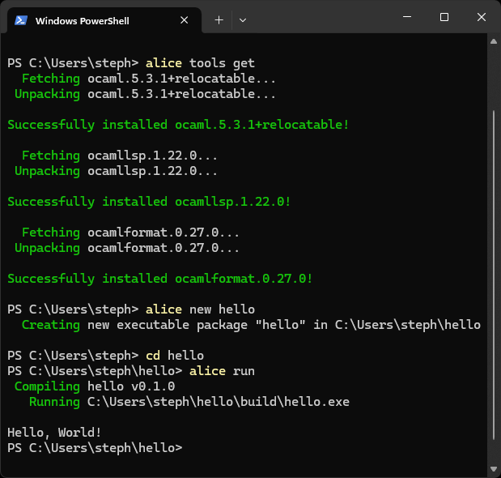

+++
title = "Porting my Toy OCaml Build System to Windows"
date = 2025-08-28
path = "porting-my-toy-ocaml-build-system-to-windows"

[taxonomies]
tags = ["ocaml", "windows", "alice"]

[extra]
og_image = "screenshot.png"
+++


[Alice](https://github.com/alicecaml/alice) is my toy OCaml build system
project where I ask "What if [Cargo](https://doc.rust-lang.org/stable/cargo/)
but for OCaml?". My main priority when designing Alice is accessibility but
perhaps a more suitable term would be _inclusivity_ as my goal is for the tool
to be usable by as many people as possible. Alice is still in its infancy and is
currently used by _nobody_ but if the day comes when it becomes a viable tool
for building OCaml software I would hate to systematically exclude a potential
user base because of baked-in assumptions made early in its design.

I do most of my development on Linux and macOS which means I'm likely to
make design decisions favouring those systems, possibly at the expense of
potential users on other systems. In particular, because Windows differs so much
from other popular OSes due to it not being Unix-based, there's a significant
risk of excluding Windows users if I don't make a conscious effort to support
them.

Like most people who grew up in the 2000s or later I was introduced to
computing on home and school computers running Windows (Windows 98 in my case!).
I started playing with Linux in 2009 and it gradually became my daily driver
but it took a huge amount of free time messing around with different distros and
learning the tools and conventions to get to my level of comfort. I'm also
fortunate enough to have the means to afford a Mac. But people who learnt
Windows first and lack the time, money, or inclination to switch to a
Unix-based OS will remain Windows users. So when Windows users are excluded from
a tool, who is _really_ being excluded?

Today I'm going to port Alice to Windows.

To prepare for this work I've compiled a relocatable OCaml compiler toolchain for
Windows based on [David Allsopp](https://www.dra27.uk/blog/)'s patches to allow
the compiler to be moved after its initial installation. See [this talk from
ICFP 2022](https://www.youtube.com/watch?v=5JDSUCx-tPw) for more info. Without
this work every user would need to compile the OCaml compiler on their machine before
using it. It's important to me that a user of Alice can get started writing
OCaml as quickly as possible with no hurdles. Building the compiler from source can
take over 10 minutes and I don't want users' first experience of Alice to be
waiting such a long time. I don't think I would have started working on Alice
at all if distributing a pre-compiled relocatable compiler wasn't an option.

Technically I could have used opam to bootstrap my development environment as it works
[perfectly fine](@/blog/sound-on-ocaml-on-windows/index.md#trying-again-with-msys2)
on Windows but one cool feature of Alice is that it can download pre-compiled
development tools for you. Alice can't build itself (yet!) but I still want to
eat my own dogfood when I can, and so I'm testing out the prebuilt toolchain
while developing Alice. I haven't updated Alice to be able to install the
dev tools prebuilt for Windows yet, but I have a handy
[shell script](https://github.com/alicecaml/alice/blob/main/boot/x86_64-windows.sh)
that sets up a development environment for working on Alice using the same tools
as Alice would install if it _was_ already built. Classic bootstrapping problem.

I'm using powershell and I have [msys2](https://www.msys2.org/) installed so
some commands will look very Unix-y. Alice itself will work fine on Windows once
ported but I barely know what I'm doing in powershell so I'll stick to what I
know (ie. Unix commands from msys2) while setting up my environment!

This command installed a prebuilt compiler toolchain to `D:\alice\current`:
```
PS D:\src\alice> sh boot\x86_64-windows.sh D:\alice
```

The result:
```
PS D:\src\alice> ls D:\alice\current\bin\


    Directory: D:\alice\current\bin


Mode                 LastWriteTime         Length Name
----                 -------------         ------ ----
-a----        2025-08-28     02:07         451937 flexlink.byte.exe
-a----        2025-08-28     02:08        4706378 flexlink.exe
-a----        2025-08-28     02:08        4706378 flexlink.opt.exe
-a----        2025-08-28     02:08       24365426 ocaml.exe
-a----        2025-08-28     02:08        3394118 ocamlc.byte.exe
-a----        2025-08-28     02:08       13950043 ocamlc.exe
-a----        2025-08-28     02:08       13950043 ocamlc.opt.exe
...
```

In addition to the compiler, this command installed `ocamlformat` and `ocamllsp`,
which I also pre-compiled for Windows in preparation for this work.

```
PS D:\src\alice> Get-Command ocamlformat

CommandType     Name               Version    Source
-----------     ----               -------    ------
Application     ocamlformat.exe    0.0.0.0    D:\alice\current\bin\ocamlformat.exe


PS D:\src\alice> Get-Command ocamllsp

CommandType     Name               Version    Source
-----------     ----               -------    ------
Application     ocamllsp.exe       0.0.0.0    D:\alice\current\bin\ocamllsp.exe
```

The other development tool I'll need is `dune`. Alice uses Dune's relatively new
package-management features and these have not yet been ported to Windows so
I've needed to hack Dune a little bit to make it work here. I already did this
work while building `ocamlformat` and `ocamllsp` with Dune package management on
Windows. Most hacks were to those projects' lockfiles rather than to Dune itself.
I kept a
[log](https://github.com/alicecaml/alice/blob/1c934ce6eb096130659268e913e4da54b7b2853c/tool-build-scripts/5.3.1/windows-notes.md)
of everything I needed to change. I may be referring to it in order to get Alice
to build with Dune on Windows.

I built Dune from source on Windows using opam while building `ocamlformat` and
`ocamllsp` and that's the Dune executable I'll be using for today's work on
Alice.

Ok so I have all the tools I need, let's see if Alice builds on Windows:
```
PS D:\src\alice> dune build
File "dune.lock/lock.dune", lines 18-29, characters 1-288:
18 |  ((arch x86_64)
19 |   (os linux)
20 |   (sys-ocaml-version 5.3.1+relocatable))
....
27 |  ((arch arm64)
28 |   (os macos)
29 |   (sys-ocaml-version 5.3.1+relocatable)))
Error: The lockdir does not contain a solution compatible with the current
platfort.
The current platform is:
- arch = x86_64
- os = win32
- os-distribution = win32
- os-family = windows
- os-version = 10.0.22621
- sys-ocaml-version = 5.3.1+relocatable
Hint: Try adding the following to dune-workspace:
Hint: (lock_dir (solve_for_platforms ((arch x86_64) (os win32))))
Hint: ...and then rerun 'dune pkg lock'
```

I've seen this error before while building `ocamlformat`. Alice has [its own
little opam repository](https://github.com/alicecaml/alice-opam-repo) which
allows it to use the pre-compiled relocatable OCaml toolchain. The relocatable
OCaml toolchain has a version which is not released on the main opam repository
which means the `ocaml-system` package can't be used, so I needed to make a new
version of `ocaml-system` matching the version of the pre-compiled toolchain
(`5.3.1+relocatable`). I did this months ago when first getting Alice working
on Linux and macOS but the version of the `ocaml-system` package originally had
some logic preventing its installation on Windows (copied from the upstream
`ocaml-system` package), but that logic turned out to be unnecessary for my use
case so I just
[deleted it](https://github.com/alicecaml/alice-opam-repo/commit/781db10863f3b7a3507842e88d0d3beeebd264ad).
However I did so recently and that change hasn't made its way into Alice yet.
Making that change to Alice was
straightforward:

```patch
diff --git a/dune-workspace b/dune-workspace
index bc77561..8d8b9db 100644
--- a/dune-workspace
+++ b/dune-workspace
@@ -7,7 +7,7 @@
 (repository
  (name alice_frozen)
  (url
-  git+https://github.com/alicecaml/alice-opam-repo#9957c6334ca7ea18a973ea2fa9e3e56ab9c85eeb))
+  git+https://github.com/alicecaml/alice-opam-repo#781db10863f3b7a3507842e88d0d3beeebd264ad))

 (repository
  (name upstream_frozen)
diff --git a/dune.lock/lock.dune b/dune.lock/lock.dune
index 5ef36e2..fdc34a5 100644
--- a/dune.lock/lock.dune
+++ b/dune.lock/lock.dune
@@ -12,7 +12,7 @@
   ((source
     https://github.com/ocaml-dune/opam-overlays.git#2a9543286ff0e0656058fee5c0da7abc16b8717d))
   ((source
-    https://github.com/alicecaml/alice-opam-repo#9957c6334ca7ea18a973ea2fa9e3e56ab9c85eeb))))
+    https://github.com/alicecaml/alice-opam-repo#781db10863f3b7a3507842e88d0d3beeebd264ad))))

 (solved_for_platforms
  ((arch x86_64)
@@ -26,4 +26,10 @@
   (sys-ocaml-version 5.3.1+relocatable))
  ((arch arm64)
   (os macos)
+  (sys-ocaml-version 5.3.1+relocatable))
+ ((arch x86_64)
+  (os win32)
+  (sys-ocaml-version 5.3.1+relocatable))
+ ((arch arm64)
+  (os win32)
   (sys-ocaml-version 5.3.1+relocatable)))
```

Trying to build again:
```
PS D:\src\alice> dune build
    Building ocaml-system.5.3.1+relocatable
    Building ocaml-config.3
    Building ocaml.5.3.1+relocatable
 Downloading xdg.3.19.1
    Building xdg.3.19.1
    Building base-unix.base
Shared cache miss [bc92329a7327ee6a16f45fa75edf32e5] (_build/_fetch/checksum/md5=a460f01d409d51b7d537429881bfa276/dir): error: Unix.Unix_error(Unix.EXDEV, "link", "_build/_fetch/checksum/md5=a460f01d409d51b7d537429881bfa276/dir/.gitignore")
 Downloading ISO8601.0.2.6
    Building ISO8601.0.2.6
 Downloading menhirLib.20240715
 Downloading menhirSdk.20240715
 Downloading menhirCST.20240715
    Building menhirLib.20240715
    Building menhirSdk.20240715
    Building menhirCST.20240715
 Downloading menhir.20240715
    Building menhir.20240715
Shared cache miss [919bb687d0058dc8265afa905483f2bd] (_build/_fetch/checksum/sha256=1d4e9c16ed9e24d46dd757ce94adc7fc8b2068eb5ff7cd2a70fce08135a752ef/dir): error: Unix.Unix_error(Unix.EXDEV, "link", "_build/_fetch/checksum/sha256=1d4e9c16ed9e24d46dd757ce94adc7fc8b2068eb5ff7cd2a70fce08135a752ef/dir/.gitignore")
 Downloading toml.7.1.0
    Building toml.7.1.0
 Downloading stdlib-shims.0.3.0
    Building stdlib-shims.0.3.0
 Downloading sha.1.15.4
    Building sha.1.15.4
    Building seq.base
 Downloading re.1.13.2
    Building re.1.13.2
Shared cache miss [806d141e2f359f01b7662634ccd5886d] (_build/_fetch/checksum/sha256=796d5791e2bf7b3bff200cf5057a7a1878439ebcd74ed0f1088cf86756d52be6/dir): error: Unix.Unix_error(Unix.EXDEV, "link", "_build/_fetch/checksum/sha256=796d5791e2bf7b3bff200cf5057a7a1878439ebcd74ed0f1088cf86756d52be6/dir/.gitignore")
 Downloading fileutils.0.6.6
    Building fileutils.0.6.6
 Downloading ordering.3.19.1
 Downloading pp.2.0.0
    Building pp.2.0.0
    Building ordering.3.19.1
 Downloading dyn.3.19.1
    Building dyn.3.19.1
 Downloading climate.0.8.0
    Building climate.0.8.0
```

That worked!

I thought I might have to apply some of the hacks I wrote about while getting
`ocamlformat` and `ocamllsp` to build
([here](https://github.com/alicecaml/alice/blob/1c934ce6eb096130659268e913e4da54b7b2853c/tool-build-scripts/5.3.1/windows-notes.md))
but fortunately not. Most of those problems come from the dependency on packages
that don't use Dune as their build system, and I've avoided such packages in
Alice.

The `Shared cache miss` errors are benign, and I think related to
the fact that my user account in on a different partition to the project I'm
building, though it's odd that it doesn't happen for all the dependencies.

```
PS D:\src\alice> ls .\_build\default\alice\src\alice.exe


    Directory: D:\src\alice\_build\default\alice\src


Mode                 LastWriteTime         Length Name
----                 -------------         ------ ----
-ar---        2025-08-28     02:51        7180768 alice.exe


PS D:\src\alice> ls .\_build\install\default\bin\


    Directory: D:\src\alice\_build\install\default\bin


Mode                 LastWriteTime         Length Name
----                 -------------         ------ ----
-ar---        2025-08-28     02:51        7180768 alice.exe
-ar---        2025-08-28     02:51        4825269 alice_demo.exe
```

One difference I observe between building Alice on Windows verses Unix-based
OSes is that on Windows it's very slow to compile. It took over 7 minutes.
One possibility is that I'm building Alice from a spinning disk drive. I use
this same computer for most of my OCaml development but usually booted into
Linux and I don't remember if I use an SSD or spinning disk for that work but
I've never run into this type of performance issue there.

The `Shared cache miss` errors suggest something is going wrong accessing Dune's
cache, and I see that rebuilding the project causes dependencies to be
downloaded again which also suggests a cache problem. As an experiment I deleted
the Dune cache from my Mac (a 2020 Macbook Air) and rebuilt Alice there, and from a
cold cache it took about a minute compared to 10 seconds building from scratch
on my Mac from a warm cache, so the caching issue on Windows probably has an
impact on the build time but it's clearly not the full story.

I tried copying the project into my Windows user account which _is_ on an SSD, and the
same partition as Dune's cache. Rebuilding from a clean project with a cold
cache took almost 9 minutes this time but there were no cache errors. I think
this rules out the explanation that my spinning disk is the problem. Rebuilding
from a clean project a second time still caused the dependencies to be
re-downloaded so I'm not sure if the cache is even enabled (but then why the
cache errors when I was on a different drive?).

Anyway incremental builds are still pretty fast and that's
all I'll be needing today so I'll move on. The goal of this project isn't to
debug Dune performance issues on Windows.

Now that I have Alice building on Windows the next step is to make sure
`ocamlformat` and `ocamllsp` work and integrate them into my editor. I built
binary versions of these tools for Windows in preparation for today's work but I
didn't test them yet.

I'm going to be using Neovim with the same
[configuration](https://github.com/gridbugs/dotfiles/tree/main/nvim) as I use
for development on Linux and macOS. It starts an `ocamllsp` server upon opening
an OCaml source file and autoformats the code with `ocamlformat` whenever I
save an OCaml source file.

Both of these tools worked flawlessly on the first try.

The next step is to add Windows support to the `alice tools get` command which
downloads the OCaml development tools for the current platform. Alice currently
has no concept of Windows at all, and running that command on my machine prints
`Unknown system: MSYS_NT-10.0-22631`.

When Alice installs tools it creates a "root" which is a directory resembling a
typical Unix filesystem root, with subdirectories like `bin` and `share`. This
lets it include things like manual pages when installing tools as well as the
tools themselves. Over time I expect to support multiple different versions of the compiler
though currently `5.3.1+relocatable` is the only supported version. Similar
to [`rustup`](https://rustup.rs/) it's possible to change the
global root that is considered "active" by running the command `alice tools
change`. This creates a symlink at `~/.alice/current` pointing to (say)
`~/.alice/roots/5.3.1+relocatable`.

The problem is that creating a symlink on Windows requires admin permissions.
My solution is to copy the selected root into `~/.alice/current` instead.

Now it works:
```
PS D:\src\alice> alice tools get
Fetching ocaml.5.3.1+relocatable...Done!
Unpacking ocaml.5.3.1+relocatable...Done!
Successfully installed ocaml.5.3.1+relocatable!

Fetching ocamllsp.1.22.0...Done!
Unpacking ocamllsp.1.22.0...Done!
Successfully installed ocamllsp.1.22.0!

Fetching ocamlformat.0.27.0...Done!
Unpacking ocamlformat.0.27.0...Done!
Successfully installed ocamlformat.0.27.0!

No current root was found so making 5.3.1+relocatable the current root.
```

Even though that command installed the same version of the tools I'm already
using, I updated my `PATH` variable to include `$HOME\.alice\current\bin`,
so now I have:
```
PS D:\src\alice> Get-Command ocamlopt

CommandType     Name          Version    Source
-----------     ----          -------    ------
Application     ocamlopt.exe  0.0.0.0    C:\Users\steph\.alice\current\bin\ocamlopt.exe
```

Next up let's see if it's possible to create a new project using Alice on
Windows:
```
PS D:\tmp> alice new foo
Created new executable project in D:\tmp\foo

PS D:\tmp> find foo
foo
foo/.gitignore
foo/Alice.toml
foo/src
foo/src/main.ml
```

Can we build it?
```
PS D:\tmp\foo> alice build
Program "ocamldep.opt" not found!
```

I do have `ocamldep.opt` installed as part of the OCaml compiler toolchain
however I suspect the `.exe` extension is causing the problem:
```
PS D:\tmp\foo> Get-Command ocamldep.opt

CommandType Name             Version Source
----------- ----             ------- ------
Application ocamldep.opt.exe 0.0.0.0 C:\Users\steph\.alice\current\bin\ocamldep.opt.exe
```

I updated Alice to include the `.exe` on Windows. I also needed to update the
invocation of `ocamlopt.opt` to `ocamlopt.opt.exe`. After this change
`alice build` could run successfully.

```
PS D:\tmp\foo> alice build
PS D:\tmp\foo> ls .\build\


    Directory: D:\tmp\foo\build


Mode                 LastWriteTime         Length Name
----                 -------------         ------ ----
-a----        2025-08-29     10:25        3134570 foo.exe
-a----        2025-08-29     10:25            180 main.cmi
-a----        2025-08-29     10:25            196 main.cmx
-a----        2025-08-29     10:18             38 main.ml
-a----        2025-08-29     10:25           1226 main.o

PS D:\tmp\foo> .\build\foo.exe
Hello, World!
```

Alice has some commands for cleaning and running a project too:
```
PS D:\tmp\foo> alice clean
PS D:\tmp\foo> alice run
```

Need to add some more printouts so it's more clear when a command completes
successfully! In the case of `alice run` something did go wrong since it didn't
print "Hello, World!". When I press enter again I see "Hello, World!" print at
the next prompt:
```
PS D:\tmp\foo> alice run
PS D:\tmp\foo> Hello, World!
```

Alice runs programs with `Unix.execv`. Here's its documentation:

> `execv prog args` execute the program in file `prog`, with the arguments `args`, and the current process environment. Note that the first argument, `args.(0)`, is by convention the filename of the program being executed, just like `Sys.argv.(0)`. These `execv*` functions never return: on success, the current program is replaced by the new one.
>
> On Windows: the CRT simply spawns a new process and exits the current one. This will have unwanted consequences if e.g. another process is waiting on the current one. Using `create_process` or one of the `open_process_*` functions instead is recommended.
>
> ***@raise*** `Unix_error` on failure

As the docs suggest I replaced `Unix.execv` with `Unix.create_process`.

```
PS D:\tmp\foo> alice run
Hello, World!
```

Next I want to test `alice dot` which prints the graphviz dot sourcecode for the
build graph:

```
PS D:\tmp\foo> alice dot
digraph {
  "foo" -> {"main.cmx", "main.o"}
  "main.cmx" -> {"main.ml"}
  "main.o" -> {"main.ml"}
}
```

The `.exe` is missing from the executable name. Windows obviously allows file
extensions like `.exe` to be omitted under some conditions since `alice run` was
able to execute `foo.exe` without its extension. It would still be better to
include the file extension here and in any other debug output printed by Alice.
Another place where the extension is missing is from the build commands
themselves. Rerunning the build with verbose logging:
```
PS D:\tmp\foo> alice build -vv
[DEBUG] copying source file: main.ml
[DEBUG] running build command: ocamlopt.opt.exe -g -c main.ml
[DEBUG] running build command: ocamlopt.opt.exe -g -o foo main.cmx
```

The OCaml compiler is clearly able to add the appropriate extension even though
it was omitted from `-o foo` but it would still be better to update the build
rules so that on Windows they use the correct extension for executable files.

```
PS D:\tmp\foo> alice build -vv
[DEBUG] copying source file: main.ml
[DEBUG] running build command: ocamlopt.opt.exe -g -c main.ml
[DEBUG] running build command: ocamlopt.opt.exe -g -o foo.exe main.cmx

PS D:\tmp\foo> alice dot
digraph {
  "foo.exe" -> {"main.cmx", "main.o"}
  "main.cmx" -> {"main.ml"}
  "main.o" -> {"main.ml"}
}
```

Just for fun here's a render of the graph made with `alice dot | dot -Tsvg > graph.svg`
showing dependencies between build artifacts and source files.


I added a second source file and interface to exercise Alice on a slightly less
trivial case:
```
PS D:\tmp\foo> alice build -vv
[DEBUG] copying source file: foo.mli
[DEBUG] running build command: ocamlopt.opt.exe -g -c foo.mli
[DEBUG] copying source file: foo.ml
[DEBUG] running build command: ocamlopt.opt.exe -g -c foo.ml
[DEBUG] copying source file: main.ml
[DEBUG] running build command: ocamlopt.opt.exe -g -c main.ml
[DEBUG] running build command: ocamlopt.opt.exe -g -o foo.exe foo.cmx main.cmx
```


I did a little more work not directly relating to supporting Windows but which
will make it easier for Alice to find the OCaml compiler, assuming the toolchain
was installed by Alice. If Alice would run an external program (such as the
OCaml compiler) and the program isn't in the user's `PATH` variable then Alice
will run the program from the current root (like `~/.alice/current`). This
will make Alice easier to set up since it removes the need to add
`~/.alice/current/bin` to `PATH`.

And now Alice works on Windows!

You need to be in Powershell rather than CMD.exe, and you'll need a C compiler
like LLVM installed an in your `PATH` for the OCaml compiler to work
correctly. After that, as long as `alice.exe` is in your `PATH`, just run
run `alice tools get` to install the OCaml compiler and dev tools, `alice new <NAME>`
to make a new project, and `alice run` from within the new project's directory
to run the project.



Alice is highly experimental and far from ready for everyday use. The next step
will be allowing Alice packages to depend on each other.
