+++
title = "Programming an Arduino the Hard Way"
date = 2023-05-10
path = "programming-an-arduino-the-hard-way"

[taxonomies]
tags = ["electronics"]

[extra]
og_image = "arduino1.jpg"
+++

This is a guide I wrote mostly for my future self on how to set up an ergonomic
development environment for writing Arduino programs in c without any
Arduino-specific tools and using an Arduino to make a simple circuit with some
flashing LEDs. I'll also discus options for powering the Arduino from a 12v
DC power supply.

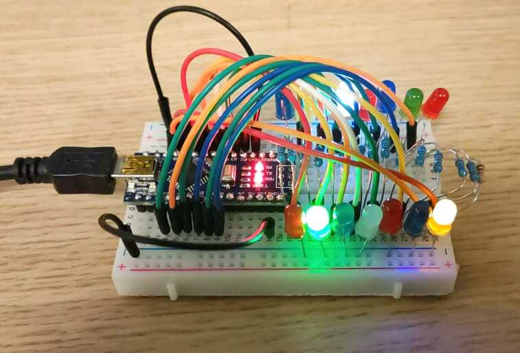

<!-- more -->

For this guide I'll be using one of
[these](https://www.elegoo.com/en-au/products/elegoo-nano-v3-0):


It's an Elegoo Nano - a cheaper drop-in replacement for the Arduino Nano. The
only noticeable differences are that the header pins don't come pre-soldered,
it doesn't come with any cables and it has a different USB to serial
chip (a CH340 instead of the FT232 found on the Arduino).

## USB Serial Driver

The docs on the [Elegoo
website](https://www.elegoo.com/en-au/products/elegoo-nano-v3-0) suggest that
you'll need to install special drivers in order for your computer to detect the
Elegoo Nano when you plug it in with a USB cable. The necessary Linux driver is
called `ch341` and it's probably already installed as a kernel module on most
Linux distributions and it's likely that it just work when you plug in the USB
cable with the Arduino attached.

If not, here are some things to try.

Enable the kernel module explicitly. If this fails it indicates that you don't have
the `ch341` kernel module installed and may have to install it with a package manager
or build it from source.
```
$ sudo modprobe ch341
$ lsmod | grep ch341
ch341                  28672  0
usbserial              73728  2 pl2303,ch341
usbcore               385024  13 pl2303,usbserial,xhci_hcd,snd_usb_audio,usbhid,snd_usbmidi_lib,xpad,usb_storage,uvcvideo,btusb,xhci_pci,uas,ch341
```

When you connect the Elegoo Nano via a USB cable, you'll see this in the output
of `dmesg`:
```
...
[210724.817737] usb 1-6: new full-speed USB device number 23 using xhci_hcd
[210724.958846] usb 1-6: New USB device found, idVendor=1a86, idProduct=7523, bcdDevice= 2.64
[210724.958853] usb 1-6: New USB device strings: Mfr=0, Product=2, SerialNumber=0
[210724.958856] usb 1-6: Product: USB Serial
[210724.967993] ch341 1-6:1.0: ch341-uart converter detected
[210724.981915] usb 1-6: ch341-uart converter now attached to ttyUSB0
```

After plugging in the device you should see a new device file `/dev/ttyUSB0`.
This will be used later on both to program the device and also to see the output
when printing messages over the serial port.

If nothing happens when you plug in the device, try a different cable (the first
one I used didn't work for some reason). If your Linux kernel didn't come with
the ch341 module try building and loading the ch341ser module from
[here](https://github.com/juliagoda/CH341SER).

Note that even though I'm technically not using an Arduino, I'll be referring to
the device as an Arduino for the remainder of this post!

## Get the Tools

We won't be using the Arduino IDE but we still need to install some tools.
Namely:

### `avr-gcc`

A c compiler targeting AVR processors such as the one found in the Arduino.

### `make`

Minimal build system.

### `avrdude`

Tool for downloading code to AVR processors such as the one found in the
Arduino.

### `picocom`

Tool for sending and receiving data over a serial port. This will be used to
connect to the Arduino so we can see the messages it prints.

### `clangd`

A Language Server Protocol (LSP) server for c. This will allow for some
ergonomics such as jumping to function definitions in editors that contain an
LSP client (e.g. vscode, neovim with the LanguageClient-neovim plugin). This
might be found in a package named `clang-tools` if no `clangd` package is
available in your distro.

### `bear`

`bear` is a tool for generating compilation databases (`compile_commands.json`)
from a `Makefile`.

### `avr-libc`

The standard c library for AVR devices. In some Linux distros this will come with
`avr-gcc` but on others it will need to be installed separately.

## Print "Hello, World!"

The code for this section is [here](https://github.com/gridbugs/hello-avr).

Put this in `main.c`. This program implements a very simple serial (USART)
driver for the Arduino and uses it to print `Hello, World!` with `printf`:

```c
// main.c
#include <stdio.h>
#include <avr/io.h>

// The arduino clock is 16Mhz and the USART0 divides this clock rate by 16
#define USART0_CLOCK_HZ 1000000
#define BAUD_RATE_HZ 9600
#define UBRR_VALUE (USART0_CLOCK_HZ / BAUD_RATE_HZ)

// Send a character over USART0.
int USART0_tx(char data, struct __file* _f) {
    while (!(UCSR0A & (1 << UDRE0))); // wait for the data buffer to be empty
    UDR0 = data; // write the character to the data buffer
    return 0;
}

// Create a stream associated with transmitting data over USART0 (this will be
// used for stdout so we can print to a terminal with printf).
static FILE uartout = FDEV_SETUP_STREAM(USART0_tx, NULL, _FDEV_SETUP_WRITE);

void USART0_init( void ) {
    UBRR0H = (UBRR_VALUE >> 8) & 0xF; // set the high byte of the baud rate
    UBRR0L = UBRR_VALUE & 0xFF; // set the low byte of the baud rate
    UCSR0B = 1 << TXEN0; // enable the USART0 transmitter
    UCSR0C = 3 << UCSZ00; // use 8-bit characters
    stdout = &uartout;
}

int main(void) {
    USART0_init();
    printf("Hello, World!\r\n");
    return 0;
}
```

Compile the code to an elf file. `atmega328p` is the name of the microcontroller
on the Arduino Nano but other devices may have a different microcontroller.
```
$ avr-gcc -mmcu=atmega328p main.c -o hello.elf
```

Flash the Arduino. Plug it in with a USB cable, then run the following command.
Replace `/dev/ttyUSB0` with the device associated with the Arduino's serial port
(if you have multiple USB serial devices plugged in it might get assigned a
different device file). Also as with the `avr-gcc` command above, replace
`m328p` with the part number of the microcontroller on your Arduino. `avrdude`
uses a different naming convention to `avr-gcc`.
```
$ sudo avrdude -P /dev/ttyUSB0 -c arduino -p m328p -U flash:w:hello.elf

avrdude: AVR device initialized and ready to accept instructions
avrdude: device signature = 0x1e950f (probably m328p)
avrdude: Note: flash memory has been specified, an erase cycle will be performed.
         To disable this feature, specify the -D option.
avrdude: erasing chip
avrdude: reading input file hello.elf for flash
         with 390 bytes in 1 section within [0, 0x185]
         using 4 pages and 122 pad bytes
avrdude: writing 390 bytes flash ...

Writing | ################################################## | 100% 0.10 s

avrdude: 390 bytes of flash written
avrdude: verifying flash memory against hello.elf

Reading | ################################################## | 100% 0.06 s

avrdude: 390 bytes of flash verified

avrdude done.  Thank you.
```

To see the output of this program you'll need to use a tool that prints data
received over a serial connection. I'll use `picocom` in this guide. Run the
following command, replacing `/dev/ttyUSB0` with the device file associated with
the Arduino.
```
$ sudo picocom -b9600 /dev/ttyUSB0
picocom v3.2a

port is        : /dev/ttyUSB0
flowcontrol    : none
baudrate is    : 9600
parity is      : none
databits are   : 8
stopbits are   : 1
escape is      : C-a
local echo is  : no
noinit is      : no
noreset is     : no
hangup is      : no
nolock is      : no
send_cmd is    : /nix/store/sy0ipq6qy2slql25lbax77i4315bynzp-lrzsz-0.12.20/bin/sz -vv
receive_cmd is : /nix/store/sy0ipq6qy2slql25lbax77i4315bynzp-lrzsz-0.12.20/bin/rz -vv -E
imap is        :
omap is        :
emap is        : crcrlf,delbs,
logfile is     : none
initstring     : none
exit_after is  : not set
exit is        : no

Type [C-a] [C-h] to see available commands
Terminal ready
Hello, World!
```

To exit `picocom`, press Ctrl-a, then Ctrl-x.

When the Arduino is plugged in via its USB port, connecting to it with `picocom` (running the `sudo picocom ...` command)
will cause the device to reset, so you won't miss the "Hello, World!" message if
you don't connect fast enough. You can also reset the Arduino by pressing the
button near its built-in LEDs.

Also note the `-b9600` sets the baud rate which corresponds to the line `#define
BAUD_RATE_HZ 9600` in the program.

Another note on `picocom` is that you won't be able to download code to the Arduino (the
`avrdude` command) while connected to the device with `picocom`. Exit `picocom`
(Ctrl-a, then Ctrl-x) before running `avrdude`.

So that we don't have to manually run `avr-gcc` every time we compile the code,
create a `Makefile` with the following contents:
```make
# Makefile
TARGET=hello

SRC=main.c
OBJ=$(SRC:.c=.o)

CC=avr-gcc
MCU=atmega328p

# The --param=min-pagesize=0 argument is to fix the error:
# error: array subscript 0 is outside array bounds of ‘volatile uint8_t[0]’
#        {aka ‘volatile unsigned char[]’}
# ...which is incorrectly reported in some versions of gcc
CFLAGS=-mmcu=$(MCU) -std=c99 -Werror -Wall --param=min-pagesize=0

$(TARGET).elf: $(OBJ)
	$(CC) $(CFLAGS) $(OBJ) -o $@

%.o : %.c
	$(CC) $(CFLAGS) -c -o $@ $<

clean: 
	rm -rf *.o *.elf
```

Note that this also enables more warnings and works around a problem where
`avr-gcc` would incorrectly report an error.

Now to rebuild the `hello.elf` binary after changing the code you can simply run:
```
$ make
avr-gcc -mmcu=atmega328p -std=c99 -Werror -Wall --param=min-pagesize=0 -c -o main.o main.c
avr-gcc -mmcu=atmega328p -std=c99 -Werror -Wall --param=min-pagesize=0 main.o -o hello.elf
```

## Jump to Definition and other ergonomics with LanguageClient-neovim and clangd

I won't cover setting up an LSP client here as there are too many different
editors and plugins to choose from, but for an example neovim LSP setup using
the LanguageClient-neovim plugin, see [my neovim
config](https://github.com/gridbugs/dotfiles/blob/1f7375ff2ab74bb3688326ec43744df0c77fd07a/nvim/plugins.vim#L72).

For the LSP server we'll use `clangd`. As long as `clangd` is installed and your editor is correctly configured,
your editor should take care of starting and stopping `clangd` in the background. To check
that it's installed try running the command `clangd`.

For `clangd` to work correctly it needs to know how you intend on compiling the
code. It finds this out by reading a file `compile_commands.json` that lists the
commands used to compile the code. There are various ways of generating this
file and since it will contain absolute paths it's not advised to check it into
the project. One way of generating `compile_commands.json` is with a tool called
`bear`.

`bear` can generate a `compile_commands.json` from an invocation of `make` by
watching what commands are run. For example (the working directory is
`/home/s/src/hello-avr`):
```
$ bear -- make --always-make
avr-gcc -mmcu=atmega328p -std=c99 -Werror -Wall --param=min-pagesize=0 -c -o main.o main.c
avr-gcc -mmcu=atmega328p -std=c99 -Werror -Wall --param=min-pagesize=0 main.o -o hello.elf

$ cat compile_commands.json
[
  {
    "arguments": [
      "/usr/bin/avr-gcc",
      "-mmcu=atmega328p",
      "-std=c99",
      "-Werror",
      "-Wall",
      "--param=min-pagesize=0",
      "-c",
      "-o",
      "main.o",
      "main.c"
    ],
    "directory": "/home/s/src/hello-avr",
    "file": "/home/s/src/hello-avr/main.c",
    "output": "/home/s/src/hello-avr/main.o"
  }
]
```
The `--always-make` argument to `make` tells it to unconditionally run the
build commands and removes the need to run `make clean` first.

On some systems, this is sufficient to allow an LSP client to do code navigation
and other ergonomic features.

I've tested this on Alpine Linux and NixOS. On the former, LSP features worked as expected
at this point and no further configuration was necessary, but on NixOS I had
some errors from `clangd` when opening `main.c` in a text editor with LSP
support:

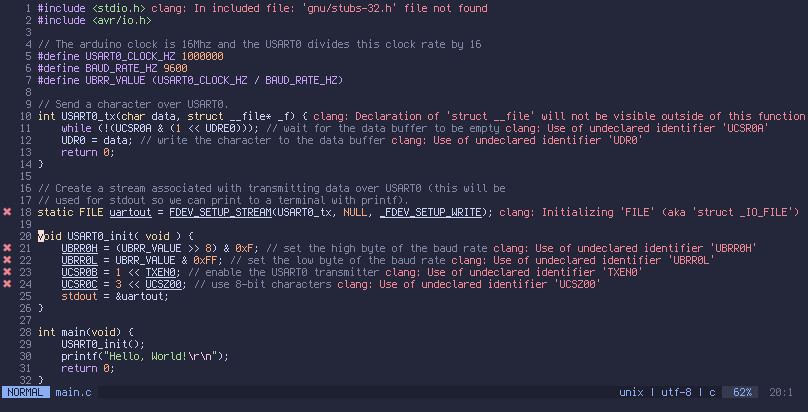

It's not immediately clear from the error messages but this problem is caused by
the LSP server (`clangd`) being unable to locate the header file `<avr/io.h>`.

Since this problem is easy to reproduce on NixOS, we'll start by looking at the
contents of `compile_commands.json` on NixOS:
```json
[
  {
    "arguments": [
      "/nix/store/pfxqwrvm0y6lbs53injrl4sqz2njrpyl-avr-stage-final-gcc-wrapper-12.2.0/bin/avr-gcc",
      "-mmcu=atmega328p",
      "-std=c99",
      "-Werror",
      "-Wall",
      "--param=min-pagesize=0",
      "-c",
      "-o",
      "main.o",
      "main.c"
    ],
    "directory": "/home/s/src/hello-avr",
    "file": "/home/s/src/hello-avr/main.c",
    "output": "/home/s/src/hello-avr/main.o"
  }
]
```

Let's try manually adding some extra include paths to help `clangd` find
`<avr/io.h>`. Since the code compiles when we run `make`, `avr-gcc` must be
finding headers successfully. We can ask `avr-gcc` to print out its additional
include paths with this command:
```
$ avr-gcc -E -Wp,-v - < /dev/null
ignoring duplicate directory "/nix/store/fh0ccmn4vv7hncyfic4ph3hx34vmzsih-avrdude-7.1/include"
ignoring duplicate directory "/nix/store/fh0ccmn4vv7hncyfic4ph3hx34vmzsih-avrdude-7.1/include"
ignoring duplicate directory "/nix/store/fh0ccmn4vv7hncyfic4ph3hx34vmzsih-avrdude-7.1/include"
ignoring nonexistent directory "/nix/store/ss76yfg4wj01ha9rjjgkr4qg0g76ivpa-avr-stage-final-gcc-12.2.0/lib/gcc/avr/12.2.0/../../../../avr/sys-include"
ignoring nonexistent directory "/nix/store/ss76yfg4wj01ha9rjjgkr4qg0g76ivpa-avr-stage-final-gcc-12.2.0/lib/gcc/avr/12.2.0/../../../../avr/include"
ignoring duplicate directory "/nix/store/ss76yfg4wj01ha9rjjgkr4qg0g76ivpa-avr-stage-final-gcc-12.2.0/lib/gcc/avr/12.2.0/include-fixed"
#include "..." search starts here:
#include <...> search starts here:
 /nix/store/fh0ccmn4vv7hncyfic4ph3hx34vmzsih-avrdude-7.1/include
 /nix/store/ss76yfg4wj01ha9rjjgkr4qg0g76ivpa-avr-stage-final-gcc-12.2.0/lib/gcc/avr/12.2.0/include
 /nix/store/ss76yfg4wj01ha9rjjgkr4qg0g76ivpa-avr-stage-final-gcc-12.2.0/lib/gcc/avr/12.2.0/include-fixed
 /nix/store/r2jr0x50g79spg2ncm5kjmw74n7gvxzg-avr-libc-avr-2.1.0/avr/include
End of search list.
# 0 "<stdin>"
# 0 "<built-in>"
# 0 "<command-line>"
# 1 "<stdin>"
```

The 4 lines after
`#include <...> search starts here:` are the paths we're interested in.
We can probably skip the first one as it's related to `avrdude` but including it
won't hurt and just adding all the extra include paths simplifies the process
compared to adding a select few. Manually editing `compile_commands.json`
to explicitly add these include files results in:
```json
[
  {
    "arguments": [
      "/nix/store/pfxqwrvm0y6lbs53injrl4sqz2njrpyl-avr-stage-final-gcc-wrapper-12.2.0/bin/avr-gcc",
      "-mmcu=atmega328p",
      "-std=c99",
      "-Werror",
      "-Wall",
      "--param=min-pagesize=0",
      "-c",
      "-o",
      "main.o",
      "main.c",
      "-I/nix/store/fh0ccmn4vv7hncyfic4ph3hx34vmzsih-avrdude-7.1/include",
      "-I/nix/store/ss76yfg4wj01ha9rjjgkr4qg0g76ivpa-avr-stage-final-gcc-12.2.0/lib/gcc/avr/12.2.0/include",
      "-I/nix/store/ss76yfg4wj01ha9rjjgkr4qg0g76ivpa-avr-stage-final-gcc-12.2.0/lib/gcc/avr/12.2.0/include-fixed",
      "-I/nix/store/r2jr0x50g79spg2ncm5kjmw74n7gvxzg-avr-libc-avr-2.1.0/avr/include"
    ],
    "directory": "/home/s/src/hello-avr",
    "file": "/home/s/src/hello-avr/main.c",
    "output": "/home/s/src/hello-avr/main.o"
  }
]
```

Note the extra 4 `-I...` arguments to `avr-gcc`.

Opening `main.c` in an LSP-enabled editor again, the errors are gone:


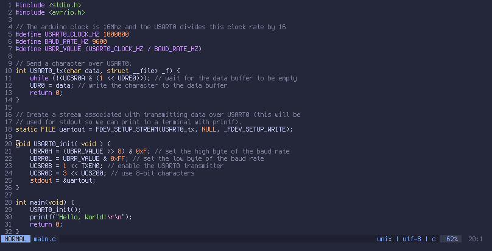

We can use LSP's "jump to definition" feature to open `<avr/io.h>`. In neovim
(with LanguageClient-neovim)
move the cursor over `<avr/io.h>` and run `:call
LanguageClient#textDocument_definition()` (obviously [bind this to a key
combination](https://github.com/gridbugs/dotfiles/blob/1f7375ff2ab74bb3688326ec43744df0c77fd07a/nvim/plugins.vim#L108)):

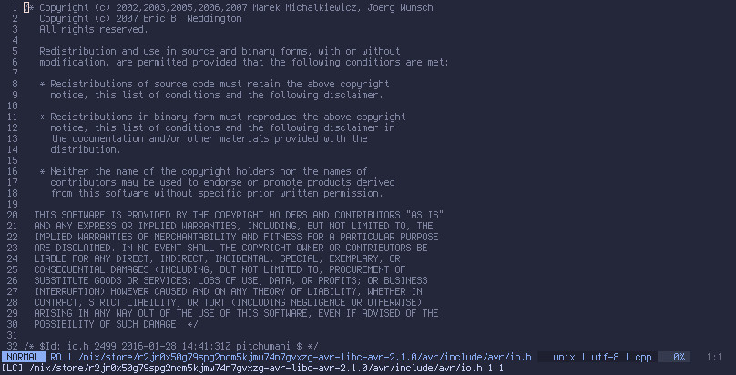

For another example, move the cursor over a symbol defined in a header, such as
the `UCSR0A` register on line 11 of `main.c`:

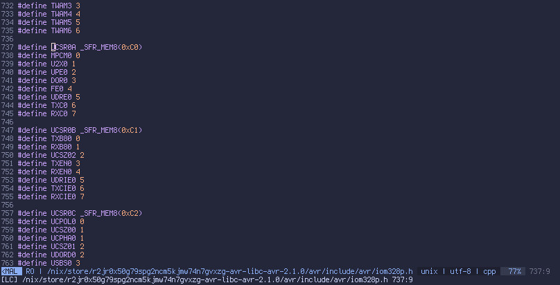

Another handy feature of LSP is showing type signatures and documentation of
symbols. For example put the cursor over the call to `printf` in `main.c` and
run `:call LanguageClient#textDocument_hover()` (again, assuming
LanguageClient-neovim):


One remaining problem is that `compile_commands.json` contains a bunch of
absolute paths and so isn't portable; we can't check it into version control
which means we need to generate it after checking out the project. Rather than
using `bear` directly and manually modifying the result, here is a script that
automates the modification we just performed. Note that it uses the `jq` command
which may need to be installed.

```bash
#!/bin/sh
set -euo pipefail

# Script that prints a compilation database (typically stored in
# compile_commands.json) which contains additional include paths found by
# querying avr-gcc.

include_paths() {
    # Print custom include paths used by the avr compiler to stdout, one per line.
    CC=avr-gcc
    $CC -E -Wp,-v - < /dev/null 2>&1 \
        | sed -n '/#include <...> search starts here:/,/End of search list./p' \
        | tail -n+2 \
        | head -n-1 \
        | xargs -n1 echo
}

compile_commands() {
    # Print the compilation database that would normally go in
    # compile_commands.json.
    # This would be simpler if bear supported printing to stdout:
    # https://github.com/rizsotto/Bear/issues/525
    TMP="$(mktemp -d)"
    trap "rm -rf $TMP" EXIT
    OUTPUT=$TMP/x.json
    bear --output $OUTPUT -- make --always-make > /dev/null
    cat $OUTPUT
}

# Comma-separated list of quoted include paths with "-I" prepended to each. E.g.
# "-Ifoo","-Ibar"
COMMA_SEPARATED_QUOTED_INCLUDE_ARGS=$(
    include_paths \
        | xargs -I{} echo '"-I{}"' \
        | tr '\n' , \
        | sed 's/,$//'
)

# Add the extra include paths to the compilation database and print the result.
compile_commands | \
    jq "map(.arguments += [$COMMA_SEPARATED_QUOTED_INCLUDE_ARGS])"
```

Put this script in `tools/compile_commands_with_extra_include_paths.sh` and run
it with:
```
$ tools/compile_commands_with_extra_include_paths.sh > compile_commands.json
```

## LED Chaser Circuit

Now let's make a simple LED Chaser circuit by attaching some LEDs to some of the
digital IO pins on the Arduino.

Step 1 is working out which pins we'll be using.

Here's a close up of an Arduino Nano with the names of each pin visible:

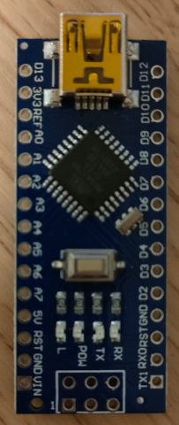

For ease of reading here are the pin labels copied from the above image in a
table in the same positions as they appear in the image above:

| Left Side   | Right Side  |
| ----------- | ----------- |
| D13         | D12         |
| 3V3         | D11         |
| REF         | D10         |
| A0          | D9          |
| A1          | D8          |
| A2          | D7          |
| A3          | D6          |
| A4          | D5          |
| A5          | D4          |
| A6          | D3          |
| A7          | D2          |
| 5V          | GND         |
| RST         | RST         |
| GND         | RX0         |
| VIN         | TX1         |


And this is the pinout from the Arduino official docs. Most pins have multiple
functions. The I/O-Port functions are what we're interested in. They are
coloured orange without stripes in the following diagram. The key calls them
"Microcontroler's Port" and ATmega328P manual calls them "I/O-Port".

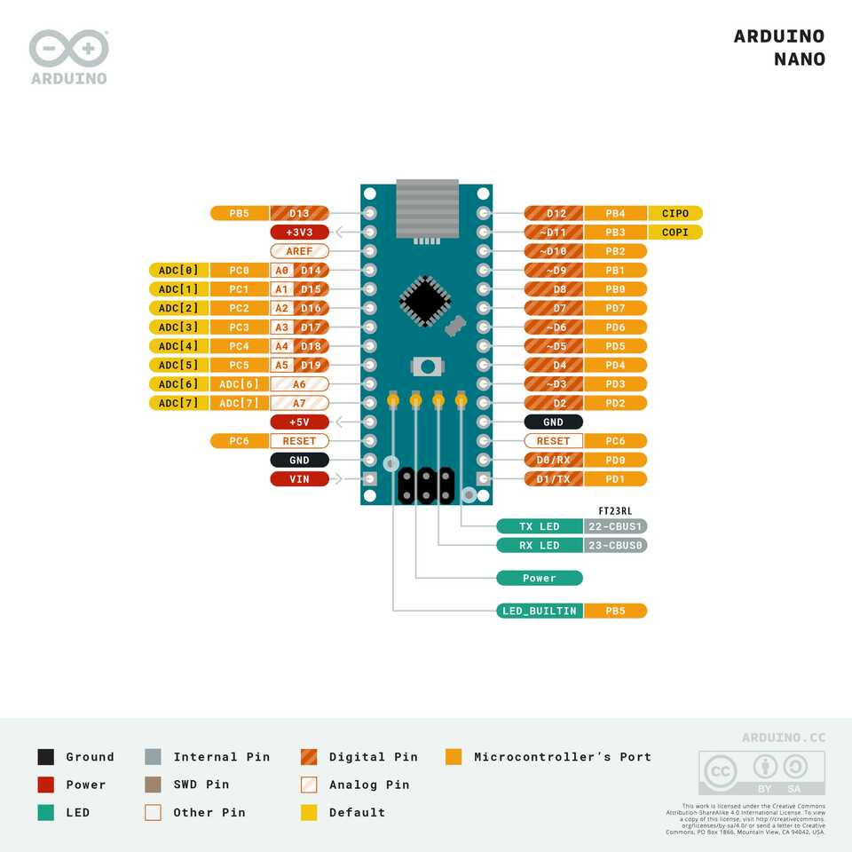

Note that this diagram contains an error. The "ADC[6]" and "ADC[7]" pins have
labels coloured both yellow and orange with "ADC[x]" on them but the orange
labels are for I/O-Ports only so labeling them with "ADC" doesn't make sense. We
won't be using these pins here, but I did do an experiment where I turned on
all the I/O-Port pins and A6 and A7 pins didn't turn on so they aren't
connected to an I/O-Port.

I only have enough space on my breadboard for 15 LEDs (after accounting for the
Arduino's pins and current-limiting resistors for the LEDs), so I've chosen 15
pins on
the Arduino Nano that connect to I/O-Port pins on the microcontroller. Using the
labels of pins physically printed on the Arduino board, these
pins are: D2, D3, D4, D5, D6, D7, D8, D9, D10, A0, A1, A2, A3, A4, A5.

This is the circuit diagram for the LED chaser. The orientation of the
Arduino is the same as in the above image, and the pins are all in the same
positions and labels.

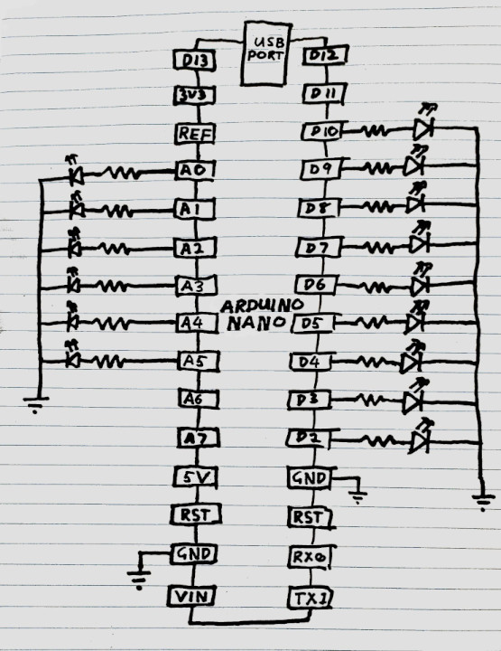

In the circuit, some pins are connected to a resistor in series with an LED.
The cathode of each LED is connected to ground. The resistor is there to limit
the current flowing through the pin and LED to prevent damage to each. I used 1K
resistors here.

Here's how the circuit looks on a breadboard:


## LED Chaser Code

Here's the code for the LED chaser.
It's also available on github [here](https://github.com/gridbugs/arduino-nano-led-chaser).

Most of the I/O-Port pins on the Arduino have multiple possible functions and must be
configured by writing to various registers. All pins which can function as
I/O-Port pins are initially configured as I/O-Port pins, so no explicit
configuration is necessary for this example. Note however that the pins labelled
TX1 and RX0 are also I/O-Port pins (Port D, pins 0 and 1). They must be
explicitly configured to behave as USART pins (sending and receiving data over a
serial port - this is how "Hello, World!" is printed on startup). Even though
nothing is plugged into these pins, they are connected internally to the
Arduino's USB chip. The LED chaser intentionally doesn't use this pins as if it
did we wouldn't be able to print anything over USART.

```c
#include <stdio.h>
#include <avr/io.h>


// The arduino clock is 16Mhz and the USART0 divides this clock rate by 16
#define USART0_CLOCK_HZ 1000000
#define BAUD_RATE_HZ 9600
#define UBRR_VALUE (USART0_CLOCK_HZ / BAUD_RATE_HZ)

// Send a character over USART0.
int USART0_tx(char data, struct __file* _f) {
    while (!(UCSR0A & (1 << UDRE0))); // wait for the data buffer to be empty
    UDR0 = data; // write the character to the data buffer
    return 0;
}

// Create a stream associated with transmitting data over USART0 (this will be
// used for stdout so we can print to a terminal with printf).
static FILE uartout = FDEV_SETUP_STREAM(USART0_tx, NULL, _FDEV_SETUP_WRITE);

void USART0_init( void ) {
    UBRR0H = (UBRR_VALUE >> 8) & 0xF; // set the high byte of the baud rate
    UBRR0L = UBRR_VALUE & 0xFF; // set the low byte of the baud rate
    UCSR0B = 1 << TXEN0; // enable the USART0 transmitter
    UCSR0C = 3 << UCSZ00; // use 8-bit characters
    stdout = &uartout;
}

// Represents a single I/O-Port pin
typedef struct {
    volatile uint8_t* port; // pointer to the port's register
    uint8_t bit; // (0 to 7) which bit in the register the port corresponds to
} led_t;

// List out each pin with an attached LED in the order we want them to flash
led_t leds[] = {
    { .port = &PORTD, .bit = 7 },
    { .port = &PORTD, .bit = 6 },
    { .port = &PORTD, .bit = 5 },
    { .port = &PORTD, .bit = 4 },
    { .port = &PORTD, .bit = 3 },
    { .port = &PORTD, .bit = 2 },
    { .port = &PORTB, .bit = 2 },
    { .port = &PORTB, .bit = 1 },
    { .port = &PORTB, .bit = 0 },
    { .port = &PORTC, .bit = 5 },
    { .port = &PORTC, .bit = 4 },
    { .port = &PORTC, .bit = 3 },
    { .port = &PORTC, .bit = 2 },
    { .port = &PORTC, .bit = 1 },
    { .port = &PORTC, .bit = 0 },
};

// The number of LEDs
#define N_LEDS (sizeof(leds) / sizeof(led_t))

// Turn on a single LED without affecting the state of the other LEDs
void led_on(led_t led) {
    *led.port |= 1 << led.bit;
}

int main(void) {
    USART0_init();
    printf("Hello, World!\r\n");

    // Set the data direction for each I/O-Port pin to "output".
    // Each DDRx register controls whether each pin in I/O-Port x is
    // an input pin (0) or an output pin (1).
    DDRB = 0xFF;
    DDRC = 0xFF;
    DDRD = 0xFF;

    // The starting points for the indices into the global `leds` array
    // that will be on. We'll have 3 lights on at a time in a rotating
    // pattern, evenly spaced out.
    int indices[] = {0, 5, 10};

    while (1) {

        // Briefly turn off all the LEDs
        PORTB = 0;
        PORTC = 0;
        PORTD = 0;

        // Turn on just the pins at the indices, and increment each index
        // wrapping around at N_LEDS
        for (int i = 0; i < (sizeof(indices) / sizeof(indices[0])); i++) {
            led_on(leds[indices[i]]);
            indices[i] = (indices[i] + 1) % N_LEDS;
        }

        // Wait for a short amount of time before progressing
        uint32_t delay = 100000;
        while (delay > 0) {
            delay -= 1;
        }
    }

    return 0;
}
```

Use the same Makefile as in the previous example, then build and download the
code to an Arduino with the command:
```
make && sudo avrdude -P /dev/ttyUSB0 -c arduino -p m328p -U flash:w:hello.elf
```

Remember to substitute `/dev/ttyUSB0` with the device corresponding to your
Arduino.

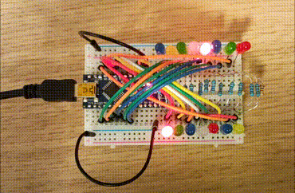

## USB UART Adapter

I have a bunch of these USB to UART adapters lying around from another project.
It would be fun to try using one of these to talk to the Arduino directly via
its header pins rather than through its USB port. We won't be able to program it
through this adapter but we will be able to power it and print over UART and see
the results in `picocom`.


What are the 4 wires? There's no brand name and I forget where I bought it from so I
don't know how to find documentation. However, the black wire is probably
ground, and the red wire provides 5v. Of the two remaining wires, one of them is
transmit (TX) and the other receive (RX). I don't know which one is which and there
doesn't seem to be standardised colours as far as I can tell, so I'll just
guess.

Turns out the white wire is TX and the green wire is RX.

Disconnect the USB cable from the Arduino's USB port as we should only power it
from one source at a time, and we'll be using the 5V pin on the USB to UART
adapter to power it now.

I used male to male patch pins to connect the wires on the USB to UART adapter
to my breadboard. Connect the wires as per this table:

| UART to USB wire function | UART to USB wire colour | Arduino pin name |
|---------------------------|-------------------------|------------------|
| 5v                        | Red                     | 5V               |
| Ground                    | Black                   | GND (any of them)|
| TX (UART end)             | White                   | TX1              |
| RX (UART end)             | Green                   | RX0              |

I clarify "UART end" for the TX an RX wires as for example the other end of the
TX wire would be labelled "RX"; the Arduino transmits data on this wire and the
device at the other end of the wire (the UART to USB adapter in this case)
receives that data, and vice versa.

Again, disconnect the cable from the Arduino's USB port before doing this.
Here's how it looks on my breadboard:


When you plug the USB end of the adapter into your computer it should show up as
a device `/dev/ttyUSBx`, just like the Arduino did when we plugged it in. You
can't program the device with `avrdude`, but you can still connect to it with
`picocom` to see it print "Hello, World!".

Unlike before, connecting to the
device with `picocom` will not cause the Arduino to reset, so you can miss the
message it prints when it turns on. Just press the reset button on the top of
the Arduino to restart it and you should see "Hello, World!" in the `picocom`
session. (Resetting the Arduino does not cause `picocom` to disconnect as
technically `picocom` is connected to the USB to UART adapter - not the Arduino.
It just displays whatever data arrives over the TX wire no matter what it's
plugged into.
In fact, if you had a magnetized needle and a steady hand...[never
mind](https://xkcd.com/378/)).

Also note that we aren't transmitting any data _to_ the Arduino over UART, so
you don't even need to plug the green wire in at all.

One trick this adapter lets us perform is continuously seeing the output of the
Arduino, even while programming it. Previously if we wanted to program the
Arduino and see the messages it prints over UART we would need to first run
`avrdude` to program it, then run `picocom` to see its output. To program it
again we would have to stop `picocom` before running `avrdude`. That gets a bit
annoying.

We're going to use the USB cable for programming and the USB to UART adapter for receiving messages printed by the Arduino.
To set this up, unplug the red 5v wire from the UART adapter, and plug the USB cable back into
the USB port. Keep at least the white and black wires attached from the setup
above - just make sure the red wire is unplugged as we'll be powering the
Arduino with the USB cable once again. Now with both the USB cable (the one
attached to the Arduino's USB port) _and_ the USB to UART adapter both plugged
into your computer, you should see devices `/dev/ttyUSB0` and `/dev/ttyUSB1`
corresponding to both of these devices. You can use `dmesg` to determine which
one is which by unplugging and re-plugging them and watching the output of
`dmesg`, or just see which one can be used to program the device with `avrdude`.
Connect `picocom` to the USB to UART adapter, and program the device with
`avrdude` via the USB cable, and you'll no longer need to close `picocom` to
reprogram the Arduino!

Here's an example of how this might look.

In one terminal:
```
$ sudo avrdude -P /dev/ttyUSB0 -c arduino -p m328p -U flash:w:hello.elf
```

And in the other terminal:
```
$ sudo picocom /dev/ttyUSB1
```

Depending on the order you plugged things in, the `ttyUSB0` and `ttyUSB1` in the
above commands might have to be swapped.

## Power Options

There are a couple of additional ways you can power the arduino besides the two
mentioned above. When your Arduino is deployed in whatever wonderful project
you're planning to use it for, probably there won't be a USB cable or USB to
UART adapter attached to it.

Power solutions will depend on what power supply is available in your project.
Mine has a 12v DC power supply, so here are my options:

### Powering from a DC 12v supply via the VIN pin

The simplest solution is to attach the 12v DC supply directly to the VIN
pin on the Arduino. Between the VIN and 5V pins on the Arduino there is a 5 volt
voltage regulator (specifically, a
[LM117IMPX-5.0](https://www.ti.com/lit/ds/symlink/lm1117.pdf?ts=168433779491) -
see the Arduino Nano schematics
[here](https://docs.arduino.cc/static/59500e84ace853fee30c7854084c2e2c/A000005-schematics.pdf)).


This means that you can provide a range of voltages to the VIN pin and the
voltage regulator will provide a steady 5v to the rest of the board. All the
advice I can find recommends between 7 and 12 volts be provided to this pin. Too
little and the voltage regulator might not be able to provide 5v at its output.
Too much and it could overheat.

### Powering from a DC 12v supply with a 78L05 voltage regulator

You can also power the Arduino directly from its 5V pin, bypassing the built-in
voltage regulator. To do this, I'll attach an external voltage regulator - a
78L05, like this one:

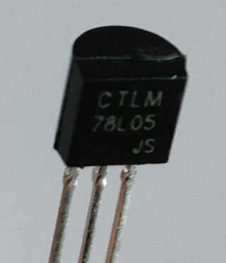

It looks like a transistor but it's not. The right pin is the input which I'll
attach to the 12v supply. The middle pin is ground. The left pin is the output
which I'll connect to the 5V pin of the Arduino.

This shows how the voltage regulator will be attached between the 12v power
supply and the Arduino, via its 5V pin:

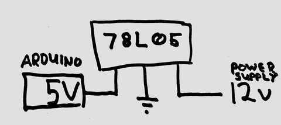

Here it is on my breadboard:

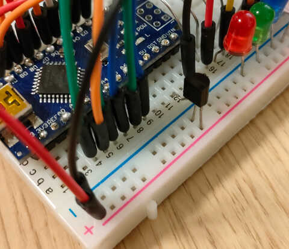

And here's proof that it didn't immediately catch fire when I turned it on!

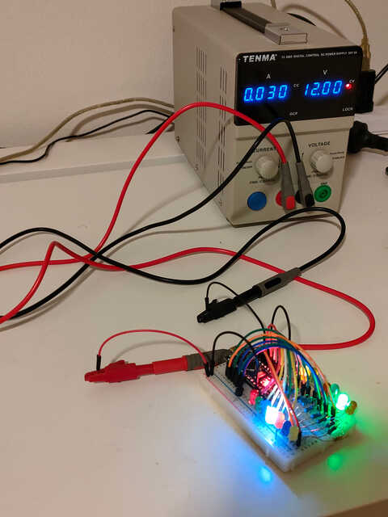
