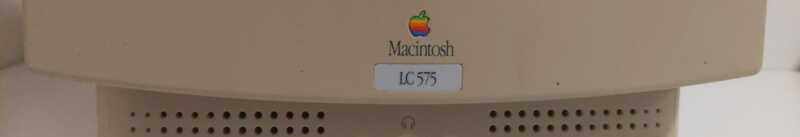
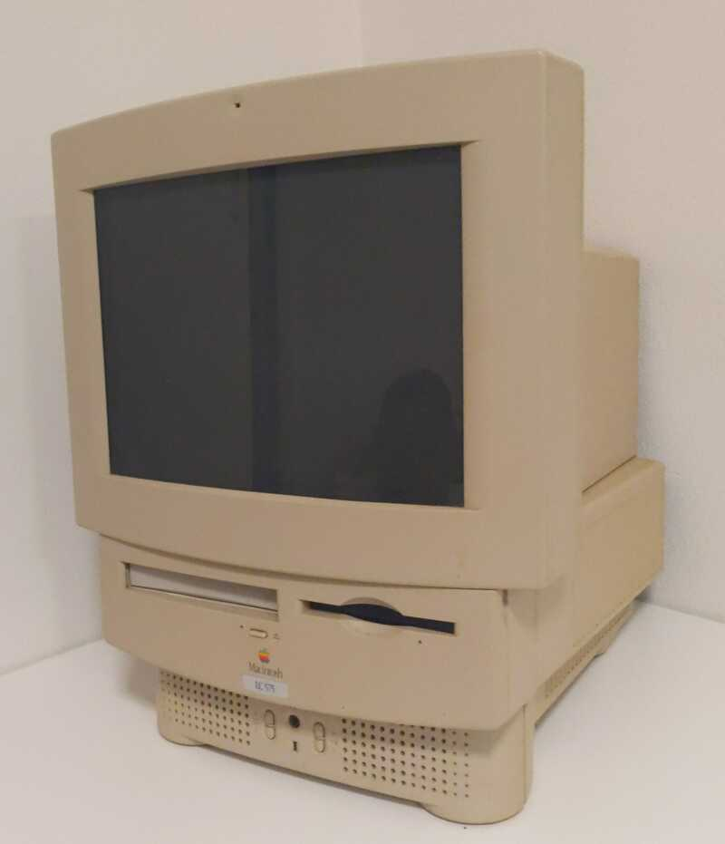
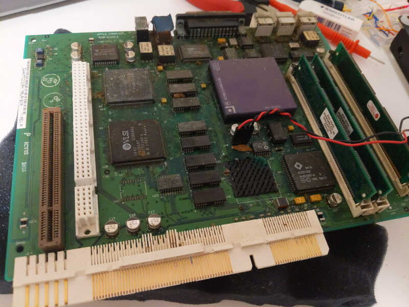
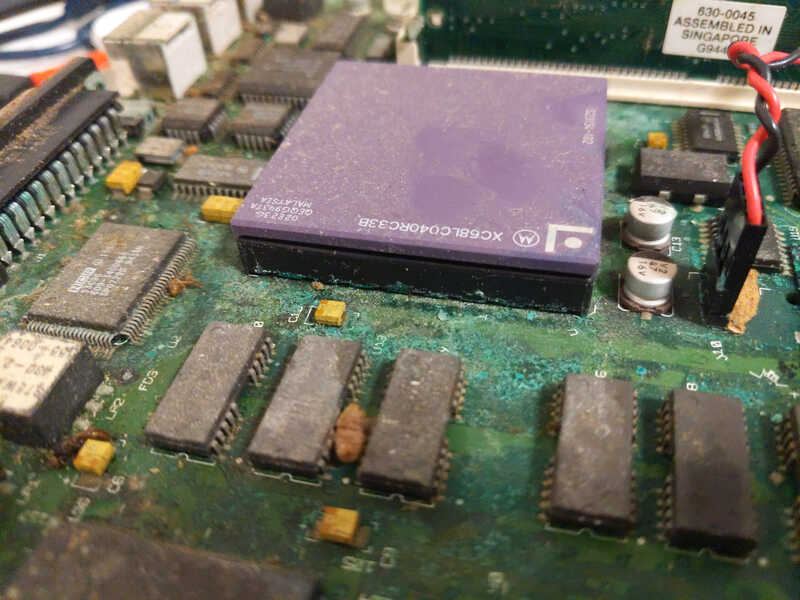

+++
title = "Restoring my Childhood Family Computer Part 1: Rust"
date = 2024-10-26
path = "restoring-my-childhood-family-computer-part-1"

[taxonomies]
tags = ["retrocomputing", "electronics"]
+++

I'm going to attempt to repair my family's old Macintosh LC575. Some of my
earliest memories are of playing games on this computer and I'm keen to check out some of
the primary school assignments I typed up on it and save files from games I
played as a kid. I visited home about 10 years ago and was disappointed to find
that it didn't power on. I asked my mum to mail it to me and now I finally have
enough confidence with electronics to begin figuring out what's wrong with it
and hopefully to repair it. This is the first retro computer I've attempted to
repair and there's a chance that it will never work but it would be really cool
if I can fix it!

Here it is:

The first step was taking out the motherboard. There's a plastic cover on the
back that pops off with some clips. The plastic has become so brittle that one
of the clips shattered in the process of removing it. After this the
motherboard just slides out!

It's not in great shape. The peripheral plugs are very rusty, as are some of
the IC pins. What's scarier though is the suspicious bright-green powder
clearer in this next image:

The first motherboard photo was from after attempting to clean up the board a
bit, but this second one shows it in its original state with a bright-green
powder on some parts of the board. I got some advice online after sharing this
photo around that this is the result of a battery leak. After cleaning it off,
some parts of the green coating on the board flake off. I don't know yet
whether it's impacted the connections between components.

Suggestions from asking about this online range from giving it a good wash to
accepting that it will be almost impossible to repair. Given that I mostly just
care about the contents of the hard drive (finger's crossed it isn't full of
rust!) I might end up replacing the motherboard if it is indeed irreparable.

That's all for now. The next step will be taking off the shell and inspecting
the power supply.

Part 2 is [here](@/blog/restoring-my-childhood-family-computer-part-2/index.md).
