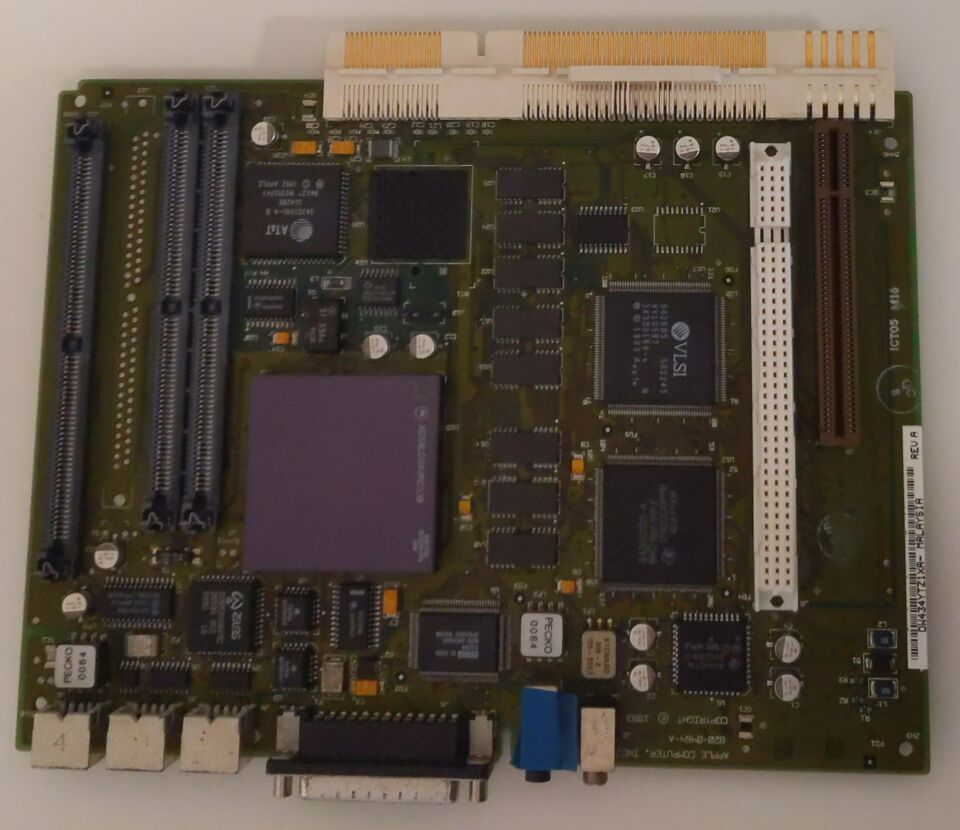
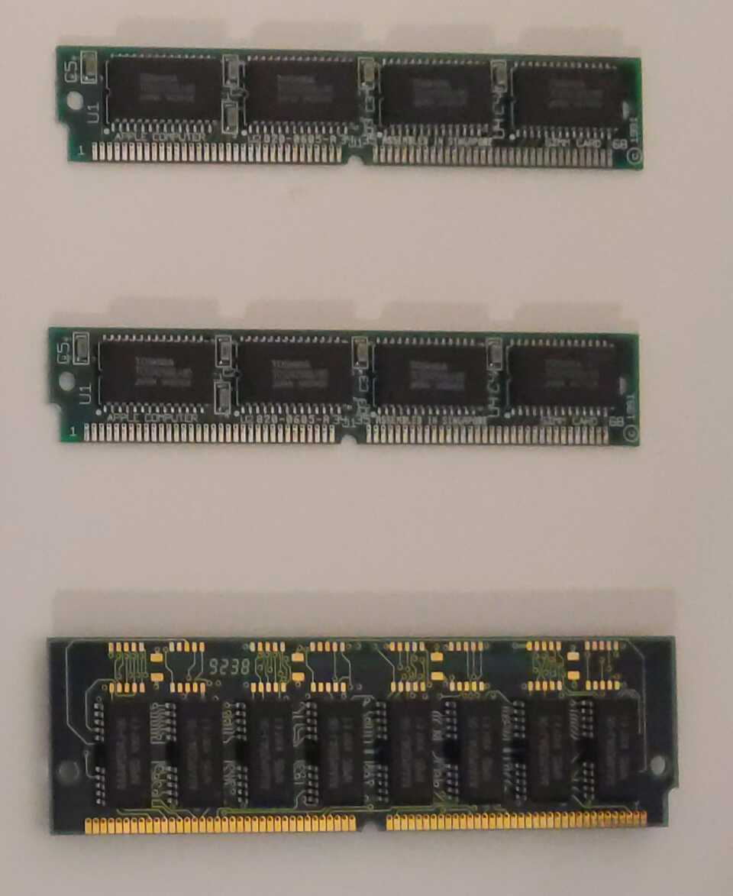
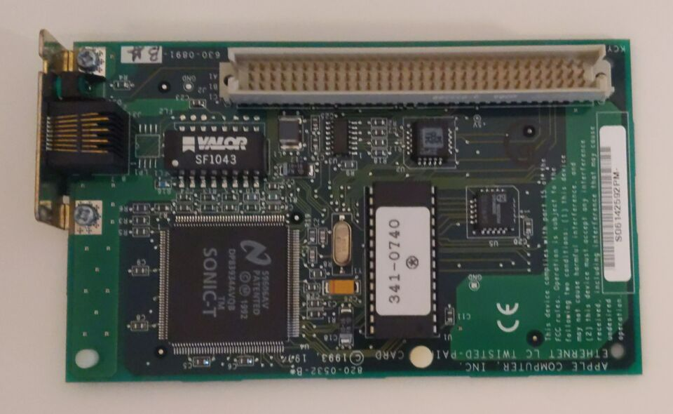
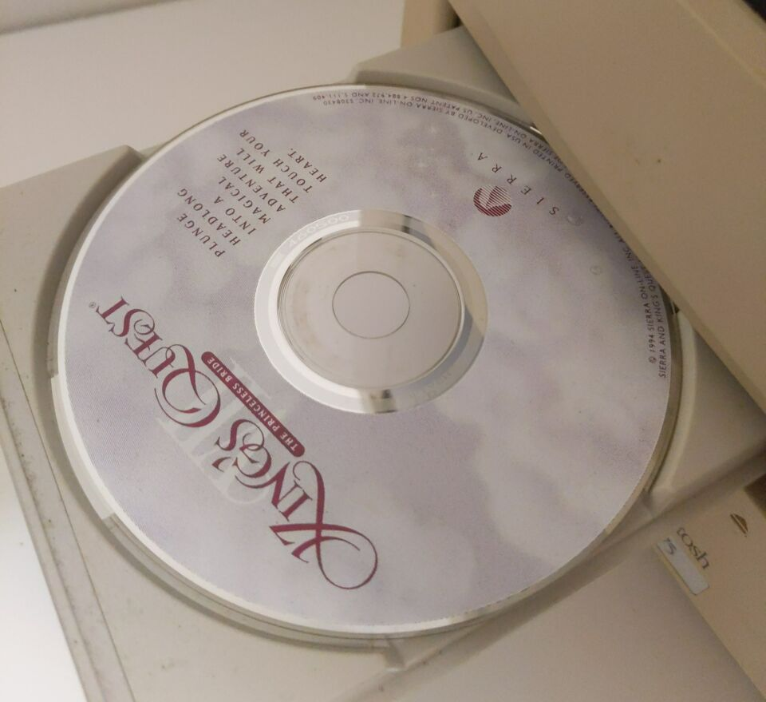

+++
title = "Restoring my Childhood Family Computer: Part 3"
date = 2024-11-03
path = "restoring-my-childhood-family-computer-part-3"

[taxonomies]
tags = ["retrocomputing", "electronics"]
+++

In [Part 2](@/blog/restoring-my-childhood-family-computer-part-1/index.md) I
inspected the power supply and cleaned out a bunch of wasp nests from the
circuitry. I concluded that the power supply for the CRT seems to work and
ordered a replacement motherboard as my current one was badly damaged by a
battery leak.

This week my replacement motherboard arrived:

It came with a processor already installed, as well as several sticks of RAM.
The longer one is DRAM in the two shorter ones are video RAM.

It also came with a network card with an Ethernet port. This might come in handy
for transferring data off the hard drive, as the only other way for this machine
to communicate with other machines is transferring data over floppy disk. One
goal for this project is to copy all the data from the hard drive into a format
that I can load into an emulator. I'll put the network card aside for later.

I installed the RAM into the new motherboard and slotted it into the machine,
plugged in the keyboard (why is the power switch on the keyboard!) and turned it
on.

And something happened. First it played the Macintosh startup chord, which is
still played by modern Macs when powering on. The fact that it even made it this
far was a relief as it means that my original motherboard was indeed dead, and
the replacement works, at least in so far as it's capable of understanding the
"on" signal from the keyboard and playing the startup chord.

Next the machine played a series of chimes. These are known as [Chimes of
Death](https://en.wikipedia.org/wiki/Macintosh_startup#Chimes_of_Death) and
indicate a hardware problem. But at least it powers on which is a great start.

The case fan started to spin.
There was a chirping sound coming from somewhere inside the case. It sounds
similar to when a modern hard drive tries to spin up but is unable to for some reason.
I haven't felt around to see if the drive vibrates in sync with the sound yet,
but that's one avenue for debugging.

I also heard some strange noises from the CD drive so I
ejected it and this came out:

This was one of the first games I ever played! Getting to play it again on the
first computer I ever used is even more motivation for me to get this thing
working.

I've recorded [a video](https://www.youtube.com/shorts/tkykigQ1hKk) of the
machine powering on showing the startup chord and the Chime of Death.

I've got a few things to try next. Firstly I want to confirm that the chirping
sound I heard was indeed the hard drive. It would be a shame if the disk has
failed but it wouldn't surprise me too much. There also seems to be an issue
with the CD drive given the strange noises it made when turning the machine on.
I'll try taking the CD drive out and cleaning it (maybe it's also full of
wasps).

It's also a little concerning that nothing has displayed on the screen yet.
Hopefully this just means that no software has run that would draw to the
screen. I'm not super familiar with CRT screens so I don't know what to expect
them to do when the power is on but no signal is received. So far I've seen no
evidence that the CRT works.

Once I have the CD drive working I'll try to get my hands on an install disk for
an operating system that's compatible with this machine, as any install disk
must be able to display something on the screen. This will let me test out the
CRT without first needing to fix or replace the hard drive.

I also want to try replacing the hard drive with a known-good drive to see if
the weird noise continues.
