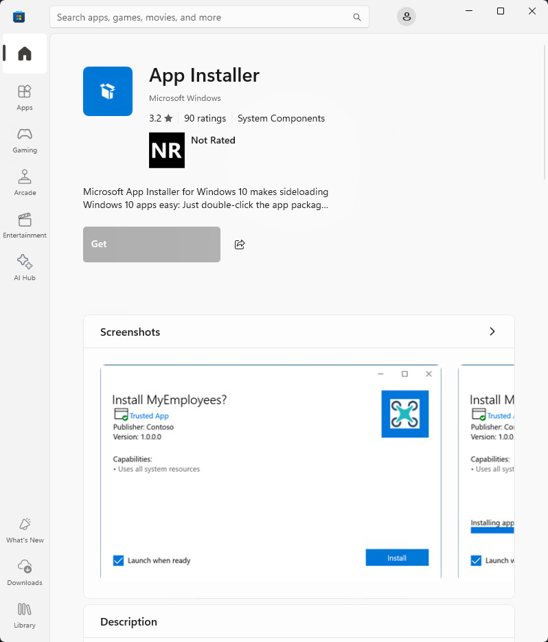

+++
title = "Setting up WinGet for the First Time"
date = 2024-11-04
path = "setting-up-winget-for-the-first-time"

[taxonomies]
tags = ["windows", "security"]
+++

I learnt today that Windows has a built-in package manager. I'm setting up a
machine for doing some Windows development at work, and I read that it's now
possible to install Git by running a command from PowerShell:

```
winget install --id Git.Git -e --source winget
```

Well I tried that and it didn't work:
```
PS C:\windows\system32> winget install --id Git.Git -e --source winget
Failed in attempting to update the source: winget
Failed when searching source: winget
An unexpected error occurred while executing the command:
0x8a15000f : Data required by the source is missing
```

The process of fixing it was a little strange and hard to discover so I'm
writing it down for the benefit of my future self and others.

The first thing I tried was listing the sources of the package repo:
```
PS C:\windows\system32> winget source list
Name    Argument                                      Explicit
--------------------------------------------------------------
msstore https://storeedgefd.dsx.mp.microsoft.com/v9.0 false
winget  https://winget.azureedge.net/cache            false
```

Some advice online suggested updating the sources which would make sense given
that this is a fresh install of Windows.

```
PS C:\Windows\system32> winget source update
Updating all sources...
Updating source: msstore...
Done
Updating source: winget...
Cancelled
```

Something is wrong with the WinGet source as evidenced by the fact that its
update was cancelled.

After an hour or so of investigation I found this on  [Microsoft's documentation about
WinGet](https://learn.microsoft.com/en-us/windows/package-manager/winget/):
> Windows Package Manager WinGet command-line tool is available on Windows 11
> and modern versions of Windows 10 as a part of the App Installer.

And there was a link to [App Installer in the Microsoft
Store](https://www.microsoft.com/store/productId/9NBLGGH4NNS1?ocid=pdpshare).
Clicking the link opens the Microsoft Store program and shows the page for App
Installer.



The only reason I trusted this is because it was on Microsoft's own website.
There's not many indications in the UI that this is an official Microsoft
application, and it's odd that such an essential piece of software isn't bundled
with the OS. It does seem like the machine came with an out-of-date version of
this tool, but then it's odd that it wasn't updated automatically while
configuring the machine the first time it's turned on.

When I first came across the advice of installing or updating App Installer I
searched the Microsoft Store for "App Installer" and was unable to find it, so I
assumed that the advice was malicious and ignored it. But it turns out that for
some reason the search feature in Microsoft Store doesn't include "App
Installer" in its results, so you have to get to its page by clicking on a link.

Requiring users to jump through these kinds of hoops makes it so easy to trick
people into downloading malicious software. Given that this happened on a fresh
install of Windows it stands to reason that many new computers will have the
same problem described in this post the first time someone tries to use WinGet.
The error message (`0x8a15000f : Data required by the source is missing`)
is not helpful, so it took an hour or so of investigation until I found the
solution. Lots of people are posting on StackOverflow and Reddit and Github
running into the same issue, and there's no simple concise explanation among the
replies describing why the problem happens and how to solve it. When you do
eventually find out that "App Installer" needs to be installed or updated, you
can't find that app in the Microsoft Store by searching for it - you have to
click on a link on a web page. It would be so easy to post a reply to one of
these threads directing people to download some malicious software hosted on the
Windows Store, and it would be so easy to make a more legitimate looking store
page than the one for App Installer.

After installing or updating App Installer I was able to update the WinGet sources:
```
PS C:\windows\system32> winget source update
Updating all sources...
Updating source: msstore...
Done
Updating source: winget...
  ██████████████████████████████  100%
Done
```

And now the URL of the `winget` source in list of sources is different:
```
PS C:\windows\system32> winget source list
Name    Argument                                      Explicit
--------------------------------------------------------------
msstore https://storeedgefd.dsx.mp.microsoft.com/v9.0 false
winget  https://cdn.winget.microsoft.com/cache        false
```

Remember the previous URL was `https://winget.azureedge.net/cache` which looks
like a random person registered a domain name made up of two
Microsoft-related words joined together and tried to pass it off as official.
That was the URL that was originally set as the `winget` source in my fresh
install of Windows so I suspect that it was run by Microsoft, but the point is
that it still looked suspicious. This whole exercise has been marred by Microsoft
doing things that look like social engineering but (hopefully!) aren't, which
makes actual social engineering of Windows users that much easier.

But now the source for `winget` is under `microsoft.com`. I wonder if all I
needed to do was to update the source for `winget` to
`https://cdn.winget.microsoft.com/cache`.

And now I can finally install Git:
```
PS C:\windows\system32> winget install --id Git.Git -e --source winget
Found Git [Git.Git] Version 2.47.0.2
This application is licensed to you by its owner.
Microsoft is not responsible for, nor does it grant any licenses to, third-party packages.
Downloading https://github.com/git-for-windows/git/releases/download/v2.47.0.windows.2/Git-2.47.0.2-64-bit.exe
  ██████████████████████████████  65.5 MB / 65.5 MB
Successfully verified installer hash
Starting package install...
Successfully installed
```
