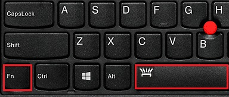

+++
title = "My keyboard backlight works!"
date = 2020-08-29
slug = "my-keyboard-backlight-works!"
+++

About a month ago I switch to FreeBSD on my laptop - a Lenovo Thinkpad T470.
After an evening of messing around, I managed to get all the hardware working
with the exception of the keyboard backlight. I resigned myself to live without
this feature if necessary, and figured I could always add support for it myself.
It works fine on linux, so the driver is likely open source and I can use it
as a reference.

Well it turns out that won't be necessary. A quick search for "freebsd thinkpad keyboard backlight"
yielded [this lenovo support page](https://support.lenovo.com/au/en/solutions/ht104451)
as the first result, which has nothing to do with FreeBSD, but did solve my problem.
Fn+space toggles the keyboard backlight on thinkpads, and it seems to be supported out of the box
(or possibly due to enabling the `acpi_ibm` module).

So _that's_ what that symbol means.
