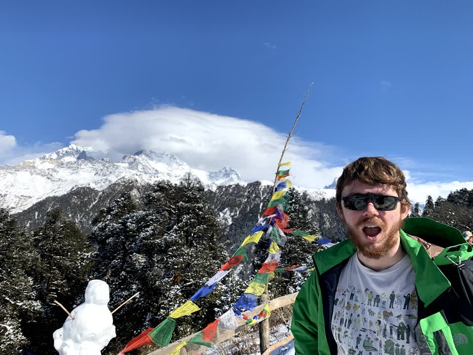

+++
title = "Trekking is good because it's a problem you can solve"
date = 2020-08-16
slug = "trekking-is-good-because-it's-a-problem-you-can-solve"
+++

Early this year I spent a week trekking in Nepal.
This is a brief reflection on one aspect.

I'm an engineer; I solve problems for fun and profit.
Working at a problem is most satisfying when you know for sure that
all the effort you're putting in is valuable. Inevitably, this won't
be true all of the time. Some work is exploratory, where the precise
nature of the solution won't become apparent until some experimentation
takes place. Sometimes it's not clear to everyone in a team that the agreed-upon solution
will actually solve the problem at hand. You may embark on solving a problem
without knowing for sure whether it can even be solved.

This uncertainty is a cause of stress, especially in a workplace whose culture which denies its existence.

There is no uncertainty in trekking (assuming you have a guide who knows where they're going
and you're physically able). If accommodation is organized, and you're prepared in terms of
water, medication, etc, the _only_ problem you need to solve is the fact that you aren't at
your destination. The _only_ way to solve this problem is by walking towards your destination,
and you know _for sure_ that every step towards your destination is useful work.

Engineering would not be interesting if all solutions were so simple,
but it is refreshing, once in a while, to be presented with a problem
where one can make fearless incremental progress.

