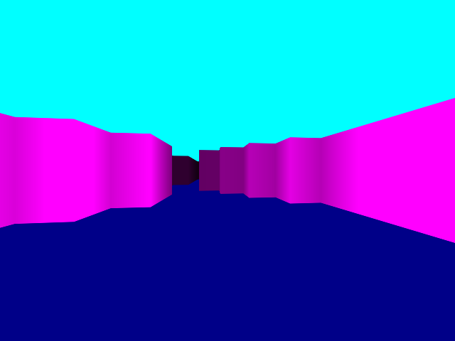

+++
title = "Vanilla Javascript and Under Engineering"
date = 2020-10-29
slug = "vanilla-javascript-and-under-engineering"
+++

I enjoy the safety of typescript, and the ease with which one can
think about a UI made with react. Webpack lets me organize my source
and compiled code, and transpile the former into the latter, frontend
and backend, however I see fit.

But sometimes I just want to make something.

Earlier this week I spent a few hours over a couple of days making
a [3D renderer in the style of Wolfenstein 3D](https://gridbugs.github.io/small-wolf).
It runs in the browser. The website has 2 files: an `index.html` referencing a file `wolf.js`.
You run the site with `python -m http.server` or whatever other static file webserver you like.
The code itself is written with the aim of writing it quickly and not overthinking anything.
Most of the state is in global mutable variables. No effort is made to abstract anything;
the world is an array of integers set to 0 for floor or 1 for wall and in lieu of a coordinate
class I just do the few 2D vector operations I need inline.

It's certainly not the nicest code I've ever written, and this approach would be maddening on
a large project, but damn it was fun to make!

Here's another screenshot:

