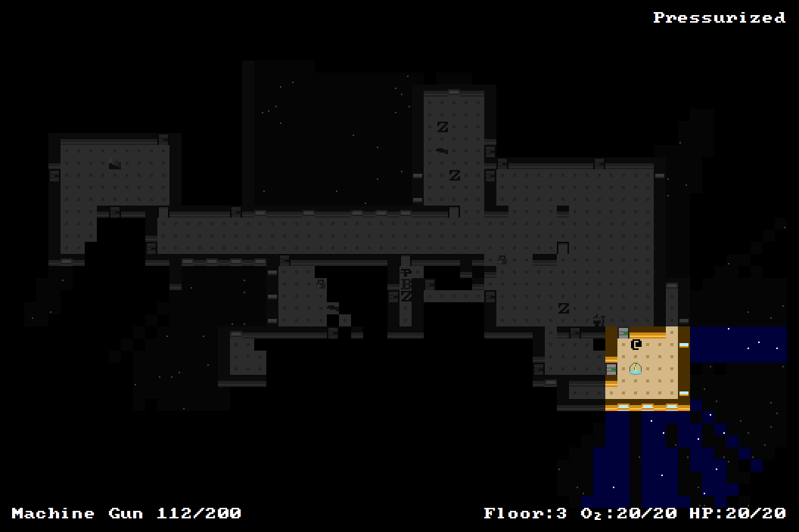

+++
title = "7 Day Roguelike 2016: Ending"
date = 2016-03-11T02:08:00+10:00
path = "7drl2016-ending"

[taxonomies]
+++

Tonight I implemented stairs and an ending for the game. You must reach the
teleporter on the 3rd floor of the ship, and teleport to safety. I also added
some more flavour text, fixed some bugs, and balanced some characters. At this
point the game is largely complete. I'll spend some of tomorrow playtesting and
adding any remaining polish and balance I think is necessary. I also want to
add a rocket launcher which shouldn't be too complicated given I already have
projectile weapons and explosions.

This screenshot shows the teleporter at the end of the game:

