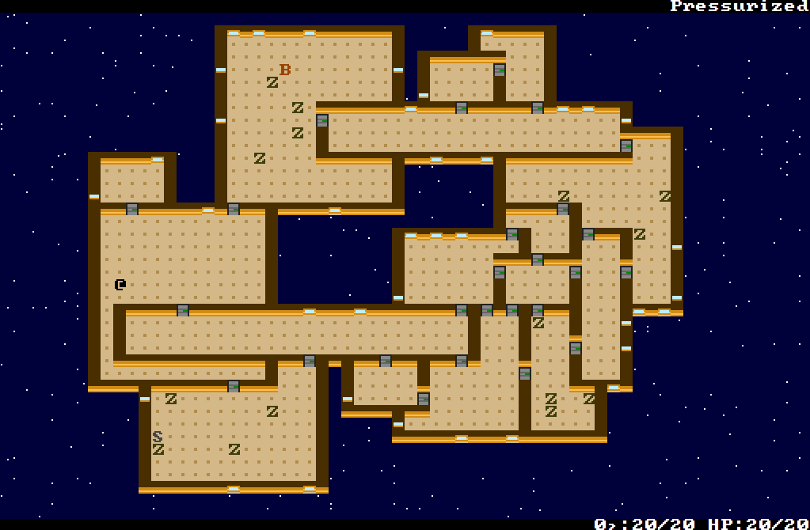

+++
title = "7 Day Roguelike 2016: Pathfinding"
date = 2016-03-09T01:56:00+10:00
path = "7drl2016-pathfinding"

[taxonomies]
+++

The most notable change from tonight is that
I turned on pathfinding for NPCs for the first time. Up until now they
had been stationary, and could be injured or killed, or affected by vacuum, but
could never observe the world or take actions. Enabling AI is scary because it
greatly increases the amount of work the computer is doing between human turns.
The vision system is now running once per NPC turn as well as the player. Then
there's the additional cost of pathfinding for each NPC. I use Dijkstra maps for
pathfinding which are
[explained in detail on roguebasin](http://www.roguebasin.com/index.php?title=The_Incredible_Power_of_Dijkstra_Maps).
This post is about solving a performance problem introduced by all the extra
characters.

With AI turned on, there was a noticeable increase in the time between player
turns.
Benchmarking revealed most of the time between player turns was spent in the
vision system.

## Vision System
The vision system uses the Recursive Shadowcast algorithm which I
[wrote about earlier](@/blog/visible-area-detection-recursive-shadowcast/index.md).
Detecting visible cells
is relatively fast. The problem was what how this information was being used.

NPC pathfinding and the renderer don't work on the canonical world
representation. This game uses
[an ECS-based engine described in a previous post](@/blog/encoding-rules-for-turn-based-games/index.md),
so more concretely, AI and the
renderer don't directly access entities or components. Instead, each character
maintains a representation of the world based on what they have observed.
A character's knowledge is represented by "shadow entities", made up of
"shadow components". These were designed to be frequently updated by setting
data in shadow components from "canonical" reference components without allocating
any new objects. This was a technique I learnt while solving performance problems in a
[game I wrote earlier](@/projects/bugcatcher/index.md).

At the
start of a character's turn, the vision system runs and updates that character's
knowledge of the world by updating shadow components.
It was this knowledge updating process that was taking
up most of the time. Knowledge is updated in the following way. It relies on a
spacial hash of entities, and an analogous spacial hash of shadow entities in
the knowledge representation of characters.
```
for each coordinate visible according to recursive shadowcast:
    knowledgeCell = get knowledge spacial hash cell for the coord
    cell = get canonical spacial hash cell for the coord

    knowledgeCell.clear() # remove all shadow entities from the cell
    for each entity in that cell:
        knowledgeCell.see(entity) # makes a shadow entity

```

Knowledge cells re-use shadow entities
and shadow components to prevent invoking the allocator on each cell that is seen.
Despite this, this process was still taking too long. A key insight for
optimization was that most entities in most cells don't change most of the time.
The only time a knowledge cell needs to be updated is when an entity has entered
or left the corresponding canonical cell, or an entity in the cell changes in a
"knowable" way (ie. a way that will be represented in a character's knowledge).

With this in mind, the loop becomes:
```
for each coordinate visible according to recursive shadowcast:
    knowledgeCell = get knowledge spacial hash cell for the coord

    if knowledgeCell.isDirty():

        cell = get canonical spacial hash cell for the coord

        knowledgeCell.clear()
        for each entity in that cell:
            knoweldgeCell.see(entity)

```

The `isDirty()` method compares a "last modified" timestamp on the canonical
spacial hash table cell with a "last observed" timestamp on the knowledge cell.
**A knowledge cell is now only updated if the cell has been changed more recently
than it was last observed.** A complication this change introduced is now the
"last modified" timestamps must be updated whenever a cell's contents is changed
in a meaningful way.

## Windows and NPCs

I've updated the level generator to include windows and NPCs. It also places the
player in a sane starting position, and determines a sane goal position (though
there currently isn't anything there).



Still to do is adding items (weapons and healthkits), and stairs. I still
haven't decided how the game will end, though the current plan is to have some
emergency beacon that needs to be activated before the ship-full-of-zombies
arrives in a populated area.
