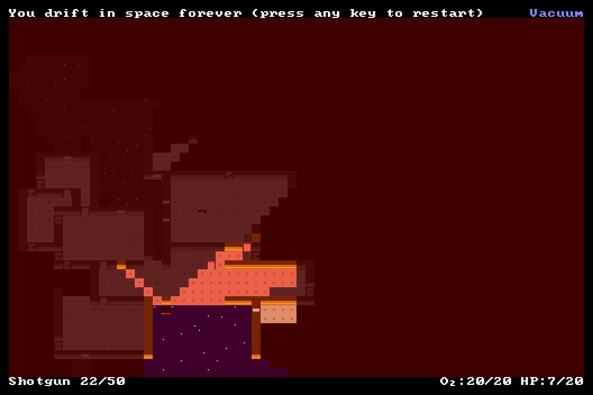

+++
title = "7 Day Roguelike 2016: Polish"
date = 2016-03-10T02:18:00+10:00
path = "7drl2016-polish"

[taxonomies]
+++

Tonight I finished the level generator, adding weapons and items.
I fixed a bug in my recursive shadowcast implementation causing strange
behaviour when looking at the edge of the map.
I tweaked a
couple of mechanics, namely:
- explosions destroy nearby walls regardless of whether one side is pressurized
    - this is unlike bullets, which  only damage walls if one side is
      pressurized and the other isn't
- flames from the flamethrower don't stop when they hit an enemy
- doors can't be closed if there is an enemy standing in the way

I spent the rest of my time tonight polishing the game's UI.

Here are some death screens from playtesting!

Shooting a bloat at point-blank range. Never a good idea.

Tried to kill some zombies by blowing up a nearby bloat. Didn't end well.

Getting sucked out of the ship as a section decompresses due to a hull breach.

