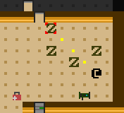
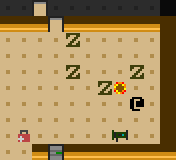
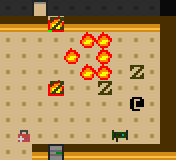
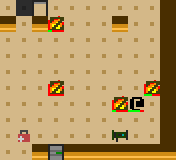

+++
title = "7 Day Roguelike 2016: Success"
date = 2016-03-12T00:17:00+10:00
path = "7drl2016-success"

[taxonomies]
+++

It's now Friday night (technically Saturday morning). Tomorrow morning it will have been 1 week since I
started work on "Skeleton Crew". This is the final entry in my development log.

Tonight was mostly polishing. I added support for arrow keys and the numpad as
an alternative to vi keys, lots of playtesting and tweaked a few parameters here
and there to make the game more balanced.

I also added a rocket launcher.

Aiming. This also happens to show another rocket launcher lying on the ground.

Fired!

Explosion! This shows the shock wave beginning to move outwards. The nearest
zombies have already been pushed back by the explosion.

Aftermath.

