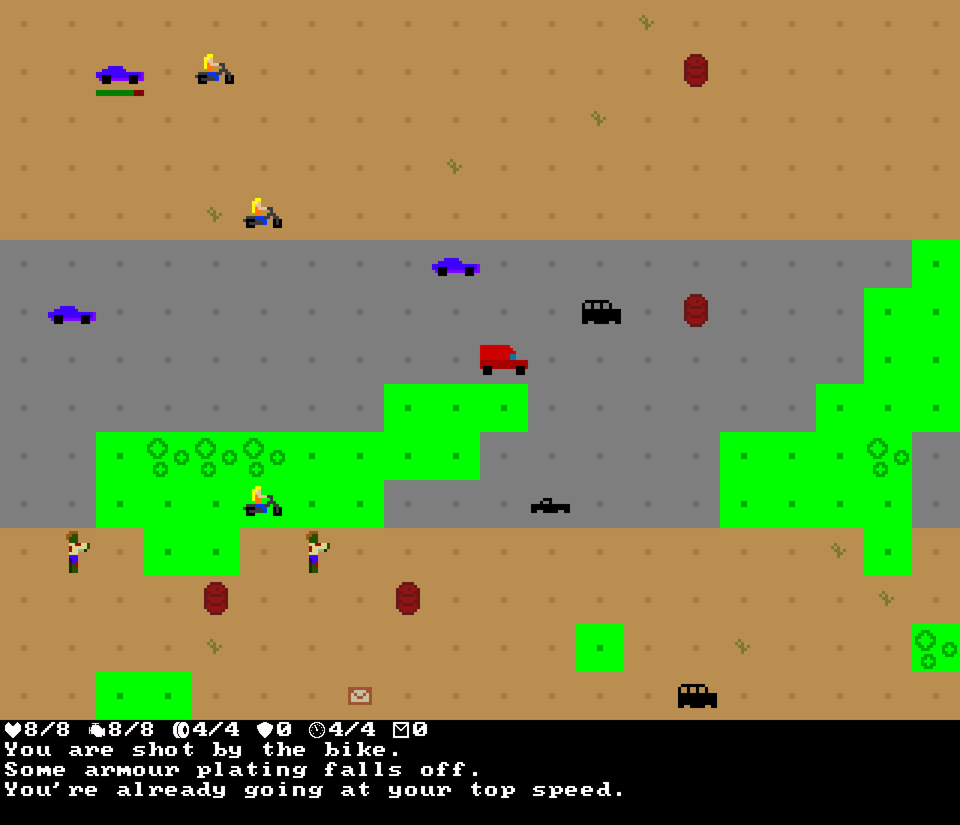
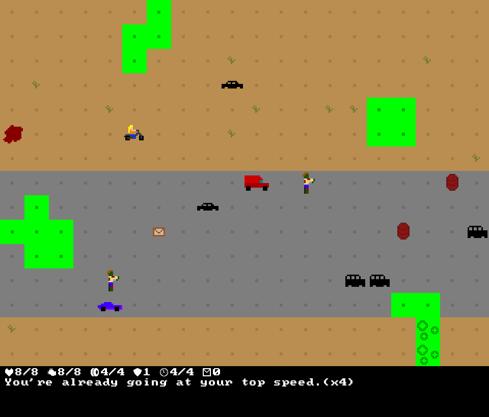

+++
title = "7 Day Roguelike 2017: Procgen and Explosions"
date = 2017-03-09T03:03:00+10:00
path = "7drl2017-procgen-explosions"

[taxonomies]
+++

Today I implemented a procedural generator. Levels are relatively simple,
compared to say, dungeons. Levels have a straight road, with acid generated
using [Perlin Noise](https://en.wikipedia.org/wiki/Perlin_noise), and various
enemies, obstacles and items placed randomly, with different probabilities for
each entity starting in a cell for road cells and off-road cells.

Here's a screenshot from a procedurally generated level.

<!-- more -->

The other big feature I added today is explosive barrels. Barrels explode when
shot, or hit by an explosion from another barrel, allowing chain reactions of
barrel explosions.

Explosive barrels made it possible for characters to die on their turn, by
accidentally shooting a barrel which explodes and kills them. This is a case
that the turn schedule did not consider, leading to an interesting bug. This was
only revealed by a particular sequence of events in a generated level, so
reproducing the bug required generating the same level.

Fortunately, when the
game starts it prints its RNG seed, and allows an RNG seed to be specified as a
command line argument, so it was easy to repeat the same game while debugging
this problem. Thank you past self!
