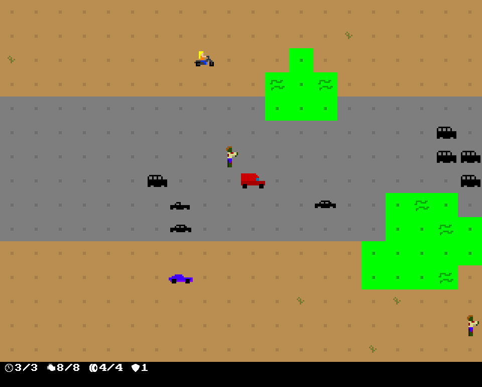

+++
title = "7 Day Roguelike 2017: Vehicles"
date = 2017-03-07T02:41:00+10:00
path = "7drl2017-vehicles"

[taxonomies]
+++

Today I added cars and motorbikes. Cars are equipped with shotguns and can
shoot to the left and right. Bikes are equipped with a pistol and can shoot in
all directions.

<!-- more -->

The AI for cars and bikes is relatively simple.
On their turn, vehicles try to align themselves with the player, and get within
range of the player, so that they
can shoot them on their next turn. If a vehicle is already appropriately lined
up, then they shoot at the player.

Navigating around obstacles while also
attempting to get within range of the player and line up a shot is a much harder
problem. In the interest of time, I allow NPC vehicles to collide with
obstacles. When I get around to implementing damaging collisions, I'll give NPC
vehicles a chance to avoid damage. Narratively speaking, cars and bikes are much
smaller than the delivery van, so they have a chance to stop in time before
colliding with an obstacle.

I also spent some time polishing the UI. I increased the size of tiles, and
display fewer tiles. The message log is now just a single line. There are also
extra gauges, which replace the health gauge. These are currently just for show,
but I plan on implementing engine and tyre health, and armour, which will
replace the single health bar for the player.

The most interesting bug was when an NPC vehicle ran over a zombie, the vehicle
would stop forever. They were still taking their turn, but all movement was
being cancelled. The culprit was the interaction of two rules:
 - when an entity would start a sequence of moves, begin the moves **only if
   they aren't already performing a sequence of moves**
 - when an NPC would move into a cell containing another NPC, cancel the move

The NPC vehicle moved into a zombie as part of a sequence of moves, which were
cancelled because it collided with another NPC. Since the sequence of moves was
never completed, the component signifying that a sequence of moves is in
progress was never removed from the NPC vehicle, so all subsequent times it attempted a
sequence of moves, it never started moving as it still had the previous
sequence. The fix involved removing the current sequence of moves when
colliding with an NPC, and ignoring any existing sequence of moves when
starting a new sequence.
