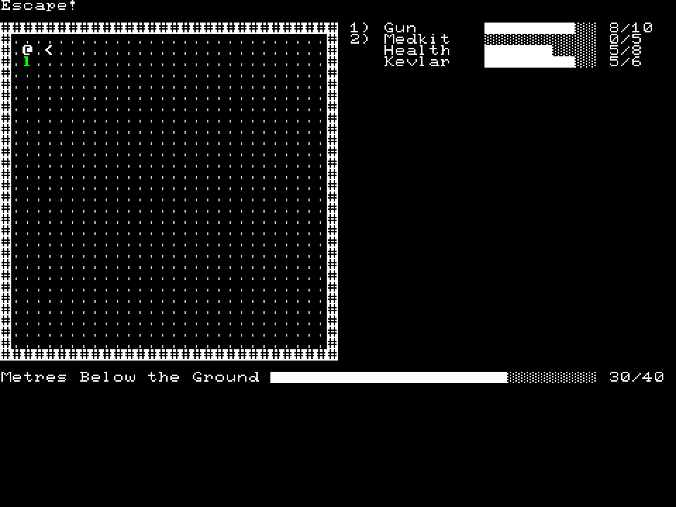

+++
title = "7 Day Roguelike 2018: Day 1"
date = 2018-03-04T00:47:00+10:00
path = "7drl2018-day1"

[taxonomies]
+++

This year I'm making a traditional roguelike where all of your stats, abilities
and goals are expressed via progress meters. The name of the game will be 
"Meters Below the Ground". Here's an early screenshot:


<!-- more -->

## Meters

I implemented a framework for progress meters. There are 2 types of progress 
meter, which I call "active" and "passive", the key distinction being that 
active meters can be activated, and passive ones cannot. The active meters are 
the ones with the numbers next to them in the screenshot, indicating the key you 
would press to activate them.

There's a special overall progress meter at the bottom of the screen, indicating 
how far you are from completing the game.

I plan on implementing goals for each level, such as defeating a tough enemy or 
reaching certain objectives within a time limit. These goals will also be 
represented by meters.

Currently I have 4 meters.  More will come.

## Level Switching

Before today my engine didn't support level switching, so I implemented a simple
single-direction level switching system.

## Continuous Deployment

I set up travis-ci and appveyor to continuously deploy the project. The most 
frustrating problem I had today was travis-ci generating keys for the incorrect 
project, which manifested as travis-ci being unable to upload build artifacts to 
S3. The solution was to explicitly specify (via the `travis` cli) which repo to 
associate with the project. The command was:

```
travis encrypt --add deploy.secret_access_key --repo gridbugs/meters-below-the-ground
```
