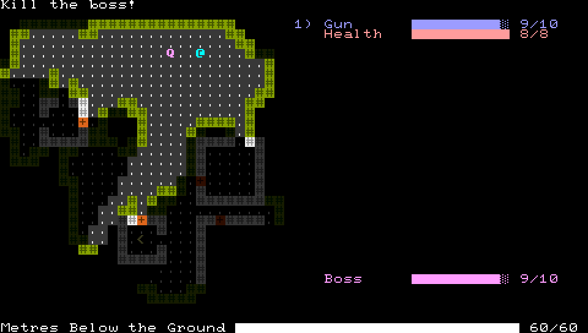

+++
title = "7 Day Roguelike 2018: Procgen, Visibility, Missions, Colour"
date = 2018-03-04T22:16:00+10:00
path = "7drl2018-procgen-visibility-missions-colour"

[taxonomies]
+++

Lots of progress today! It's starting to look like a game.

<!-- more -->

The procedural generation is based on Conway's Game of Life. I wrote 
[a post](@/blog/cellular-automata-cave-generation/index.md)
about this technique a few years ago. It creates natural-lookin caverns. I then 
place some rooms randomly, and dig tunnels so all the doors are connected to 
the main area.

For visible area detection, I'm using a library:
[shadowcast](https://crates.io/crates/shadowcast).
I implemented recursive shadowcast for an
[old project](@/projects/another-roguelike-lighting-demo/index.md),
and extracted it into a library for easy inclusion in other projects.
While adding shadowcast I found a bug in
[prototty](https://github.com/gridbugs/prototty) - my terminal rendering 
library - where foreground-only updates to a cell prevent future background 
updates of a lower depth, which manifested as the floor occasionally 
disappearing from underneath the player. I released a new version of prototty 
which fixed the bug.

I added a mission system. Missions can produce meters (the "Boss" meter on the 
right in the screenshot), and check whether they are completed. Currently the 
only mission is to kill a tough enemy, but I'll implement more missions now 
that the framework is in place.
