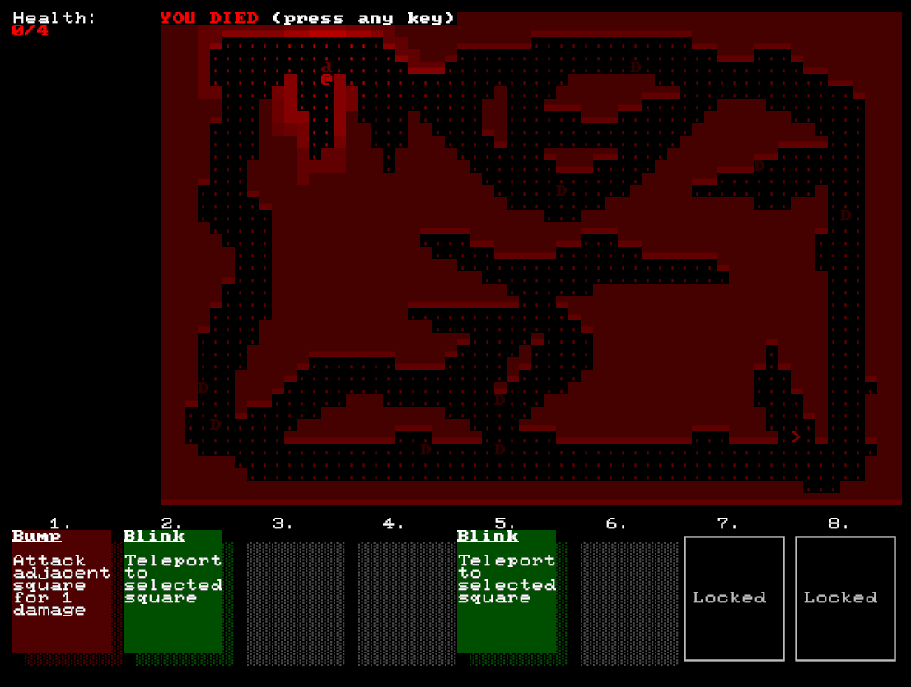
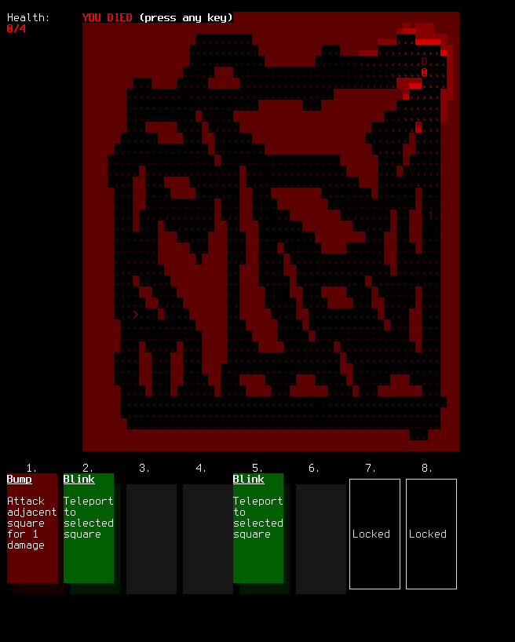

+++
title = "7 Day Roguelike 2019: Card Display, Death Screen"
date = 2019-03-05T22:00:00+10:00
path = "7drl2019-day3"

[taxonomies]
+++

Lots of work on rendering tonight. I made a renderer for the current hand, which can
display cards, empty spaces where cards used to be (before they were played), and
locked card slots which can be unlocked by character upgrade (not yet implemented!).
Deck building and actually playing the cards will come later. I want to have a solid
framework for displaying card info to players before I add too much content.

Also, who doesn't love a good death screen? Hopefully by revealing the map to players
when they die, they will think about alternative choices they could have made
which might have lead to them living a little longer.
It could also tease at some undiscovered content!

<!-- more -->

Here's a screenshot from the terminal version of the game showing off the death screen
and card display. There is a reduced colour palette, but I think it looks fine.

Last year I ran into a problem with the terminal version where dark colours
would just come out as black in the terminal, since rgb24 channel values below ~60 get rounded to 0
if you linearly map them to terminal colours. This year I added an escape hatch to
the ansi terminal prototty frontend. You can specify a custom colour conversion
function, which I used here to brighten all the colours.

## Wishlist

- The game logic defines cards with descriptions, and the text wrapping of description
  text only needs to be computed once at the start. Currently, the text wrapping logic
  lives in prototty-common, so either the game needs to depend on prototty-common,
  text wrapping must be done each frame (in the prototty level of the engine), or
  the prototty level needs to cache the wrapped text and keep the cache in sync.
  I'm going for the middle option now, but ideally the text wrapping would live in
  a standalone library which the game could depend on, without needing to depend on
  the rest of prototty.
- The rich text rendering in prototty has an inconsistent interface. Also, the game
  wants to define rich text descriptions without needing to depend on all of prototty.
  Also, rich text is currently defined with `Vec` instead of slices, which means it's
  difficult to avoid allocating a fresh `Vec` on each frame, or maintaining a cache
  of `Vec`s int the prototty layer.
- A view in prototty-common which renders a coloured rectangle.
- I often depend on `grid_2d` and then only use the `coord_system` module it defines,
  and usually just to get the `XThenYIter` for iterating over a rectangle of
  coordinates. This suggests that `coord_system` should probably be its own crate.
