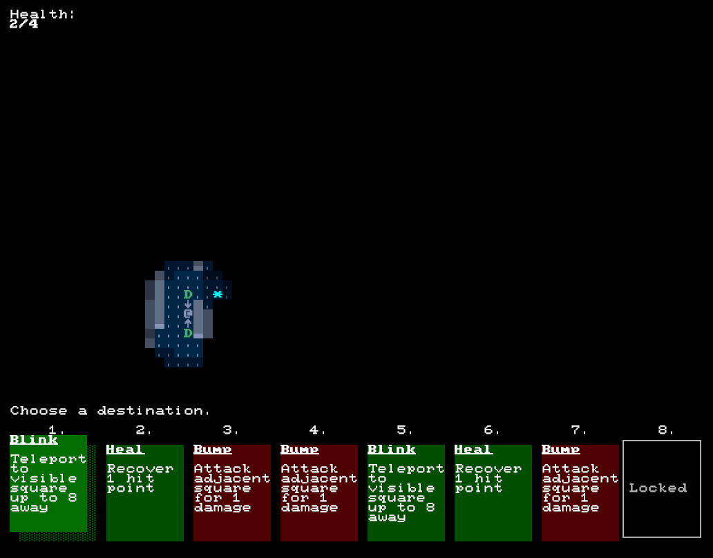
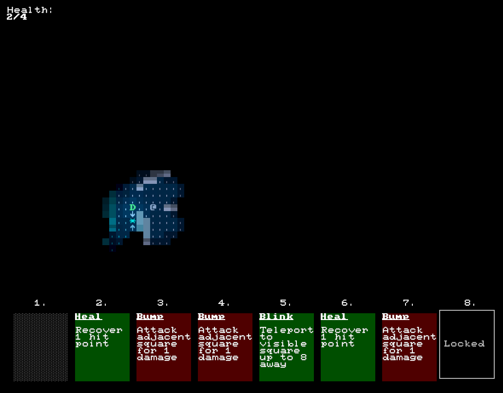

+++
title = "7 Day Roguelike 2019: Card Gameplay"
date = 2019-03-06T23:00:00+10:00
path = "7drl2019-day4"

[taxonomies]
+++

As of tonight you can actually *play* the cards from your hand.
Select a card with the number keys. Most cards require a parameter
of some kind. For example the "Blink" card needs to be told which cell to blink into,
which you specify by moving a cursor into position and hitting enter.

After blinking the game shows a glowing orb at your previous location, which
fades out after a few frames, just for fun!

<!-- more -->

There are currently 3 cards: Blink, Bump, and Heal.
Not that the basic framework is in place I'm going to add a bunch more!
I also still need to add a deck, and a redrawing mechanic, as well as character
progression, which will take the form of adding/removing cards from the deck.

## End of Day Recording

{{ video_player_mp4_autoplay_loop(src="eod.mp4") }}

## Wishlist

The ui/menu part of the game is starting to resemble what I'll call "state
machine hell".  I use a state machine to represent the application state,
keeping track of which menu we're in, whether we're in a game, displaying the
map, and as of tonight, whether the game is expecting a card parameter, and
which type of card parameter.

As the state machine grows in complexity, it
becomes more and more painful to manage. When a card requires a parameter,
I'd like to effectively call a function which displays the appropriate prompt,
waits for input, and returns the result. This isn't possible as is,
since the ui state is tick-based.

After the 7drl I want to think about
a futures-style library for composing operations in a synchronous-looking way,
while still keeping the ui and game tick based.
