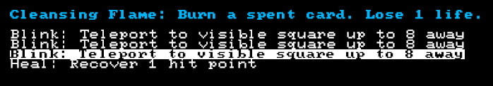
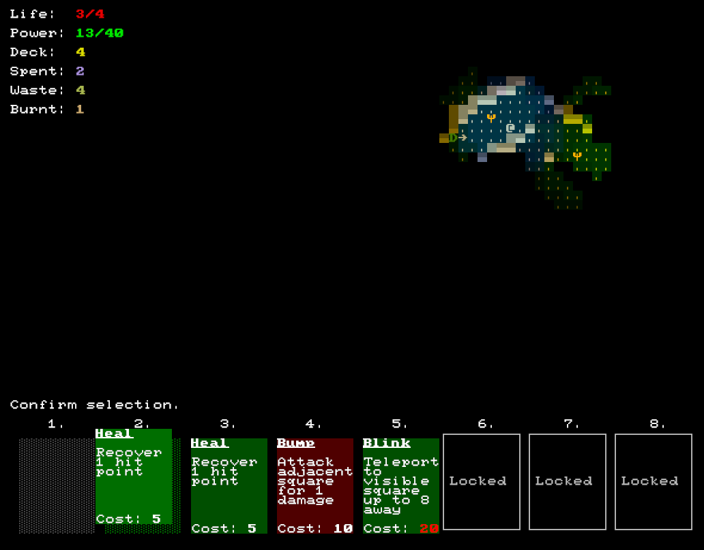

+++
title = "7 Day Roguelike 2019: Character Progression"
date = 2019-03-07T23:00:00+10:00
path = "7drl2019-day5"

[taxonomies]
+++

I added the first of three planned upgrade items tonight: the Cleansing Flame.

In deck-building games, removing cards from your deck can improve your
deck as a whole, by increasing the odds of the remaining cards being drawn
at a critical moment. The Cleansing Flame upgrade lets you remove cards from your deck, at the
cost of health.

<!-- more -->

At the moment you can only remove cards which you have played on the current floor.
This is interesting as it forces you to play your undesirable cards at least once.
My concern is that forcing players to use their cards before burning them will
disincentivise burning any cards. I'll playtest, and if this turns out to be the case
I'll extend it to include wasted cards or even cards in the deck.

## Wasted Cards?

The current card system works as follows: (copied from the game's help file!):

On your turn, move, wait, or play a card.

Moving and waiting cost 1 power. Each card has a power cost.

Playing a card moves it to the "spent" pile.

When your power reaches 0, all the cards in your hand are moved into the "waste" pile, and you draw a fresh hand from the deck. Your power is reset to its maximum.

Certain actions may permanently remove a card from play, adding it to the "burnt" pile.

When you descend to the next level of the dungeon, the hand, and spent and waste piles are shuffled back into the deck, but the burnt pile remains out of play.

## Emergent Behaviour

The fact that moving costs power has an interesting consequence that I didn't
appreciate until I actually played the game.  When the power level drops below
the cost of the more expensive cards in your hand (e.g. Blink in the screenshot
below), you might want to quickly use through your remaining power so you can
draw a fresh hand and reset to full power. But you can't heal while you're at
full health, and you can't bump into thin air. If there's a possibility of
combat in the near future, you want to fight sooner rather than later, since
your power will drop even lower, and you might not be able to play your combat
cards. The player has an incentive to be aggressive.

Another strategy I found myself employing is fighting until my power got to 20,
and then blinking away to draw a fresh hand and reset the power.

## Cards are Food!

When your deck runs out, that's it. You can't play any more cards until you get
to the stairs to the next level. Nothing explicitly bad happens to you when
you run out of cards, but it does make surviving in the dungeon much harder.
This motivates forward progress, much like the food clock in most traditional roguelikes,
but without the need to scrounge around for food; just get to the stairs and your cards
will come back!

It's also probably not worth it for players
to kill all the enemies on a floor - only the ones which threaten them or
get in their way. There's no reason to grind enemies, and if you try, you'll
probably run out of cards.

## End of Day Screenshot

The yellow psi characters are Cleansing Flames.

