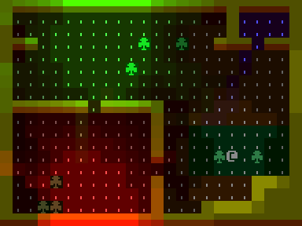

+++
title = "7 Day Roguelike 2019: Planning and Preparation"
date = 2019-03-03T09:00:00+10:00
path = "7drl2019-plan"

[taxonomies]
+++

I'm about to start working on my 7drl project for 2019: Get Well Soon.
It will be a deck-building, but otherwise traditional roguelike, in the sense that
the world is square grid, gameplay is turn-based, levels are procedurally generated
and you have to restart if you lose. All character abilities will be
activated by playing cards. The character can be upgraded by adding and removing
cards from the deck.

<!-- more -->

Aesthetically, most of the abilities will be focused on ice. I've been thinking
a lot about abilities which obstruct enemies rather than outright attacking them,
and ice has some nice affordances in this respect (it blocks your path or freezes
you but melts over time, it can be sharp, it's slippery, it's less effective
in hot areas).

I'm making some chances to my normal approach. I'm working on this from Sunday to Saturday,
rather than Saturday to Friday as I've done before. I work roughly 9-5 on weekdays, and I
want to see what difference a free day at the end of the week will make. Also, the title
isn't a pun!

As always, I won't be starting with zero code. I've been working on yet **another**
lighting demo called [Cherenkov](https://github.com/gridbugs/cherenkov),
which I have long term plans to turn into a game. I'm going to keep the prototty
boilerplate, build scripts, continuous deployment (travis-ci and appveyor) configs,
and lighting system. Actually that's about the entire project so far. It doesn't
even have physics - you can happily walk through walls or out of the map!

Here's a screenshot.

In the week leading up to the 7drl I did a lot of testing of the various "roguelike engine component"
libraries which I maintain, since I'm not interested in debugging low-level engine components during
the 7drl (but I'm sure I will still have to!). The 2 major bugs which I found with this testing:

 - The prototty renderer for opengl would draw the foreground of cells a different size to the background
   of cells on hidpi screens (lucky I tested on my laptop!).
 - My wave function collapse library provides a way to query the tile index which gets assigned to
   tiles starting at given pixels of the input image. When you include rotations and reflections,
   some BUT NOT ALL of the rotated/reflected tile indices were present in the result of this query.

Rough list of features I want to add:
 - terrain generation with WFC
   - stretch goal is multiple distinct generators for different stages of the game
 - deck building mechanics
   - there's a turn counter, and when it gets to 0 you discard your hand and draw a new hand
   - each card has a cost to play and reduces the turn counter by that much
   - if your deck runs out, you can't take any actions (but can still move), so
     better find the next level entrance quickly!
   - bufs are cards that you burn after playing and have a positive effect
   - debufs are cards that do nothing (but take up space) or have a negative effect
   - late in the game, a low-level ability card being forced into your deck should feel
     like a debuf, since it's not very useful against late-game enemies and it reduces the
     chance of drawing a good card
   - upgrades take the form of adding OR removing cards from your deck
     - still need to work out a way of delivering upgrades
 - content and gameplay
   - find different (anti)synergies between different sets of cards
     - without this, strategic planning has little value (ie. choosing which cards go in your deck).
   - find (anti)synergies between enemies and terrain, and ways for players to
     exploit these
     - without this, tactical pnalling has little value (ie. choosing which ability to use in a specific
       scenario, where to stand, who to attack first, where to place traps).
