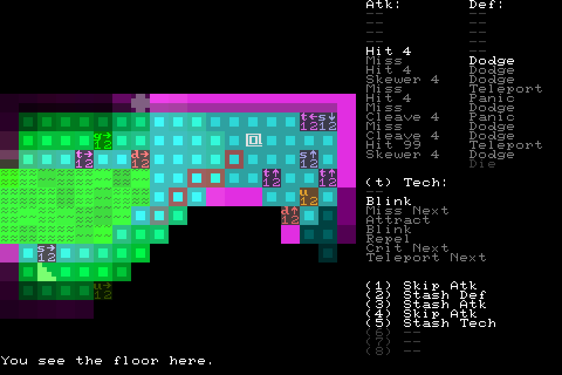

+++
title = "7 Day Roguelike 2020: Day 3"
date = 2020-03-02T20:00:00+10:00
path = "7drl2020-day3"

[taxonomies]

[extra]
og_image = "screenshot.png"
+++

Today I connected the user-interface to gameplay. Each time the player deals
or receives damage, or uses a tech, the respective list decreases and the
relevant action is applied (though not all are implemented yet).
The most complicated part of this is the aim UI (the red line in the screenshot),
but this was largely adapting some existing code to work with a grid of 2x2
tiles.

Tomorrow I'll implement all the combat outcomes, and give each type of enemy
a distinct effect which applies upon damage/death.
