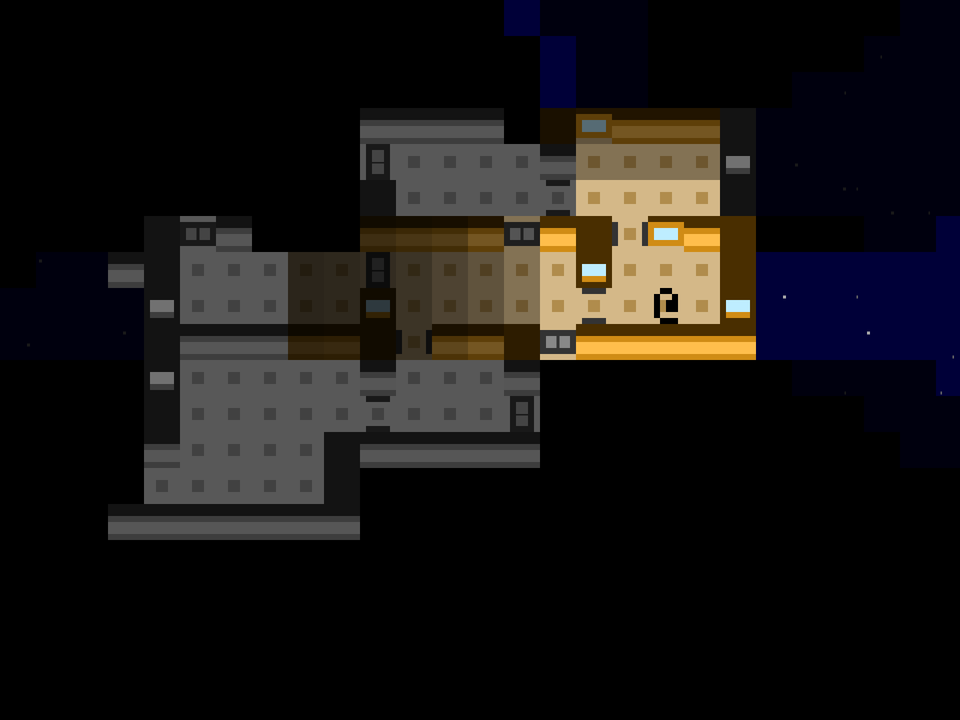
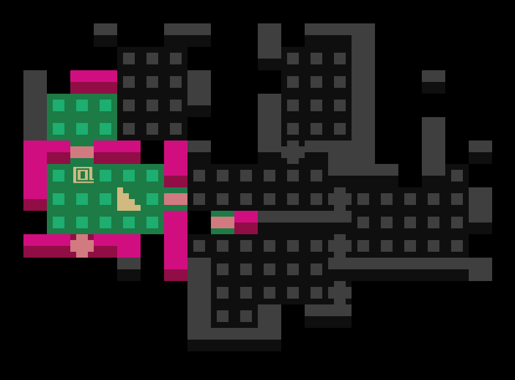
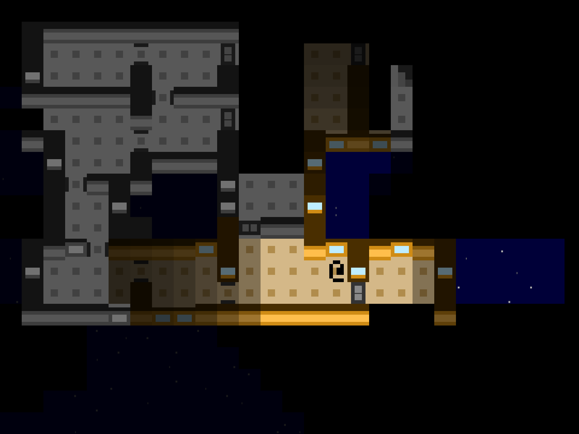
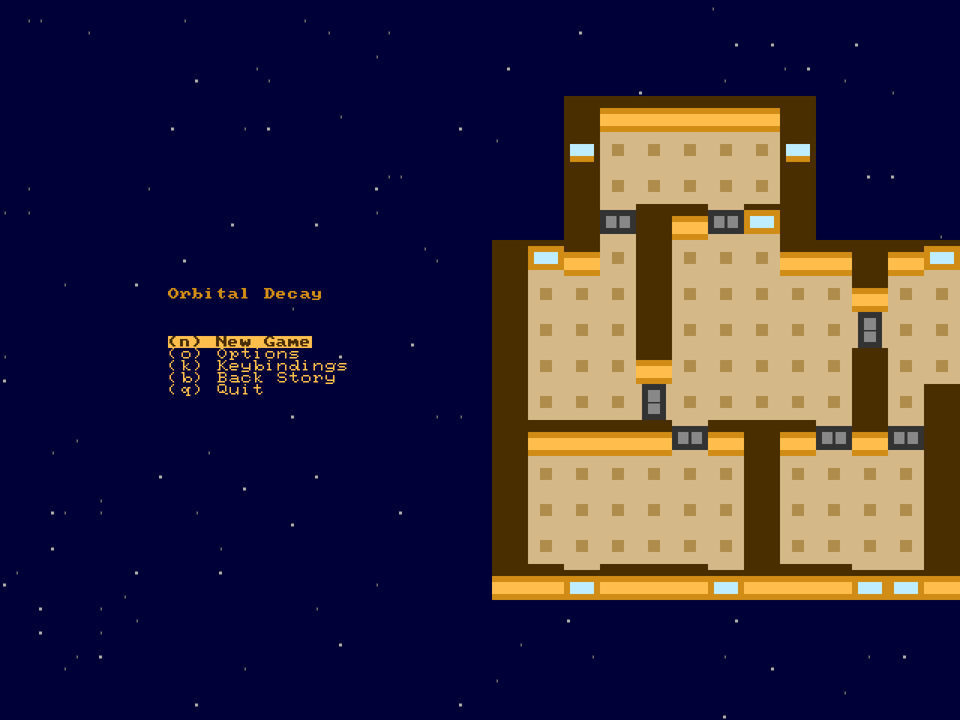
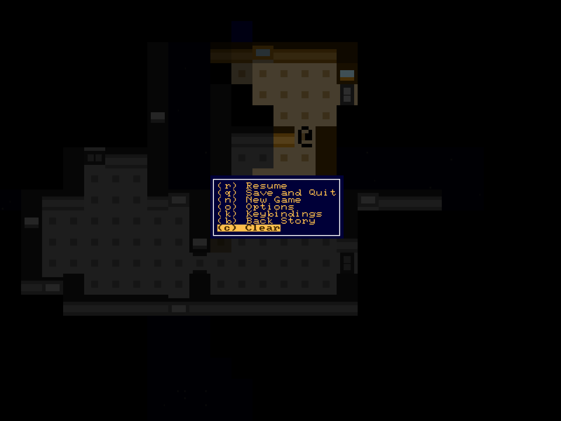
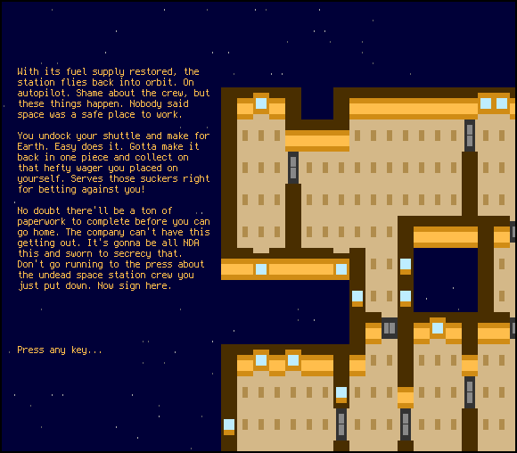

+++
title = "7 Day Roguelike 2021: Procedural Generation, Rendering, Pretty Menus, End Text"
date = 2021-03-06
path = "7drl2021-day1"

[taxonomies]
tags = ["procgen"]
+++
<style>
.orbital-decay {
    color: #D08C15;
    background-color: #00003B;
}
</style>

## <span class="orbital-decay">Orbital Decay</span>



<p class="orbital-decay">
You tape over the flashing warning light.
An overheating engine is the least of your worries.
Gotta focus.
</p>

<p class="orbital-decay">
The space station looms ahead.
It's out of fuel, and about to come crashing down to Earth.
Unless you get to it first.
Special delivery: 1 hydrogen fuel cell with enough juice to kick the station out of this pesky atmosphere and back into space where it belongs.
</p>

<!-- more -->

<p class="orbital-decay">
Back home your buddies are placing bets on whether you'll make it back alive.
Last you heard, odds were 5 to 1 against.
</p>

<p class="orbital-decay">
"Docking complete," sounds a lifeless mechanical voice. No word yet from the station crew. Comms must be down. Figures.
Shouldering your pack containing the fuel cell, you trudge into the airlock.
Gotta lug this thing down the five flights of stairs to the fuel bay. Who designed this place?
</p>

<p class="orbital-decay">
A dim light flickers on in the airlock revealing words smeared in blood on the opposite door:
"<span style="font-weight:bold">DON'T OPEN! DEAD INSIDE!</span>".
</p>

<p class="orbital-decay">
Better make those odds 6 to 1...
</p>

## Procedural Generation

### Hull

Maps will be generated from the outside in and that means starting with the hull.
I'm use the [Wave Function Collapse](@/blog/wave-function-collapse/index.md) algorithm to make the outline of the outside of the station.
```
 0:    #####            
 1:    #...#            
 2:    #...#            
 3:    #...#  ######### 
 4: ####...#  #.......##
 5: #......#  #........#
 6: #......#  #........#
 7: #......####........#
 8: #..................#
 9: #..................#
10: #..................#
11: ####...####.......##
12:    #...#  ######### 
13:    #####            
```

### Internal Walls

The entire station being one giant room wouldn't be very interesting.
The next step is to fill the hull with internal walls by repeatedly splitting
large regions of empty space - a process known as Binary Space Partitioning.
```
 0:    #################
 1:    #.....#....#....#
 2:   ##.....#....#....#
 3:   ########....#....#
 4:   #......#....######
 5:   #......######....#
 6:   #......#....#....#
 7:   #......#....######
 8:   ##############...#
 9:   #.....##     #...#
10:   #.....#      #####
11:   ##....##     #...#
12:    #.....#     #...#
13:    #######     #####
```

### Doors

Next add the doors by generating a graph with a node for each room,
and an edge between two nodes if the corresponding rooms share at
least one cell of wall that could potentially be replaced by a door.
Then choose a random minimum spanning tree of this graph, and place
a door for each edge in the tree. This guarantees that the entire
level is connected.
Finally add a handful of extra doors
on room boundaries not in the tree so the level ends up with loops.
Doors are represented below with a '+'.

```
 0: #############  #####
 1: #......+....####...#
 2: #......#......+....#
 3: #+######......#+####
 4: #......+......#....#
 5: #......#......+....#
 6: #####+##############
 7:     #......#        
 8:     #......#        
 9: ######+######       
10: #....#......#       
11: #....#......#       
12: #....+......#       
13: #############       
```

### Windows

Much the same as doors, execpt they can also appear on the hull
and there's no requirement that all areas be connected by them.
The '%' below are windows.

```
 0: ######%%#  #########
 1: #...#...#  #...#...#
 2: #...#...#  #...+...%
 3: %...+...#  #...%...%
 4: #+#######  ##%%##+%#
 5: #.#            #...#
 6: %.%            %...%
 7: #+#%#####%######...#
 8: %...+......+...##+##
 9: #...#......#...+...#
10: ##+%#......#####...#
11: %...#...##%#...+...#
12: #...+...#  %...#...%
13: #%#%#%###  ######%##
```

### Entrance and Exit

Choose a room with plenty of space and put the stairs ('>') to the next
level at a position surrounded by empty space, for purely aesthetic reasons.
Find a similarly open area in a different room from the stairs and start the
player ('@') there.

```
 0: #####%###  ##%######
 1: #...#...%  %...+...%
 2: #...#...%  #...#...#
 3: ###+#%+##  ##+##+###
 4: #......##%###......#
 5: #...@..+....#......#
 6: #......%....#......#
 7: %......#....#......#
 8: ##%#...#....+...####
 9:    ##+#######+###   
10:     %..#    #...%   
11:    ##..%    %.>.#   
12:    %...#    #...%   
13:    ##%%#    #####   
```

## Wire terrain generation up to the engine

I started with the code for [slime99](@/projects/slime99/index.md) and pulled all the content out, then plugged in the new terrain generator.



Basic things like collision detection, visibility, and stairs continue to work.

## Rendering 3x3 tiles

Dynamic lighting was enabled for the previous screenshot, but the lighting configuration in slime99 was eccentric so in the absence
of glowing green pools of sludge the lighting system wasn't doing anything (or more correctly it was but was doing it so hard there
was nothing visible that wasn't fully lit by the player's light).

For Orbital Decay, I've dialed the lighting back to a more realistic setting, with diminishing lighting around the edge of vision and
no light source but the player (at least for now). The starfield in the background isn't affected by the lighting system at all; as
long as you can see space, it is fully and consistently lit.



I changed a bunch if 2s to 3s in the code to switch from 2x2 tiles to 3x3 tiles!

## Pretty Menus

This doesn't enhance gameplay at all but it does look really cool and after all isn't that what the 7DRL is all about!



While working on this I cought and fixed a bug in [chargrid_menu](https://crates.io/crates/chargrid_menu) that prevented bold text in some menus.

As in my last few games, once a game is in progress the menu appears in a box over the dimmed game.



## End Text

I wrote some end text. The game isn't winable yet but when it is this will be displayed.
Unless it's not obvious, I'm super excited about the procedurally-generated space station in all the menus and text screens!



Also showing off the ansi terminal version of the game!
