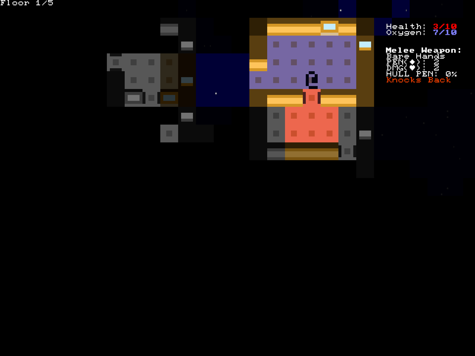

+++
title = "7 Day Roguelike 2021: Depressurisation"
date = 2021-03-08
path = "7drl2021-day3"

[taxonomies]

[extra]
og_image = "2.png"
+++

I spent the day getting depressurisation  working.
When the hull gets pierced, the area of the station exposed to space is depressurised.
Any characters in that part of the station are pulled towards the breach for several turns
until the pressure is equalised.

The red warning light indicates that an area is being depressurised.

Once the pressure equalises, a blue warning light indicates that an area has no air.
The oxygen meter will start draining, and when it runs out the health meter will start draining.

<!-- more -->

Opening a door to the pressurized region of the ship will cause the connected region to depressurise.

Once the pressure equalises again, it becomes possible to walk through the doorway.
Doors can't be forced closed, so you have to wait for it to close on its own!

When the door closes, the pressure and air supply is instantly restored. The oxygen meter starts ticking back up.

If you unwittingly open a door with vacuum on the other side, the area depressurises again and you get sucked through the doorway.

## Glyph Rendering Bug

On one machine I tested on, text rendering was broken such that only the glyphs rendered in the first frame can be rendered correctly in
subsequent frames. My hunch is that this is a bug in [wgpu_glyph](https://crates.io/crates/wgpu_glyph). I'll sort it out after the 7DRL is
over.

For now, the first thing the game does when it starts is briefly draw all the characters it needs:

Of course, it renders them with a black foreground and background, so it just looks like the game is loading. Sneaky!
