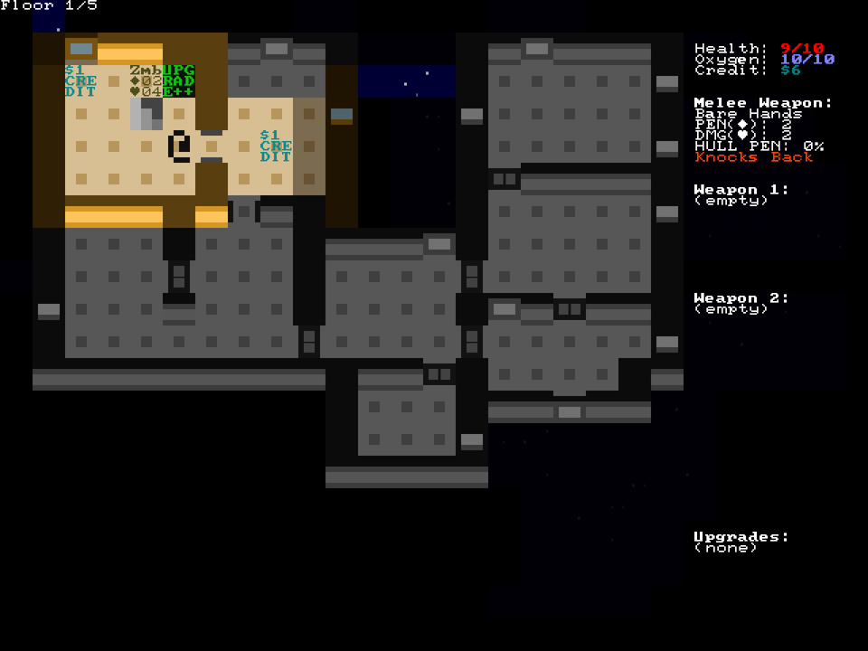
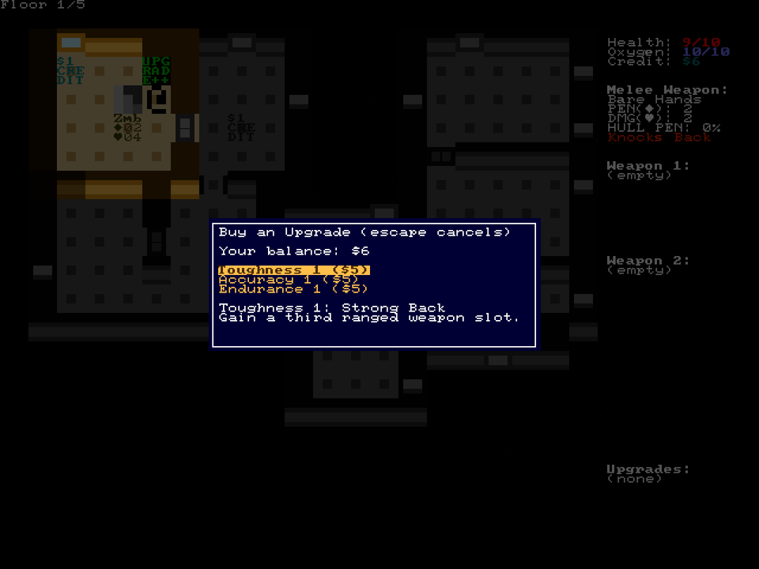
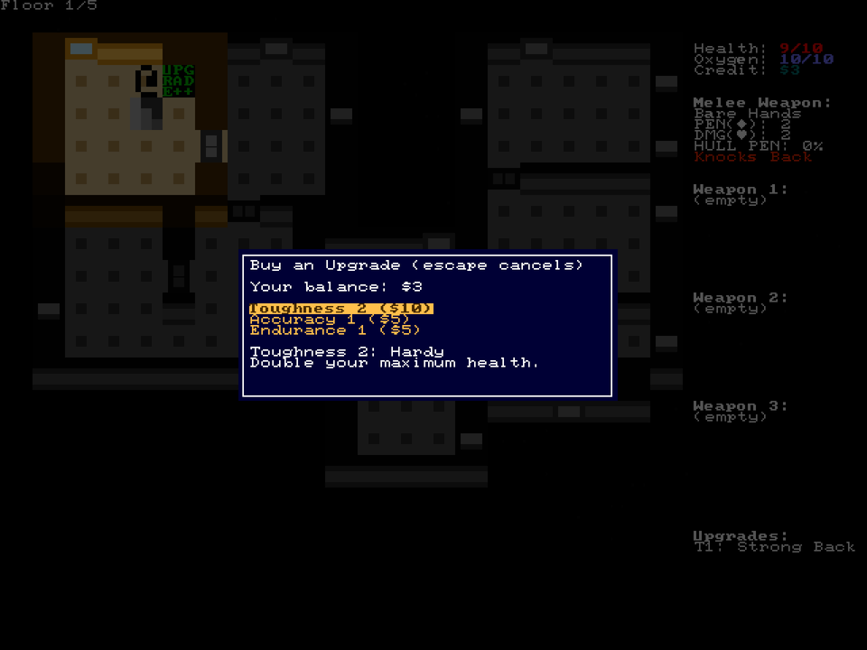

+++
title = "7 Day Roguelike 2021: Upgrades"
date = 2021-03-09
path = "7drl2021-day4"

[taxonomies]

[extra]
og_image = "screenshot.png"
+++

Today I implemented the upgrade system.
You collect credits which can spent at an upgrade store.

The store presents a menu from which one of three upgrades can be chosen.
There are three upgrade tracks with two levels each. Each level unlocks a new passive character upgrade.
The menu includes a description of the currently-selected upgrade.

<!-- more -->

After choosing a "Level 1" upgrade, the second tier of that upgrade path becomes available, for an increased price.

