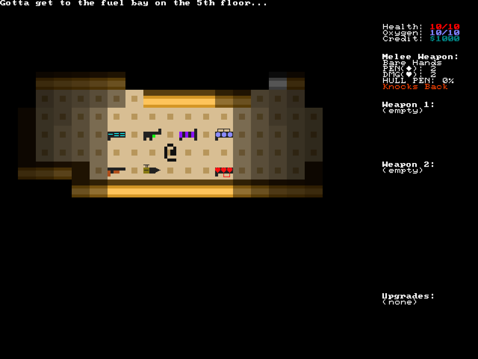
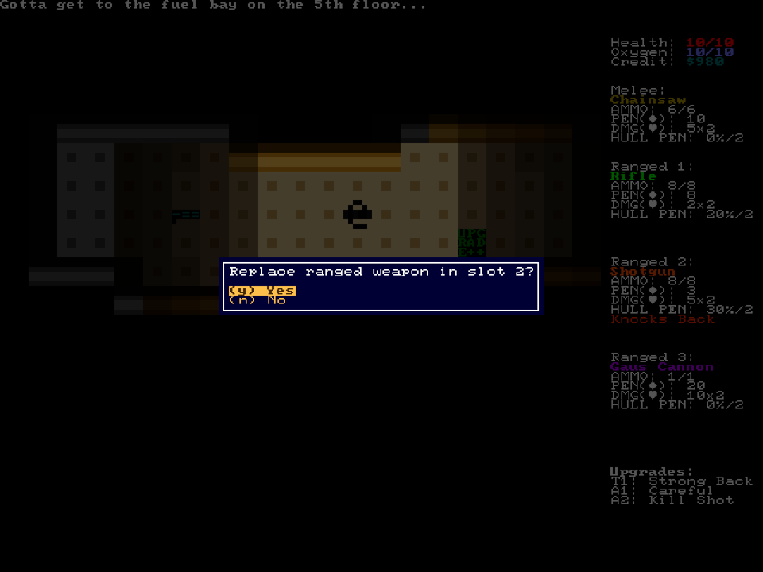
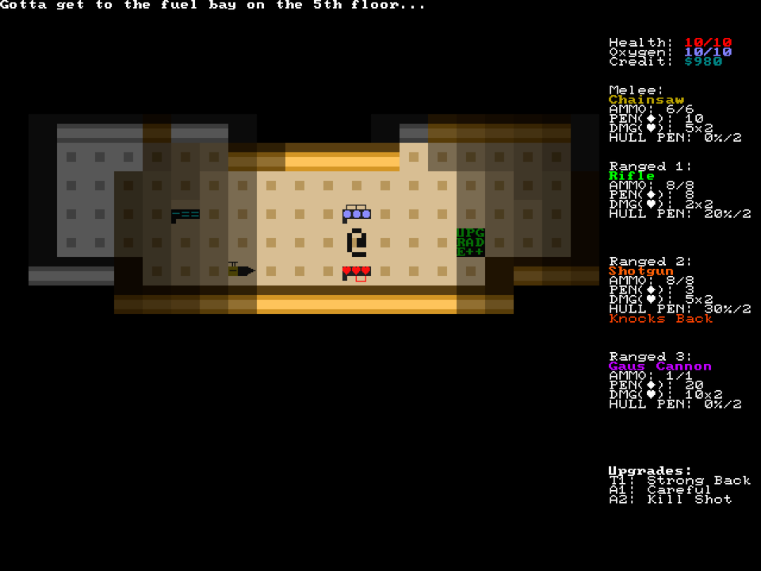
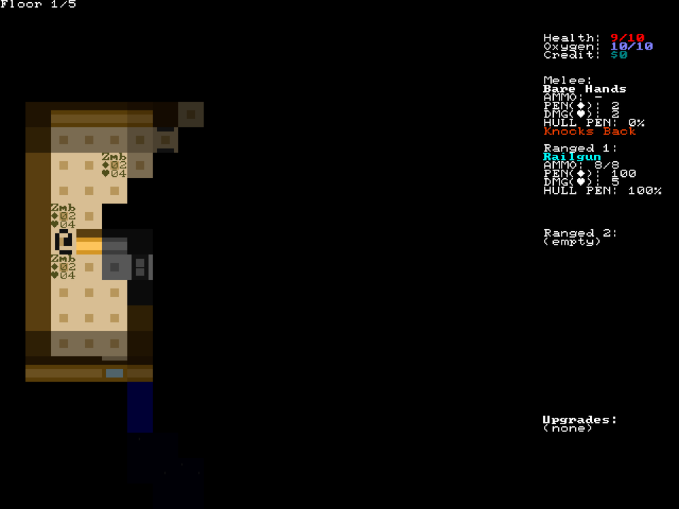
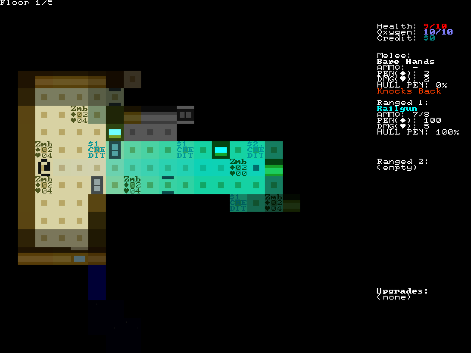
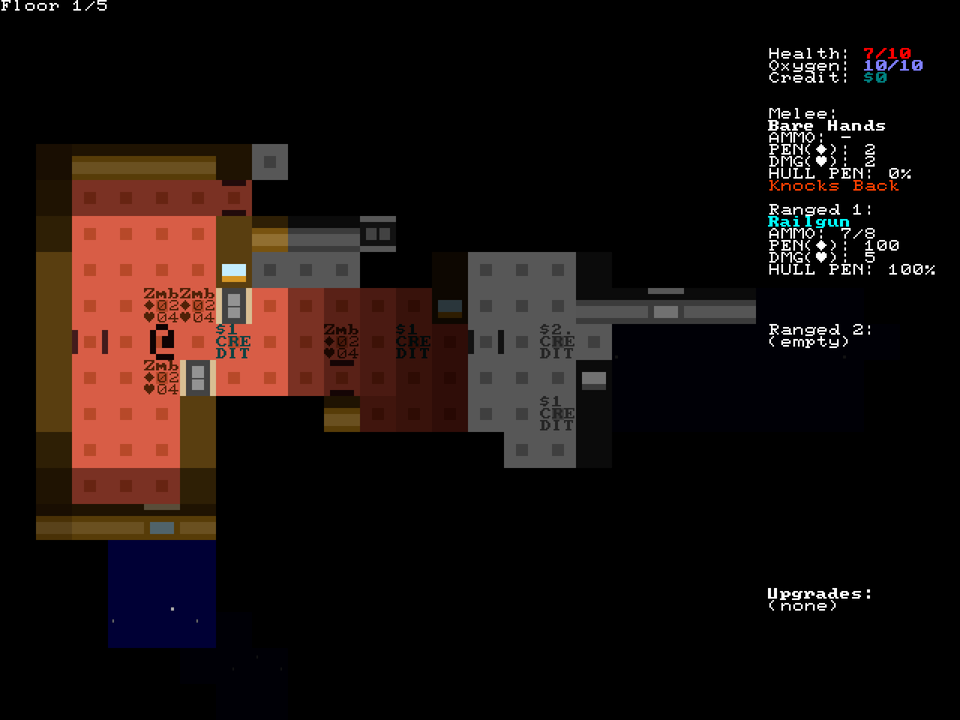
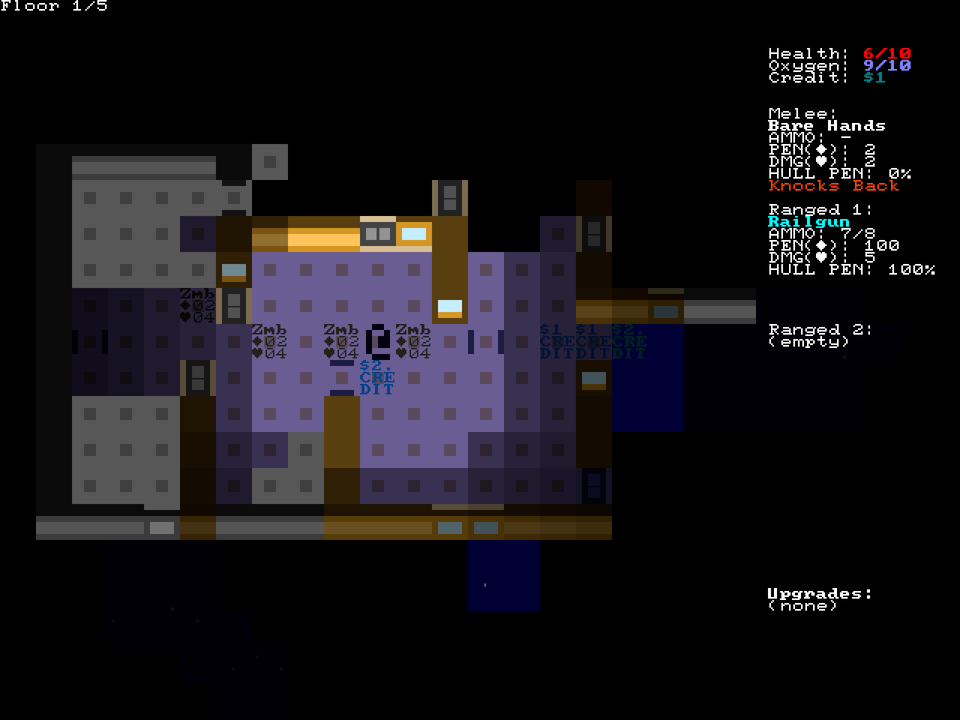

+++
title = "7 Day Roguelike 2021: Weapons"
date = 2021-03-10
path = "7drl2021-day5"

[taxonomies]

[extra]
og_image = "weapons.png"
+++

Tonight I added weapons.
This screenshot shows the game's arsenal.

Other than art, most of the work was setting up interactions like displaying a prompt before picking up a new weapon
that would replace the weapon in its destination weapon slot.

<!-- more -->

And here's how it looks when weapons are equipped with some upgrades that modify their stats.

One such weapon is the railgun, which has high PEN and is guaranteed to breach the hull.

Firing the railgun to the right to show off the lighting and destructible terrain.

Immediately after firing, most of the ship is now exposed to vacuum and decompresses.
Open doors in the path of the projectile were not impacted.

Moving closer to inspect the damage. Some credits were sucked into the void.

