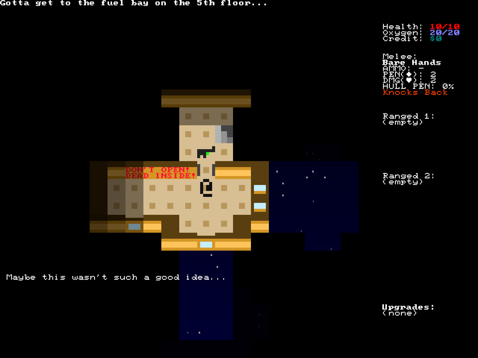

+++
title = "7 Day Roguelike 2021: Gamepad Support, Audio, Maps, Help Screen, Play Testing"
date = 2021-03-12
path = "7drl2021-day7"

[taxonomies]

[extra]
og_image = "screenshot5.png"
+++

Firstly, here's a screenshot of my first organic encounter with the final level of Orbital Decay:

<!-- more -->

## Gamepad Support and Help Screen

Last year I added gamepad input to chargrid, and used slime99 as a test bed, so basic controller support
was incidentally already present. I just needed to add additional inputs for the actions specific to this game
and update the help screen to include the new controls.

I also fleshed out the help screen to include some instructions on how to play the game.
Hopefully there is a "Wall of Text" metric when judging this year's submissions.

## Audio

This year I employed the help of a musically-talented friend to compose the soundtrack and make sound effects
in exchange for inclusion in the game's credits.

_Credits you say? Sounds like another chance to show off the menu I'm so obsessed with..._

There are 6 tracks in total: Ambient music for the menu, 3 tracks that play during gameplay, and two
end text songs ("Why two?" you ask - you'll have to beat the game to find out!).

Also there are over 10 different sound effects for weapons and other events in the game.
This is the first game I've made with sound effects, and they make it _feel_ more fun.
Which is _terrifying_! We think we enjoy games for the challenging strategic and tactical decisions,
but it turns out we're actually just children who get amused when we press a button and a thing lights up and makes a sound!

So this game has lots of things that light up and make sounds _as well as_ what I hope are challenging strategic and tactical decisions!

## Maps

One last feature before I start focussing on play-testing and balance. I promise!

This is a map terminal. It is currently locked.

Bumping into it, you are prompted to pay to unlock it.

Should you agree, the terminal is unlocked. The `***` is removed and you can now enter the cell.

The layout of the ship, as well as the location of items and enemies is revealed to you!
Behind the scenes this is repurposing the "omniscience" debugging mode in the vision system.

_Bask in the glory of the space-gradient once again!_

When you leave the cell, your omniscience stops, but you remember the layout.

You can always go back to the cell to check the map again - it's now unlocked forever.

## Play Testing

I spent some time playing the game (with an XBox One controller!) and made the following changes as a result:

- Generally tweaking stats on weapons and enemies to make the game more "fun" according to my sleep-deprived subjective opinion.
- Fixed a bug where the chainsaw never spawned at all. Oops!
- Weapons with the "Push Back" ability push enemies back further. Three spaces rather than two. Pushing things back is really useful,
  especially when dealing with the boomer enemy whom you really don't want to kill. This provides a strong reason for the player to _not_
  equip the chainsaw, which balances well with how awesome the chainsaw is as a weapon. Taking the chainsaw should be a strategic decision,
  not something that the player always does. Another benefit of three space knock back is that the player can keep walking towards an enemy
  and push them along without taking any hits. Of course this only works if there is space which there often isn't, and it gets messed up
  if there are multiple enemies in a row which there often are. That's the whole point though! One-on-one combat with no constraints on
  positioning is _boring_, and here's a way to let the player mostly skip it!
- Reduce the chance of the railgun causing a hull breach from 100% to 60% because I found that I would never use it.
- Since the shotgun has the "Push Back" ability, and this ability is getting buffed, the shotgun is now on-par with the "late game" weapons
  in terms of how useful it is. Thus the only non-awesome weapon is the rifle. Poor rifle. Make it so the player always starts with the
  rifle, and rifles don't spawn on any floors.
- When skeletons are killed they turn into a skeleton spawner countdown, which the game treats as an item rather than a character.
  There can only be one item on a cell. Fixed a bug where the game would crash if a skeleton is killed while standing on an item.
  The game now looks at surrounding cells to find one without an item in this case. If it can't find one it gives up. The player
  deserves to permanently kill a skeleton if they can figure this out!
- I reduced the amount of ammo each gun can hold by about half. The only way to get more ammo is by going to the next level or picking
  up a different gun from the floor. Choose between making progress or experimenting with new game content. Both are things I want
  the player to do!

I'm really happy with the "skeletons are food" idea. Many traditional roguelikes had a concept known as the "food clock" to incentivise
the player to make progress. Each floor of the dungeon would have a finite supply of food, and the player would get hungry over time.
Spend too long on one floor, and you'll exhaust the food supply and need to move on. Grinding on the same floor for ages is boring
but players tend to do this anyway if it's mechanically-beneficial, and the food clock helped break this cycle. In Orbital Decay,
skeletons play this role instead! They are immortal unless you cause them to get sucked into space, and you'll run out of ammo or
health if you kill and re-kill them too many times. So _maybe_ it's more correct to say that "ammo is food" but it doesn't have the same
"what is he even talking about" ring to it as "skeletons are food" so I'm going to keep saying that.

## Screenshots from my complete playthrough

That trusty rifle saw me all the way to the end. Perhaps I was too hasty to remove it from the weapon spawn pool.
I'll also add the shotgun back to the list of possible starter guns.

## More Screenshots!

In preparation for uploading to itch.io, I'm recording screenshots during all my play-tests.

At first I used the map on this floor to test that I didn't break the map mechanic with a last-minute 11th hour change (I didn't),
but I spotted a nice bit of _accidental synergy_ between the map mechanic and boomer enemy. It is _bad_ to kill boomers when they are
near the hull because they explode and destroy the hull. It's much safer to kill them somewhere where the only walls that they destroy
are internal.

And for only $2 credit you can reveal the layout of the level and carefully plan out your approach.

## Collision Bug?

Through a rare confluence of the "Push Back" mechanic and skeletons turning into skeleton spawners upon death, it's possible to
end up with the spawner stuck in a wall. Eventually a skeleton appears, also stuck in the wall, and there they remain.

I'm gonna let this one slide! Nothing to do with the looming deadline or the fact that it's 3:30am as I write this.
If players can use this bu...ahem...mechanic to their favour, more power to them!

## On the final night of 7DRL

This is one of the few nights of the year when I permit myself coffee at night.
The interest rate on technical debt becomes negative and I write some of the worst, most pragmatic code I've ever written.
The paint on the copy and paste keys of my keyboard becomes worn.

It's typical to wait until the end of the week to playtest. Otherwise you wouldn't have a game _to_ playtest.
But this means that by the time that you're turning the knobs to make the game challenging but beatable, you're
so sleep deprived and exhausted that your ability to face the challenges is diminished somewhat.
Does this mean that all 7DRLs are imbalanced in favour of the player? Or do developers account for this by making
their games too hard to beat in their end-of-7DRL state, knowing that the game will become winnable once their faculties return.
