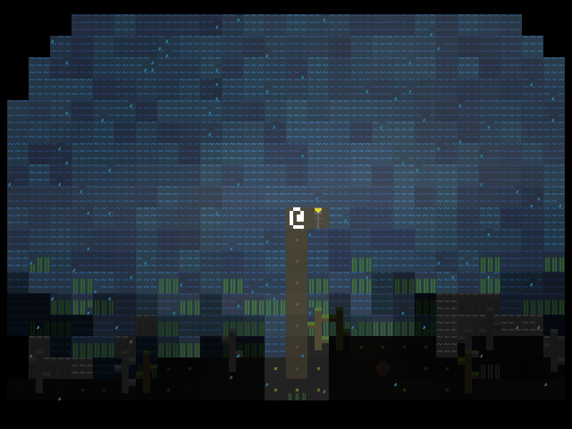
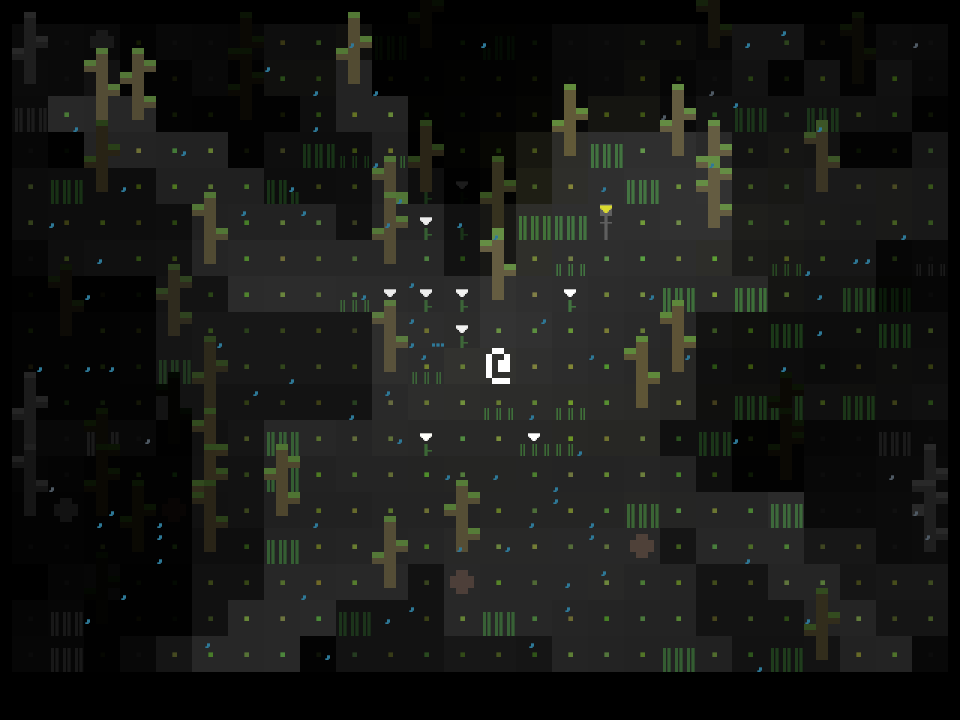
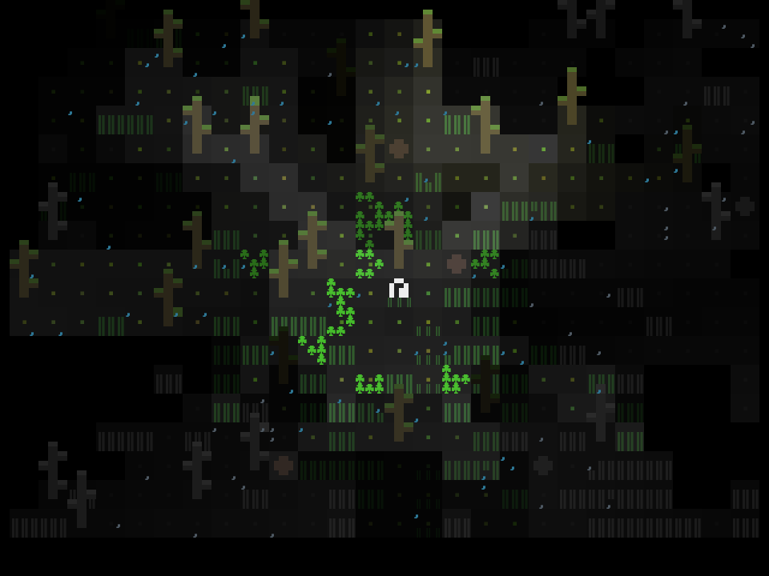
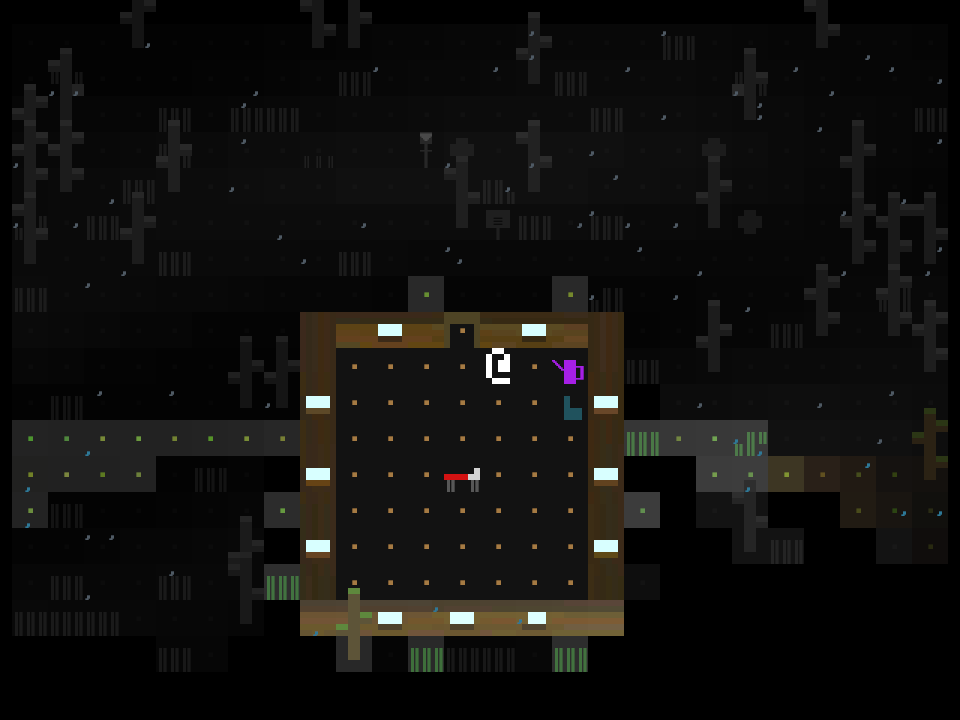
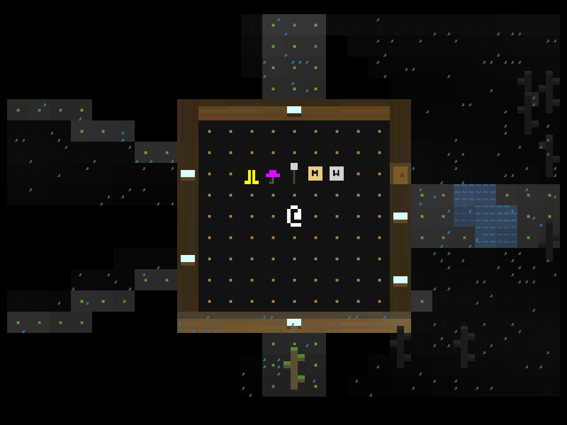

+++
title = "7 Day Roguelike 2022: Content"
date = 2022-03-07
path = "7drl2022-day3"

[taxonomies]
+++

I spent the day adding assets. There's a large lake one one side of the map with a pier.
Lamp posts, grass, and rocks are randomly placed around the forest.
There are patches of flowers and tea plants.

In addition to looking nice, the grass serves the purpose of showing players where they
have been, as when you walk on the grass it gets trampled and its sprite changes.

<!-- more -->

One of the daily motivation-building tasks will be to pick one of the flowers and take it to
the altar.

Another daily task will be to pick tea and brew it in the teapot inside the cabin.

The cabin is now furnished with a bed, a chair, and a teapot.

There are upgrade items (they don't work yet).

