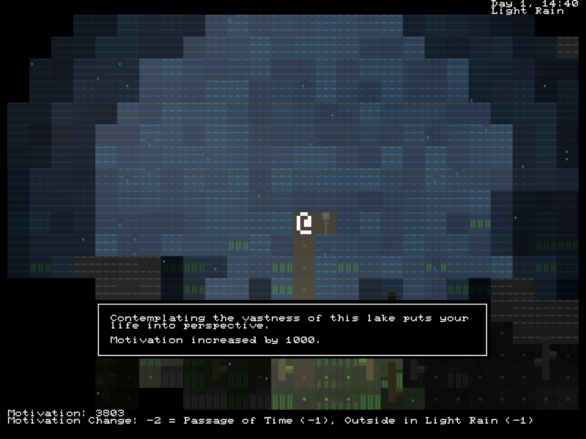
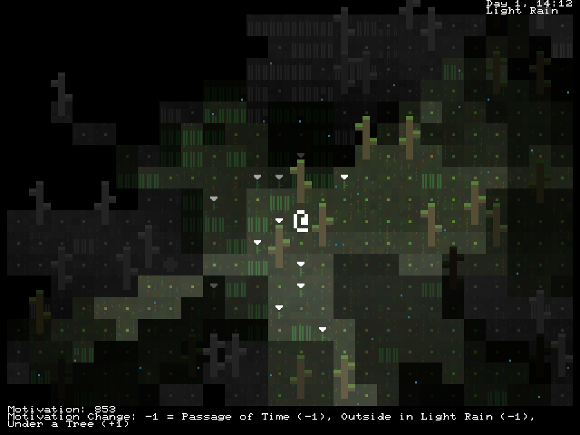
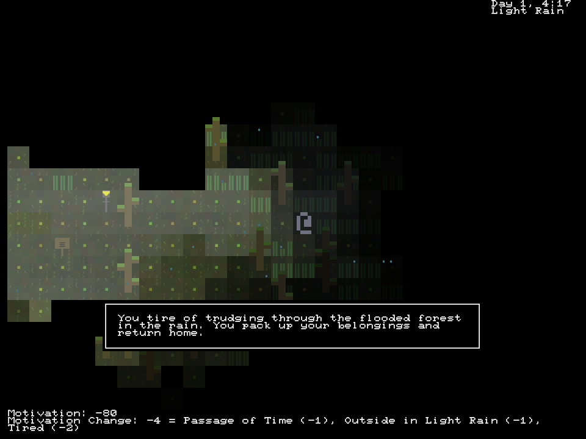

+++
title = "7 Day Roguelike 2022: Motivation"
date = 2022-03-09
path = "7drl2022-day5"

[taxonomies]
+++

Tonight I added the motivation system.
It's a number which gradually ticks down, and if it gets to zero, you lose.
It ticks down faster when you're uncomfortable, such as when you're standing
in the rain or flood water.

Various things can restore your motivation, like sleeping, or visiting the lake.

<!-- more -->

I also added ascii texture to the ground.

It's possible to lose the game.

