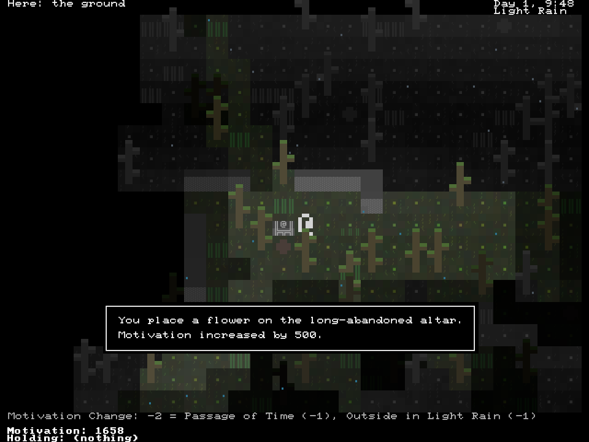
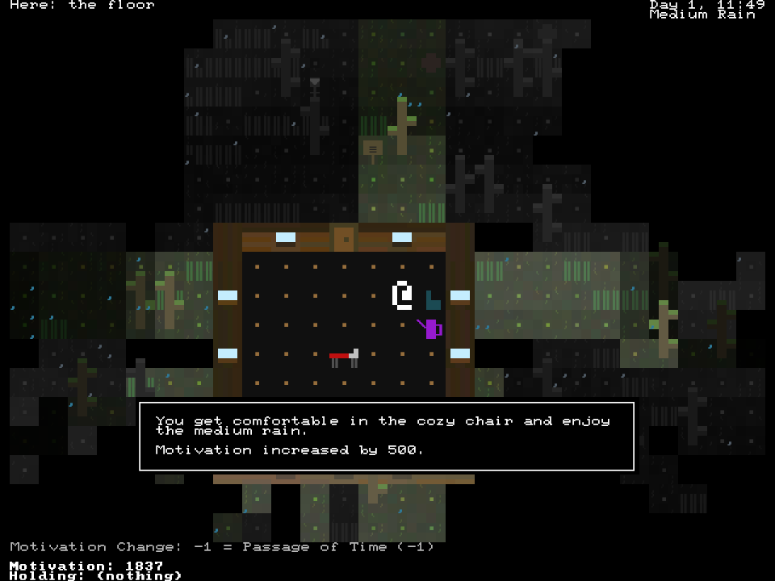
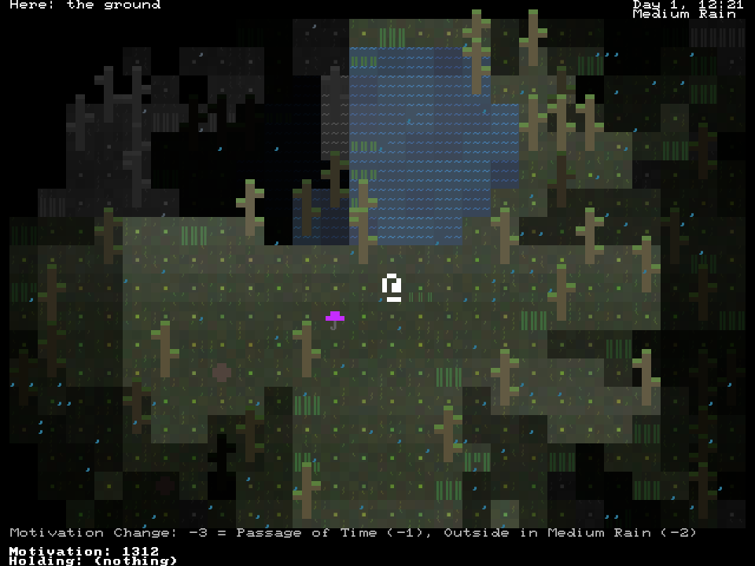

+++
title = "7 Day Roguelike 2022: Interactions"
date = 2022-03-10
path = "7drl2022-day6"

[taxonomies]
+++

I implemented most of the gameplay tonight. Gameplay consists of performing simple daily tasks
like making tea or placing a flower on an altar.

<!-- more -->

You can sit in a chair and enjoy the rain. The heavier the rain, the more motivational it is.

Equipment is randomly placed around the map. So far you can't interact with it, but most of
the active equipment (map, weather report, lantern) are implemented already (they are currently
effectively always equipped).

