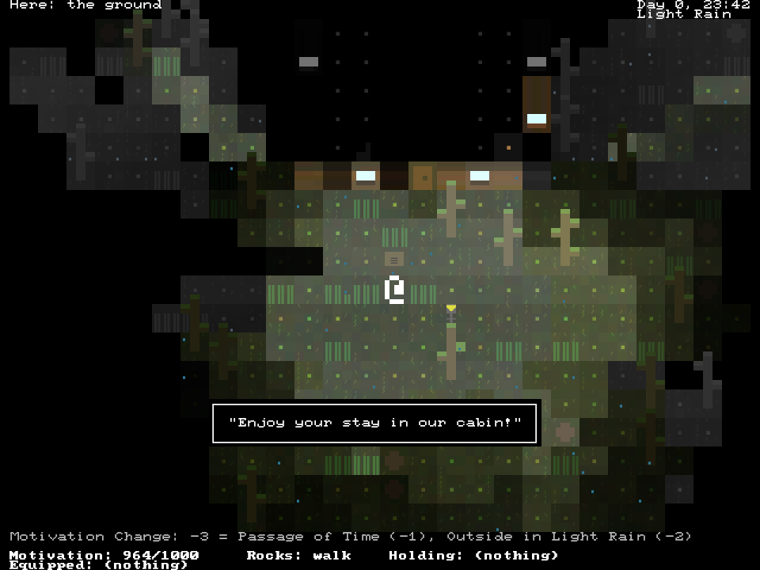
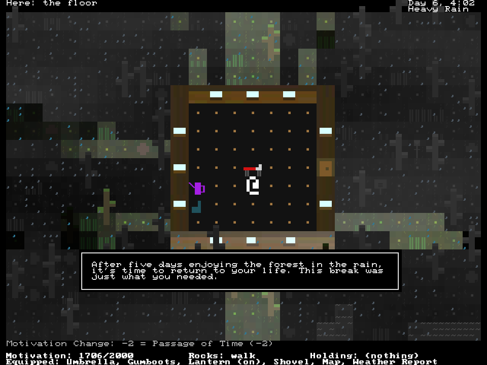

+++
title = "7 Day Roguelike 2022: Complete"
date = 2022-03-11
path = "7drl2022-day7"

[taxonomies]
+++

I added a win condition, implemented an equipment system, and did a bunch of play testing and balancing.
The game is finished and submitted to the [7drl](https://itch.io/jam/7drl-challenge-2022) jam.
Play it in a browser, or download binaries from [it's itch.io page](https://gridbugs.itch.io/rain-forest).
The source code is on [github](https://github.com/gridbugs/rainforest).

<!-- more -->

During play testing I realized that the mechanics incentivize players to bank a lot of motivation in the
first few days when it's fairly easy to be outside, but as the rain and flood waters pick up, the player
wants to stockpile a bunch of tea inside and gain motivation by drinking tea and enjoying the rain from
the chair.

I added a cap to the amount of motivation the player can have, but I didn't go too far to discourage
this strategy, since it's actually quite thematic!

