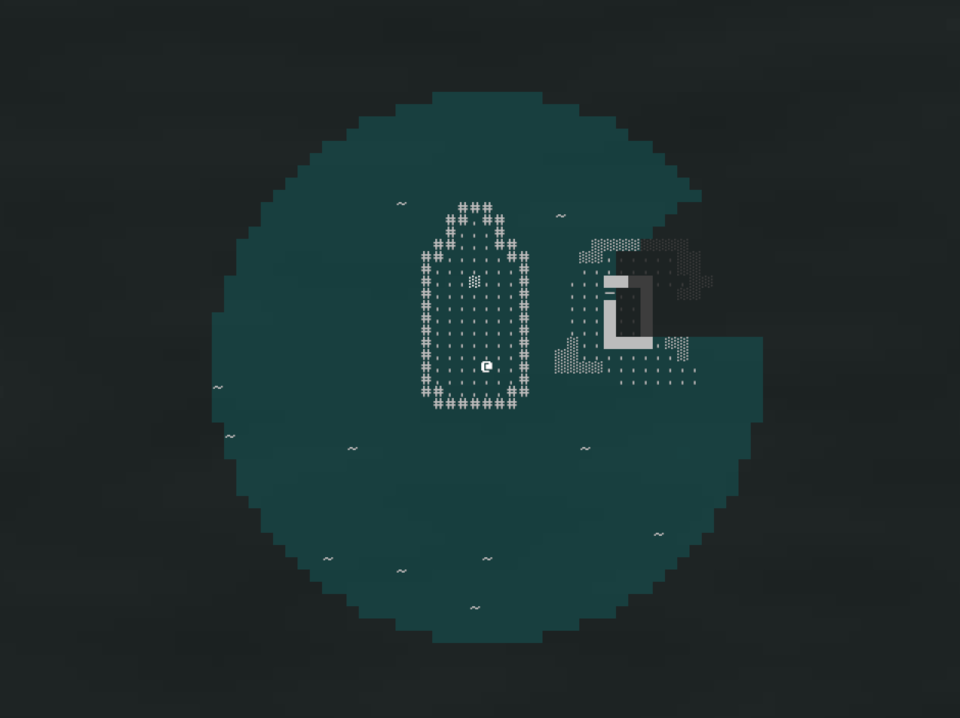
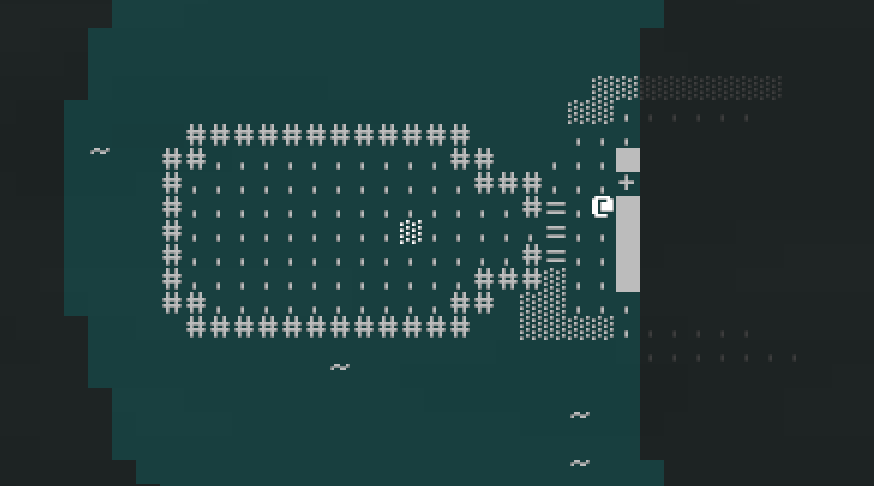

+++
title = "7 Day Roguelike 2023: Bootstrapping, Boat Gameplay, Vision"
date = 2023-03-06
path = "7drl2023-day1"

[taxonomies]

[extra]
og_image = "screenshot.png"
+++

It's the end of my first day of hacking on this year's 7DRL.
My game will be called "Boat Journey". It's about driving a boat along a river
with the goal of reaching the ocean without running out of fuel or otherwise
becoming stranded, while picking up passengers who give you additional
abilities.

I'm intentionally going for a very minimal graphical style this year since the
past few years I've found I spend more time on fancy graphics than I would like,
and less time working on gameplay features.
<!-- more -->

I spent most of the day getting basic boat gameplay working. You can drive
around in the boat, turning it in intervals of 45 degrees, toggle
between driving the boat and walking around, and you can drive the
boat slightly over walkable tiles which causes the edge of the boat to become
walkable (denoted by a '=' tile), allowing you to leave the boat. This is shown
in the screenshot below.

I also spent some time on basic bootstrapping, getting doors to work, a visible
area detection system, rendering and a subtle mist effect.
