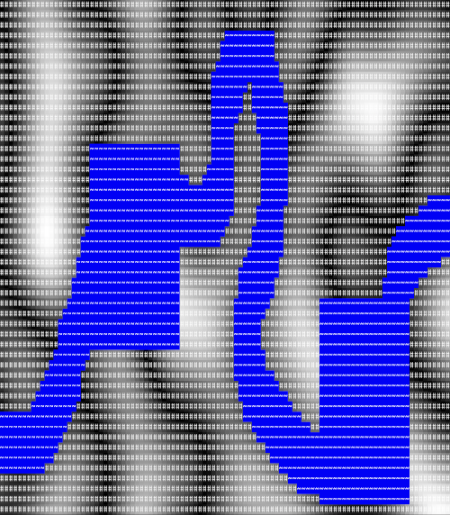

+++
title = "7 Day Roguelike 2023: Procedural Generation"
date = 2023-03-07
path = "7drl2023-day2"

[taxonomies]
tags = ["procgen"]

[extra]
og_image = "river.png"
+++

I spent this evening making a procedural generator for the shape of river and
choosing points along the river to place settlements. While I iterate on
procedural generation I'm working in a separate project to the main game so I
don't need to deal with the complexities of integrating the generated levels
into the game while I'm also figuring out how level generation will work at all.

Here's the debug output of the terrain generator so far showing the shape of the
river and the points where settlements will go.

<!-- more -->

The algorithm starts with Perlin noise and uses Dijkstra's algorithm to find a
path from a point on the left side of the screen to a point on the right side of
the screen preferring noise values closer to 0. Then there are several
post-processing steps on the chosen path that check for closed-off sections of
land created when the river is made wider, and finds point that are good
candidates for settlements so that when settlements are added it doesn't connect
multiple points of the river.

The plan for tomorrow is to generate the settlements, the starting town, and the
ocean, and integrate this into the game so that I can test out driving a boat
around the generated river.
