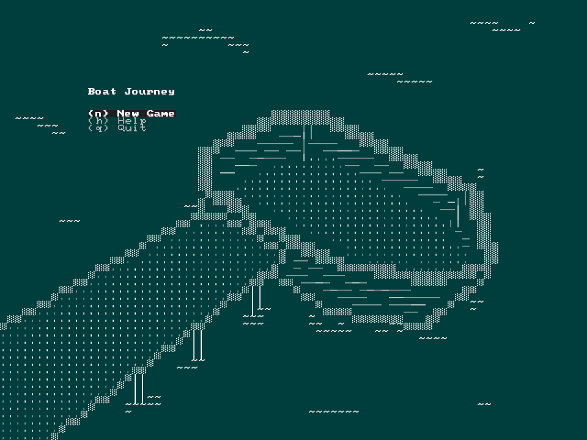
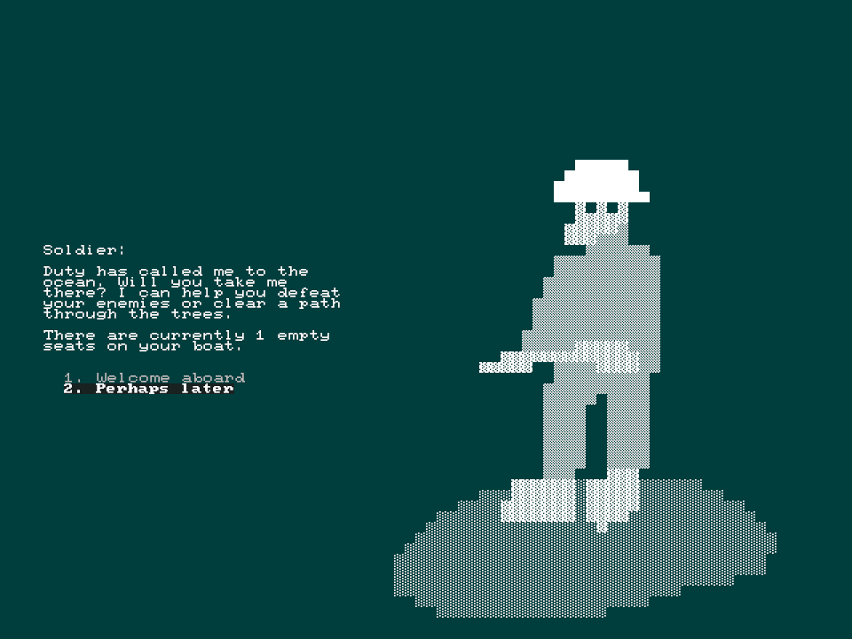
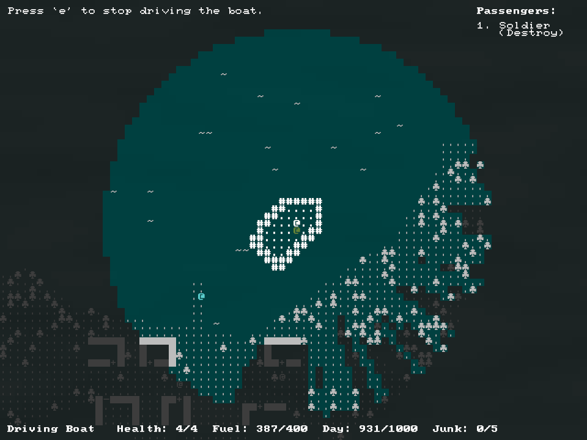
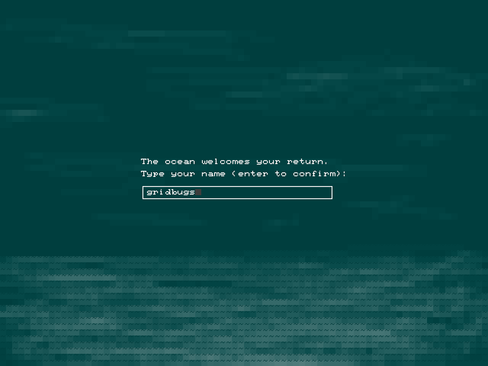

+++
title = "7 Day Roguelike 2023: Passengers, Art"
date = 2023-03-11
path = "7drl2023-day6"

[taxonomies]

[extra]
og_image = "title.png"
+++

Today I drew a bunch of background images for menus and the victory screen.

<!-- more -->

I also added a mechanic where NPCs can join your crew if you have available
space. When you walk into an NPC this menu is displayed and you can choose to
add an NPC if you have space for them.

There is a UI that lists all the passengers and the ability that they grant you.

When you win you are prompted to enter your name. The game keeps a persistent
record of successful runs.

