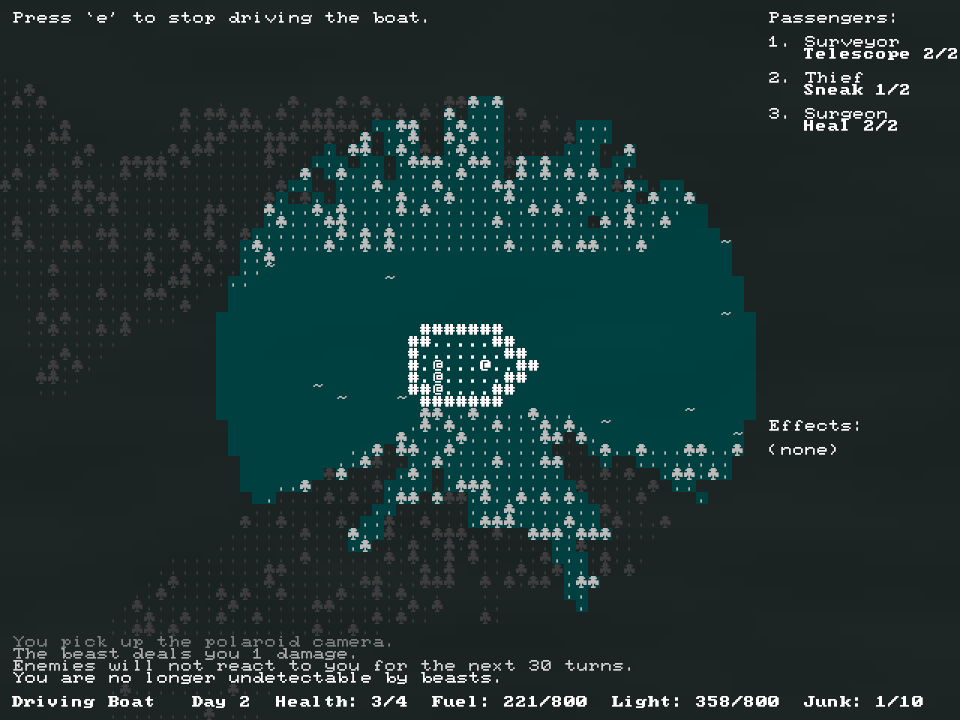
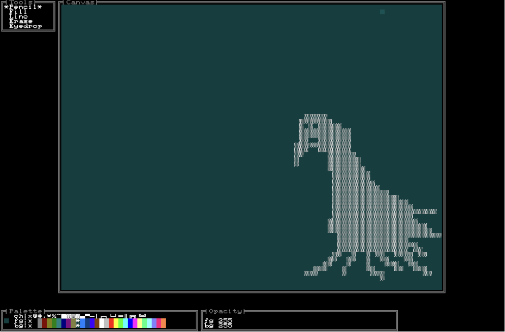
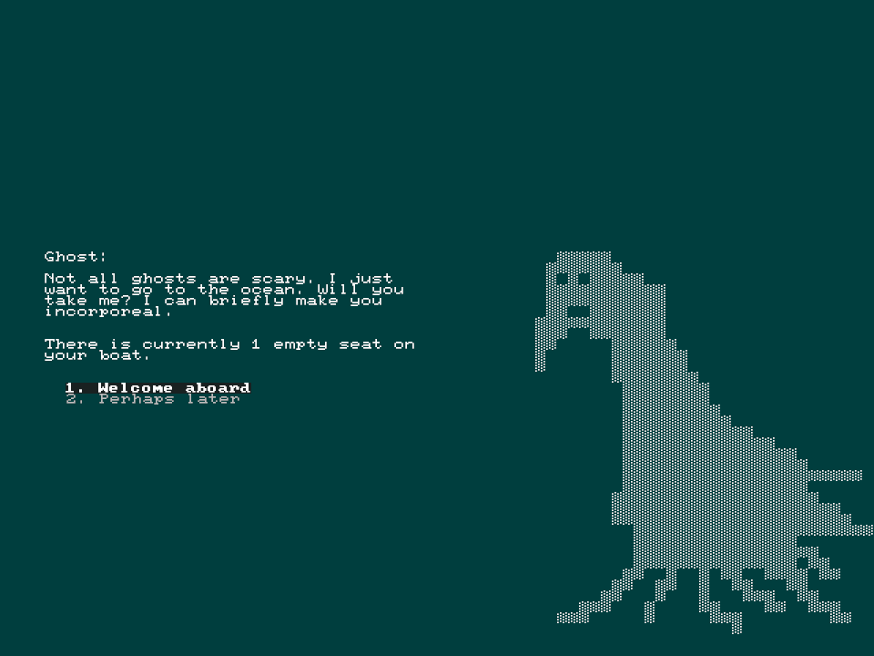

+++
title = "7 Day Roguelike 2023: Mechanics, Content, Playtesting"
date = 2023-03-12
path = "7drl2023-day7"

[taxonomies]

[extra]
og_image = "screenshot3.png"
+++

The sun is peeking beneath my curtains and another 7DRL draws to a
close. Today I implemented the passenger mechanic, the trading mechanic,
collectable junk (the game's currency), the combat system via abilities gained
from passengers, and added 7 different passengers you can pick up, each granting
you a unique ability.

The game is playable and downloadable on itch.io at
[gridbugs.itch.io/boat-journey](https://gridbugs.itch.io/boat-journey).

During playtesting I found some interesting emergent mechanics.

<!-- more -->

There's an ability called "Phase" which you get if you pick up the ghost
passenger that lets you walk through walls. I intended this as a way of avoiding
combat in the dungeon levels, but it's also useful as a way of quickly entering
buildings. I got into a situation where I ran out of time during an in-game day
and had to quickly go to the inn while being pursued by ghosts, and I found I
could drive my boat up to the wall of the inn and phase through it rather than
walking all the around and going in through the door.

Similarly, there's a "Blink" ability which teleports you short distances which I
intended as an evasive maneuver but you can use it to teleport from the boat to
an island and back which makes it easier to take junk from the island without
needing to fight enemies.

It was probably a mistake to leave most of the complex mechanics to the final
day and I was nervous that playtesting would reveal that the game is not fun but
I was relieved to find that I enjoyed playing the game during playtesting.

Something I did differently this year is drawing character art. When you
interact with potential passengers and at certain other times a hand-drawn image
is shown behind the menu.

Part of my preparation for this year's 7DRL was to make a text-based drawing
tool. Here's a screenshot of the tool editing the ghost character portrait.

I found that as I played the game I started to associate the character portraits
with the general feeling I got using that character's ability. I would see the
image and automatically feel a sense of whether that character would be useful
to my current situation in the game. This is something I've never experienced
before in a game that I've made myself.

