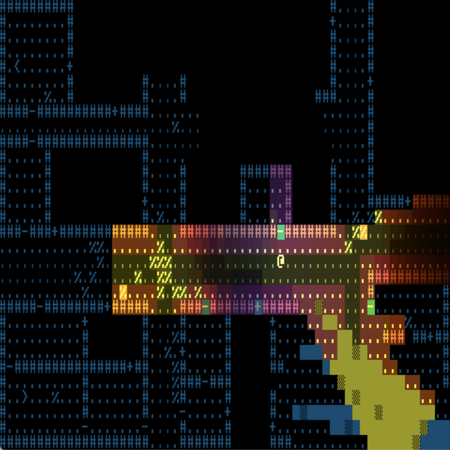

+++
title = "7 Day Roguelike 2024: Procgen, Graphics"
date = 2024-03-03
path = "7drl2024-day1"

[taxonomies]

[extra]
og_image = "screenshot.png"
+++

It's the end of day 1 of 7DRL2024. So far I've got a level generator for an
area of ruined city and basic graphics and lighting:

While working on this I fixed a very longstanding bug in my [lighting
system](https://crates.io/crates/visible_area_detection) that caused lights to
be too bright near their sources and to drop off with harsh steps rather than a
smooth gradient.
