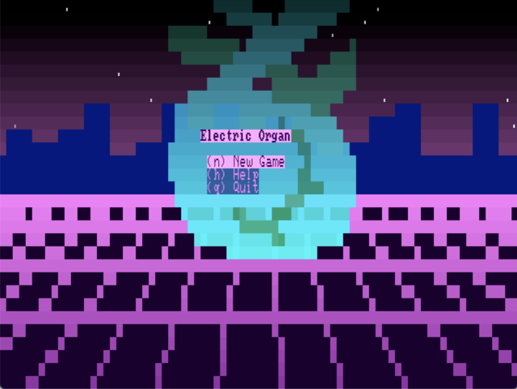
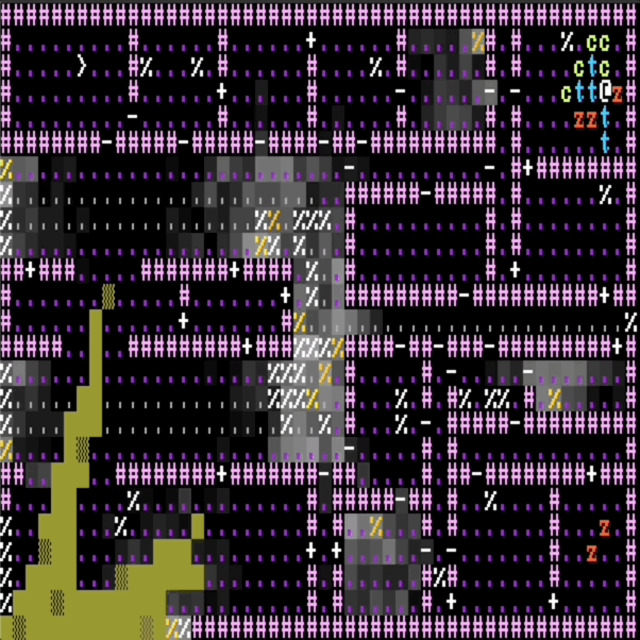
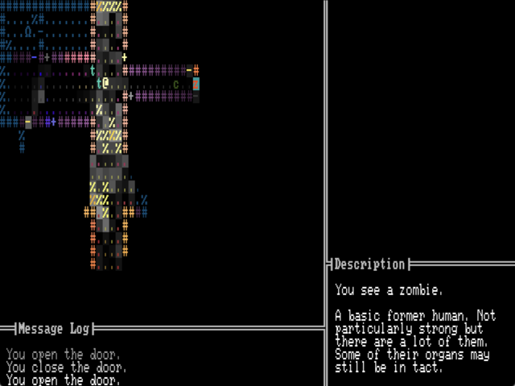

+++
title = "7 Day Roguelike 2024: Title, Pathfinding, UI"
date = 2024-03-05
path = "7drl2024-day3"

[taxonomies]

[extra]
og_image = "title.png"
+++

I had a productive evening working on Electric Organ. Firstly I implemented an
animated main menu. I'm spending a lot of time up front working on aesthetics
as I find that if the game is pretty I'm more motivated to work on it later in
the week. Hopefully there's enough time to implement all the mechanics I have
planned.

See the animation along with the music on [youtube](https://youtu.be/y5wBxGF-kPM).

<!-- more -->

I also got pathfinding working. This was interesting as I have several different types of NPC with different movement rules. Currently there are 3:
 - _zombies_ can only move into open spaces
 - _climbers_ can move over debris
 - _trespassers_ can open doors

To help with pathfinding I compute what I call "distance maps" (sometimes
called "Dijkstra maps" elsewhere - read more in [this post](@/blog/pathfinding-on-a-grid/index.md)) which NPCs can use to quickly determine the distance from each
location to the player. But now that different NPCs have different movement
rules, the effective distance to the player may differ between NPCs. For
example if the player is on the other side of a door, NPCs that can open doors
will find the player much closer than NPCs that can't. This means I need to
maintain multiple distance maps for the different combination of movement rules
that NPCs can have.

I also spent some time improving basic quality of life features like adding a
message log and descriptions of tiles. This also carves out some space for the
game's UI which I'll be adding to over the next few days as I implement the
player's stats and the combat system.

